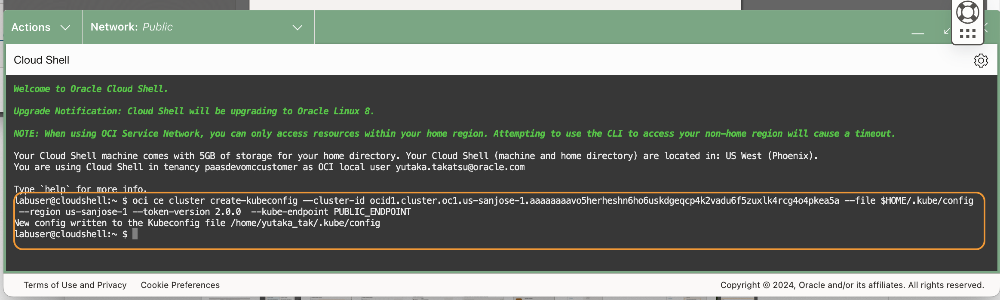
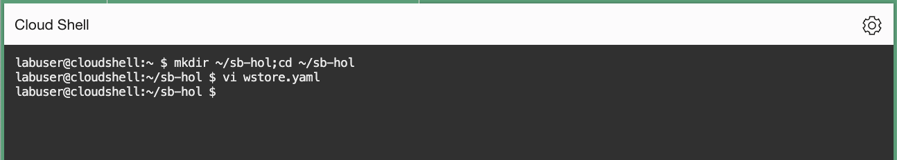
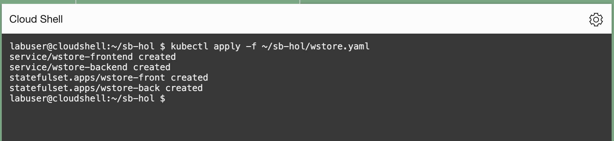

# Build a microservices application

## Introduction

This workshop uses Spring Boot-based Java microservices as a target application to trace against. In this lab, you will deploy the application to the Kubernetes cluster you created in Lab 1.

Estimated time: 10 minutes

### Objectives

* Build a microservices application for monitoring

### Prerequisites

* Completion of the preceding labs in this workshop

## Task 1: Verify OKE

1. Go back to the Kubernetes cluster page where you left Lab 1, and check the status of the cluster. Open the navigation menu from the top left corner (aka. hamburger menu) in the Oracle Cloud console, and select **Developer Services** > **Kubernetes Clusters (OKE)**.

   

2. Click the **apmlab-cluser1** link from the table.

   

3. If the status of the cluster is **Active**, creation was successful. If it is still in a **Creating** status, it may take a few more minutes to complete. (Usually, it takes 7 to 10 minutes to finish the jobs to create a cluster).

   

## Task 2: Access the OKE in the Oracle Cloud shell


1. Click **Access Cluster** on the cluster details page.

  

2. Make sure the **Cloud Shell Access** is selected. Click the **Copy** link from the command to access kubeconfig for the cluster.

  

3. Then click **Launch Cloud Shell**.

  

4. Oracle Cloud Shell window opens at the lower side of the browser screen.

  

5. Paste the copied command to the command shell prompt. Then hit enter.   

  

  >**Note:** Save the command to a text file on your laptop, and execute it whenever you start a new Cloud Shell session while working in the labs in this workshop.

## Task 3: Create a configuration file

1.  In the Cloud Shell, type down the command below to create a work directory.

    ``` bash
    <copy>
    mkdir ~/sb-hol;cd ~/sb-hol
    </copy>
    ```

      

2. Use text editor (such as the vi editor tool) to create a configuration file within the directory.

    ``` bash
    <copy>
    vi wstore.yaml
    </copy>
    ```
      
      
      >**Note**: If you are using the vi editor, type i to enter Insert mode, and make the text editable. Use allow keys to navigate the text and make changes to where you set the cursor. To save a file, press the Esc key, then type :wq to write and quit the file. If you do not wish a change, press Esc then type :q! to discard your changes. Please refer to the editor's references for more usage. 
  

3. Copy the content below and paste it into the configuration file. 

    ``` bash
    <copy>
    apiVersion: v1
    kind: Service
    metadata:
      name: wstore-frontend
    spec:
      type: LoadBalancer
      selector:
        app: wstore-front
      ports:
        - protocol: TCP
          port: 80
          targetPort: 8080
      externalTrafficPolicy: Local
    ---
    apiVersion: v1
    kind: Service
    metadata:
      name: wstore-backend
    spec:
      type: NodePort
      selector:
        app: wstore-back
      ports:
        - protocol: TCP
          port: 8080
          targetPort: 8080
    ---
    apiVersion: apps/v1
    kind: StatefulSet
    metadata:
      name: wstore-front
    spec:
      serviceName: "wstore-frontend"
      replicas: 1
      selector:
        matchLabels:
          app: wstore-front
      template:
        metadata:
          labels:
            app: wstore-front
        spec:
          containers:
          - name: wstore
            image: iad.ocir.io/axfo51x8x2ap/p-winestore:latest
            command: ["java", "-jar", "./wineStore.jar", "--spring.config.location=file:/spring/wstore.properties"]
            ports:
            - containerPort: 8080
          imagePullSecrets:
              - name: ocirsecret
    ---
    apiVersion: apps/v1
    kind: StatefulSet
    metadata:
      name: wstore-back
    spec:
      serviceName: "wstore-backend"
      replicas: 2
      selector:
        matchLabels:
          app: wstore-back
      template:
        metadata:
          labels:
            app: wstore-back
        spec:
          containers:
          - name: wstore
            image: iad.ocir.io/axfo51x8x2ap/p-winestore:latest
            command: ["java", "-jar", "./wineStore.jar", "--spring.config.location=file:/spring/wstore.properties"]
            ports:
            - containerPort: 8080
          imagePullSecrets:
              - name: ocirsecret

    </copy>
    ```
      

      >**Note**:  Make sure to keep the same space indentation when pasting the code into the file.


## Task 4: Deploy the application

1.  Execute the command below to deploy the application to the cluster.
    ``` bash
    <copy>
    kubectl apply -f ~/sb-hol/wstore.yaml
    </copy>
    ```

  Verify the 2 services and 2 stateful sets are created.

    


2. Run the kubectl command below to display the status of the pod creation. Wait until the statuses become 'Running'. This may take a few minutes.

    ``` bash
    <copy>
    kubectl get pods
    </copy>
    ```

   

3. Run the kubectl command below to display the deployed services.

    ``` bash
    <copy>
    kubectl get svc
    </copy>
    ```

4. Copy the External IP of the wstore-frontend service

    

5. Refer to the below example and construct a URL, and paste it into a browser's address bar. If you see the WineCellar content as in the below screenshot, the deployment was successful.

    ``` bash
    <copy>
    http://<IP of the wstore-frontend service>/winestore/
    </copy>
    ```
   

    >**Note:** It may take a few minutes to complete the deployment and start loading the page content on the screen for the first time.  

You may now **proceed to the next lab**.

## Acknowledgements

* **Author** - Yutaka Takatsu, Product Manager, Enterprise and Cloud Manageability
- **Contributors** - Steven Lemme, Senior Principal Product Manager,  
Anand Prabhu, Sr. Member of Technical Staff,  
Avi Huber, Vice President, Product Management
* **Last Updated By/Date** - Yutaka Takatsu, November, 2024
