# Instrumentation for server monitoring

## Introduction

In this lab, you will download the APM Java Agent installer file from the Oracle Cloud console, upload it to the Oracle Cloud shell, transfer to the Kubernetes container, provision the Java Agent to the file system, and finally deploy the Agent to the Kubernetes pods.

Estimated time: 20 minutes

### Objectives

* Download the APM Java Agent from the Oracle Cloud console
*	Upload the APM Java Agent to the Cloud shell
*	Copy the Java Agent installer from the Cloud shell to the file system
*	Provision the APM Java Agent in the shared file system directory
*	Deploy the Java Agent to the Kubernetes pods

### Prerequisites

* Completion of the preceding labs in this workshop

## **Task 1**: Download APM Java Agent

1.	Open navigation menu from the Oracle Cloud console, select **Observability & Management** > **Administration**.

   

2.	Under **Resources** at the lower left side of the screen, click **Download APM Agent**

   

3.	Click **Java Agent** link. If you are using a Chrome browser, this will save the file to your laptop. If you are using a FireFox browser, it may ask you to save the file to local. Click OK, if asked.  

   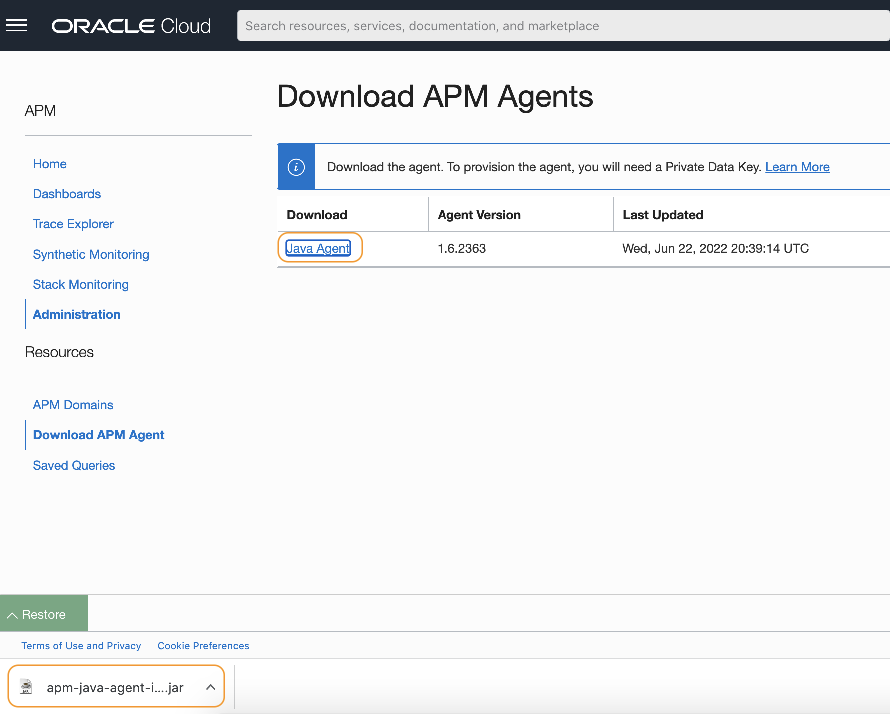

## **Task 2**: Upload the APM Java Agent to the Cloud shell

1.	Open the Cloud Shell by clicking the **>..** icon from the top right corner in the Oracle Cloud console. Restore the Cloud Shell if minimized.

   

2.	Click the Gear icon at the right upper corner of the Cloud Shell title bar to open the menu. Then select **Upload**.

   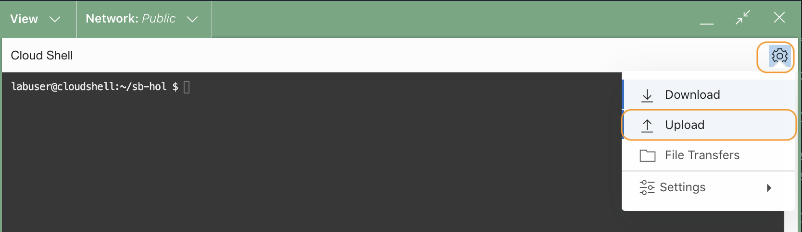

3.	Click **select from your computer** link and select the Java agent installer file from your computer. This is the file that you downloaded in the earlier steps.

   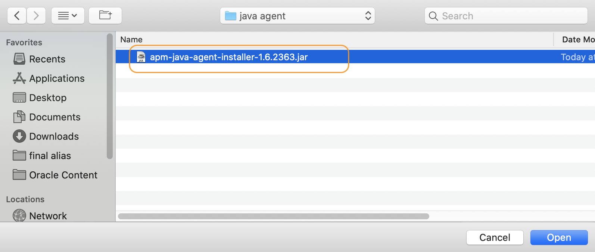

4.	Click **Upload**.

   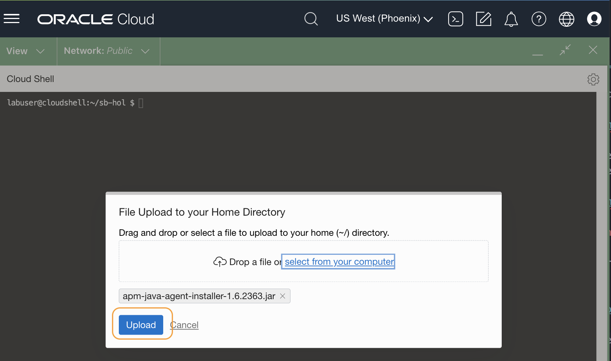

5.	Wait for the File Transfer to complete. Click **Hide** to dismiss the File Transfers window.

   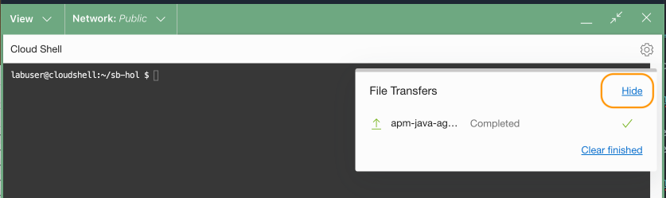

6. Then type "ls" command in the Cloud shell to confirm the file exists in the home directory.  

    ``` bash
    <copy>
    cd ~/; ls
    </copy>
    ```

   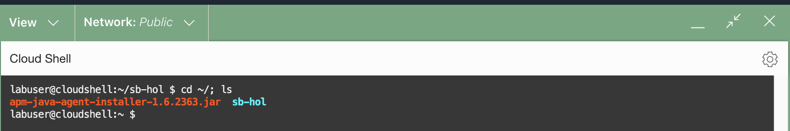

## **Task 3**: Copy the Java Agent installer to the file system

1.	Run the command below to copy the Java Agent installer file to the file system. Ensure to replace the **apm-agent-version** with that of the APM Java Agent you have, before the command execution.

    ``` bash
    <copy>
    kubectl cp apm-java-agent-installer-<apm-agent-version>.jar wstore-front-0:/apmlab-fss/
    </copy>
    ```

    > e.g., kubectl cp apm-java-agent-installer-1.6.2363.jar wstore-front-0:/apmlab-fss/


2.	Use the kubectl command below to remotely run the ls command in the container in the Kubernetes pod.

    ``` bash
    <copy>
    kubectl exec -it wstore-front-0 -- bash -c "cd /apmlab-fss && ls "
    </copy>
    ```

    If you see the java agent installer file in the location, the file transfer was successful.

   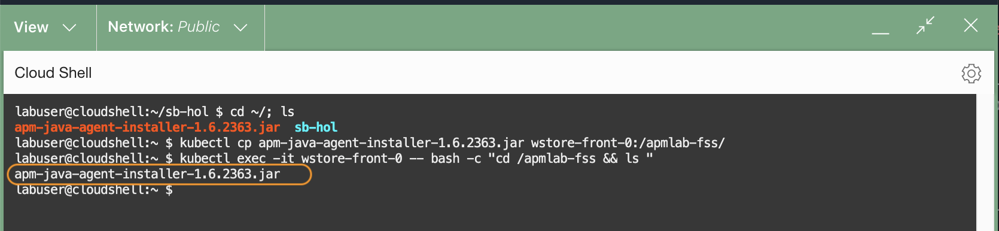

    >***NOTE***: The APM version may be different from what is showing in the example.

## **Task 4**: Provision the APM Java Agent


1.	Execute the command below to provision the APM Java agent. Replace the **APM Domain Private key** and **APM Domain Endpoint**, with the values saved in the Lab2, Task2. Please also change the **apm-agent-version** in the file name to the version of the agent you have.

    ``` bash
    <copy>
    kubectl exec -it wstore-front-0 -- bash -c "cd /apmlab-fss && java -jar ./apm-java-agent-installer-<apm-agent-version>.jar provision-agent -service-name=lab-WLS-svc -destination=.  -private-data-key=<APM Domain Private Key> -data-upload-endpoint=<APM Domain Endpoint>"
    </copy>
    ```
    E.g., kubectl exec -it wstore-front-0 -- bash -c "cd /apmlab-fss && java -jar apm-java-agent-installer-1.6.2363.jar provision-agent -service-name=WS-svc -destination=. -private-data-key=ABCDEFG12345ABCDEF123456ABCDE -data-upload-endpoint=https://abcdefgt12345aaaaaaaaabcdef.apm-agt.us-phoenix-1.oci.oraclecloud.com"

    With a successful installation, you should see the output similar to below.

   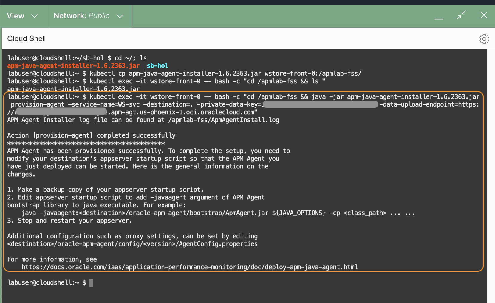

4.	Execute the below command to verify ***oracle-apm-agent*** directory is created under the apmlab-fss directory.

    ``` bash
    <copy>
    kubectl exec -it wstore-front-0 -- bash -c "cd /apmlab-fss && ls "
    </copy>
    ```

    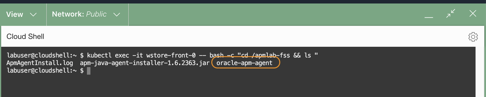

## **Task 5**: Deploy the Java Agent

Next, deploy the Java Agent by applying the wstore-deploy-agent.yaml file.


1.  Now you will need to update the configuration file and add java runtime argument that points to the APM Agent jar file bootstrap location. To save time, in this lab, we have preconfigured the changes in the **wstore-deploy-agent.yaml** file. Run the following diff command to verify the difference from the original **wstore-before.yaml** file.  

    ``` bash
    <copy>
    diff ~/sb-hol/wstore-before.yaml ~/sb-hol/wstore-deploy-agent.yaml
    </copy>
    ```
    Verify that the following changes are made to the statefulsets in the **wstore-deploy-agent.yaml** file respectively. Notice that the service names, **wstore-front** and **wstore-back**, are also added.


        command: ["java", "-javaagent:/apmlab-fss/oracle-apm-agent/bootstrap/ApmAgent.jar**", "-Dcom.oracle.apm.agent.service.name=wstore-front"**, "-jar", "./wineStore.jar", "--spring.config.location=file:/spring/wstore.properties"]

        command: ["java", "-javaagent:/apmlab-fss/oracle-apm-agent/bootstrap/ApmAgent.jar","-Dcom.oracle.apm.agent.service.name=wstore-back" ,"-jar", "./wineStore.jar", "--spring.config.location=file:/spring/wstore.properties"]


    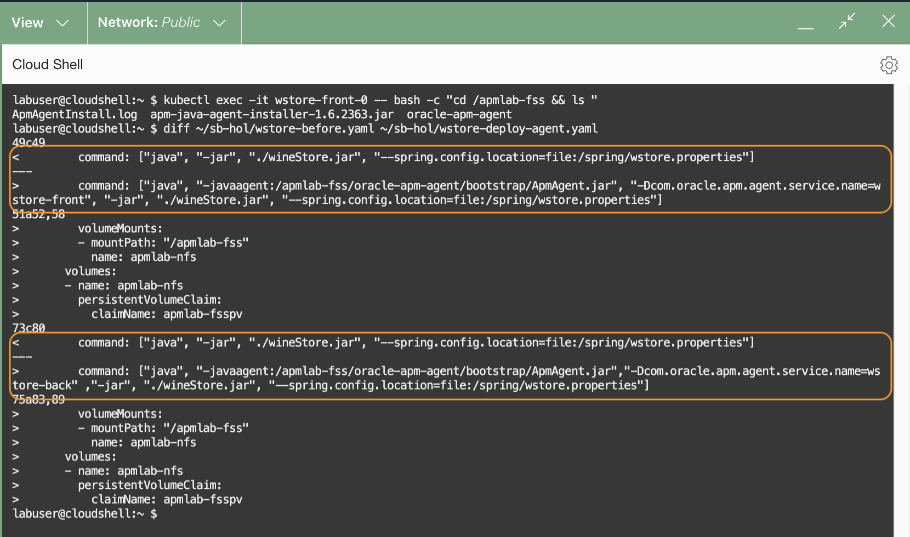    

2.	Optionally, run the following tail command to display the last 31 lines of the **wstore-deploy-agent.yaml** file and observe how the configurations are added.

    ``` bash
    <copy>
    tail -31 ~/sb-hol/wstore-deploy-agent.yaml
    </copy>
    ```
    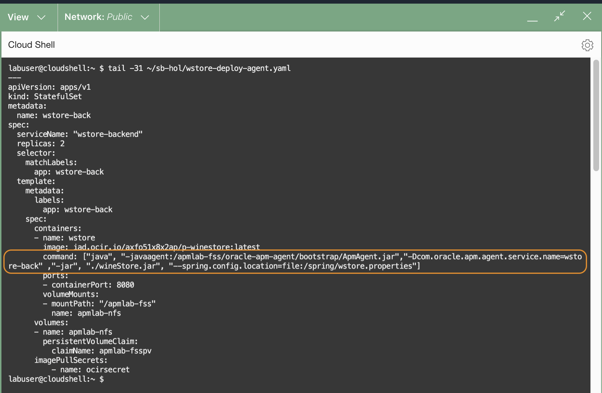

    >***Note:*** the trail command only shows one of the two statefulset as an example. You can use cat or vi commands to see the entire file to fully examine the configurations.


3.	Recreate the Kubernetes pods by applying the **wstore-deploy-agent.yaml** file.

    ```bash
    <copy>
    kubectl apply -f ~/sb-hol/wstore-deploy-agent.yaml --validate=false
    </copy>
    ```

    Verify the service and the statefulsets are configured.

    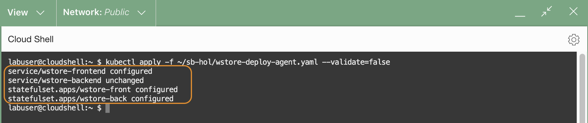    

5.	Wait for a few minutes, then run the following command to check the status of the pods. Make sure they are in the Running state and Ready.

    ```bash
    <copy>
    kubectl get pods
    </copy>
    ```
    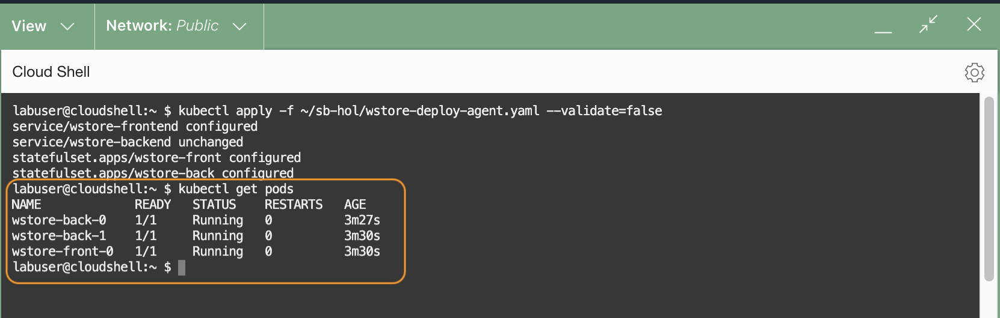

    Once the pods are in the Running state, the APM Java Agent is active and listening to the WineCellar application. It captures backend traces and spans which you can view in the APM Trace Explorer.

You may now **proceed to the next tutorial**.

## Acknowledgements

* **Author** - Yutaka Takatsu, Product Manager, Enterprise and Cloud Manageability
- **Contributors** - Steven Lemme, Senior Principal Product Manager,  
Avi Huber, Senior Director, Product Management
* **Last Updated By/Date** - Yutaka Takatsu, August, 2022
