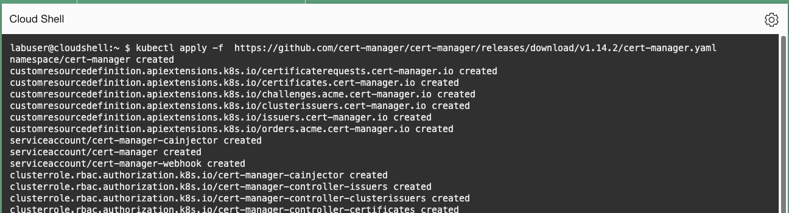
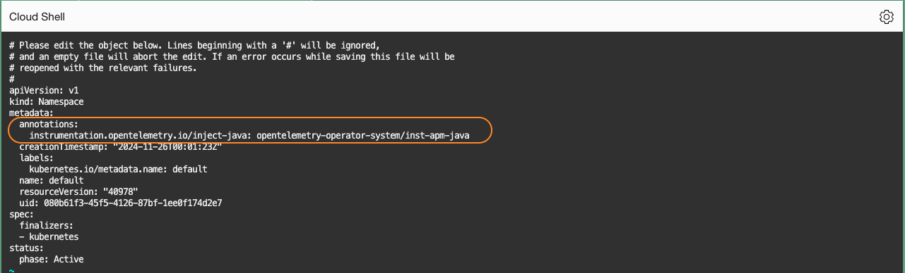
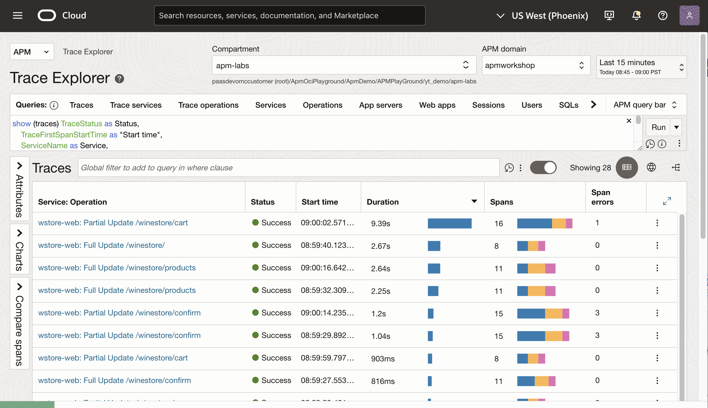

# Instrument the server monitoring with OpenTelemetry Operator

## Introduction

In this lab, you will instrement the application using the OpenTelemetry (OTEL) Operator, which automatically inject and configure APM Java Agent to the Kuberenetes cluster.

The OCI APM Java agent is designed to monitor Java applications and supports multiple deployment options across Kubernetes and other environments. The latest addition to these options is the OTEL operator, a Kubernetes operator that simplifies the automatic injection of Java agents into JVMs running in Kubernetes Pods.

   

Estimated time: 10 minutes


### Objectives

* Install cert-manager and the OpenTelemetry Operator
* Use Kubernetes Custom Resouces and annotations to deploy the APM agent to the cluster
* Verify data collection in the APM Trace Explorer page


### Prerequisites

* Completion of the preceding labs in this workshop

## Task 1: Install cert-manager and OpenTelemetry Operator

As a pre-requisite to automataically deploy APM Java agent in the Kuberenetes, cert-manager and OpenTelemetry Operator must to be installed.

1. Run the command below to install cert-manager.

    ``` bash
    <copy>
    kubectl apply -f  https://github.com/cert-manager/cert-manager/releases/download/v1.14.2/cert-manager.yaml
    </copy>
    ```
   

2. Once the command is complete, wait for 30 seconds to complete the configurations in the background. Then install the **[OpenTelemetry Operator](https://github.com/open-telemetry/opentelemetry-operator)** into the Kubernetes cluster by running the command below. 

    ``` bash
    <copy>
    kubectl apply -f  https://github.com/open-telemetry/opentelemetry-operator/releases/latest/download/opentelemetry-operator.yaml
    </copy>
    ```
   
   
 
 >**Note:** if you see an error, **no endpoints available for service "cert-manager-webhook"**, re-run the command to install OpenTelemetry Operator.

## Task 2: Create Kubernetes custom resource definition

To manage automatic instrumentation, the operator must have information about the agent and its configuration.

The first requirement is addressed using a Custom Resource Definition (CRD). The Custom Resource will be used by the operator to copy the agent into the pod with required configuration. The OpenTelemetry operator uses Kubernetes annotations to determine which pods should be automatically injected with the OCI APM Java agent.

1. To create a custom resource definition, replace **Data Upload Endpoint**, and the **Private Data key** (copied from the APM domain adminstration page in the previous labs) in the command below, and then execute it.

    ``` bash
    <copy>
    kubectl apply -f - <<EOF
    apiVersion: opentelemetry.io/v1alpha1
    kind: Instrumentation
    metadata:
      name: inst-apm-java
      namespace: opentelemetry-operator-system
    spec:
      java:
        image: container-registry.oracle.com/oci_observability_management/oci-apm-java-agent:latest
        env:
          - name: OTEL_com_oracle_apm_agent_data_upload_endpoint
            value: <DATA UPLOAD END POINT>
          - name: OTEL_com_oracle_apm_agent_private_data_key
            value: <PRIVATE DATA KEY>
    EOF
    </copy>
    ```

    

 >**Note:** You can ignore the warning. 

## Task 3: Add an annotation to the namespace

Another requirement to manage automatic instrumentation is to specify which pods should be instrumented. This is handed by special annotations. Annotations can be added to a namespace to inject all pods within that namespace. Alternatively, annotations can be applied to individual PodSpec objects, such as those in Deployment, StatefulSet, and other resources. In this lab, annotation is applied to the entire namespace for the learning purposes.

1. Open the namespage to edit.

    ``` bash
    <copy>
    kubectl edit namespace default
    </copy>
    ```
 Copy the below lines below and insert them as shown in the example image. Ensure the indentation matches the level of the "labels:" key.
    ``` bash
    <copy>
    annotations:
      instrumentation.opentelemetry.io/inject-java: "opentelemetry-operator-system/inst-apm-java"
    </copy>
    ```
     

## Task 4: Redeploy the application

1.  Run the the command below to restart the stafulsets. This will redeploy the application.

    ``` bash
    <copy>
    kubectl rollout restart statefulset 
    </copy>
    ```

     
    
2. Ensure the pods are in the running state. This may take a few minutes.  

   ``` bash
    <copy>
    kubectl get pods
    </copy>
    ```
3. Run the command below to obtain the application's external IP address. 

    ``` bash
    <copy>
    kubectl get svc
    </copy>
    ```
     

## Task 5: Verify the collection of traces and spans

5. Open a browser, type in the URL, and confirm that the page contents is loaded.


    ``` bash
    <copy>
    http://<External IP>/winestore
    </copy>
    ```
    


6. Navigate through the page content to generate some workload. For example, add a few products to the cart and view the shopping cart.

7. Open the OCI navigation menu, select **Observability and Management**, and then choose **Trace Explorer** under **Application Performance Monitoring**.

    

8. Select the compartment and the APM domain used for the lab. Verify that the traces are collected and displayed on the screen.
    


You may now **proceed to the next lab**.

## Acknowledgements

* **Author** - Yutaka Takatsu, Product Manager, Enterprise and Cloud Manageability
- **Contributors** - Steven Lemme, Senior Principal Product Manager,  
Anand Prabhu, Sr. Member of Technical Staff,  
Mike Mu, Principal Member of Technical Staff
Avi Huber, Vice President, Product Management
* **Last Updated By/Date** - Yutaka Takatsu, November 2024
