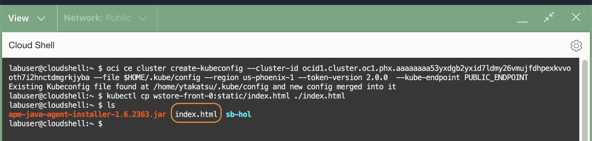
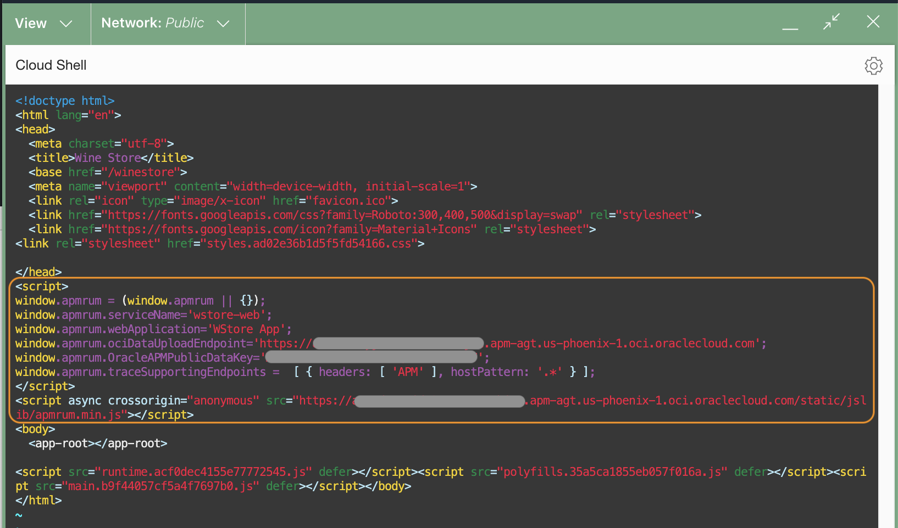
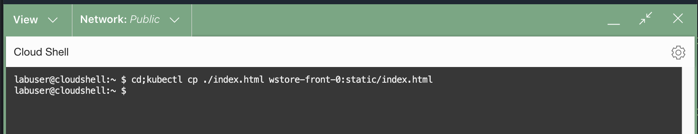
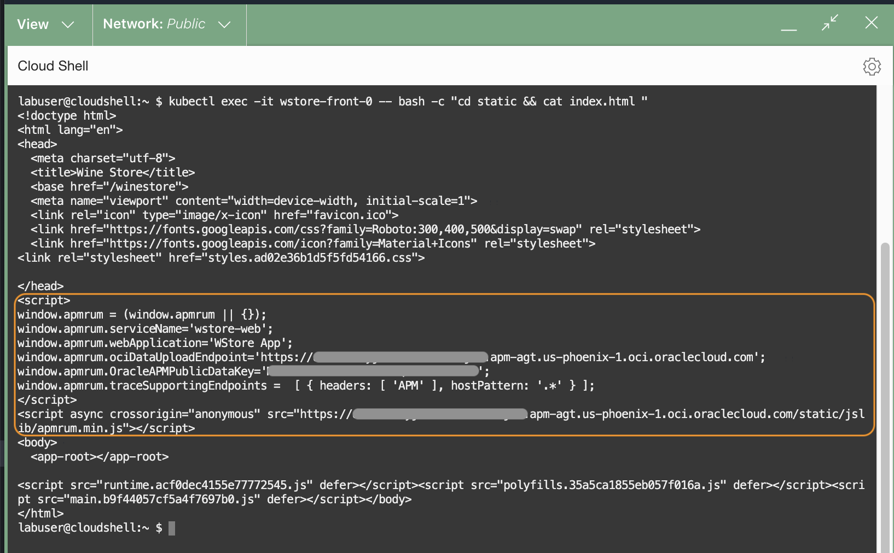

# Instrumentation for browser monitoring

## Introduction

In the previous lab, you have instrumented the application with an APM java agent, which captures traces and spans generated by the server. In this lab you will configure an APM browser agent that captures traces and spans generated by the browser. You will insert a javascript to the application's index.html file to deploy the APM browser agent.

To simplify the application setup process, the index.html file is located in a kubernetes pod. You will copy the file from the container, edit the file by injecting the JavaScript, then copy back in the container.  
Estimated time: 10 minutes

### Objectives

* Instrument browser by injecting JavaScript code to the webpage

### Prerequisites

* Completion of the preceding labs in this workshop

## **Task 1**: Copy index.html from the container

1. Run the oci ce (Container Engine) command that you saved in the Lab 2, Task 2, step 5.
2. Execute the following command to copy ***index.html*** from the container to the home directory.

    ``` bash
    <copy>
    cd;kubectl cp wstore-front-0:static/index.html ./index.html
    </copy>
    ```

3.	Run "ls" command in the home directory, to verify that the file is transferred to the Cloud Shell.

    ``` bash
    <copy>
    ls
    </copy>
    ```

   

## **Task 2**: Edit the index.html file

1.	Open the index.html with an editor.

    ```bash
    <copy>
    vi ~/index.html
    </copy>
    ```

2. Insert the following JavaScript to the index.html file, just below the &lt;/head&gt; tag. Replace **Data Upload Endpoint** and the **Public Data key**. Note that there are two locations you will need to replace the Data Upload Endpoint.


    ```bash
    <copy>
    <script>
    window.apmrum = (window.apmrum || {});
    window.apmrum.serviceName='wstore-web';
    window.apmrum.webApplication='WStore App';
    window.apmrum.ociDataUploadEndpoint='<DataUploadEndpoint>';
    window.apmrum.OracleAPMPublicDataKey='<Public_Datakey>';
    window.apmrum.traceSupportingEndpoints =  [ { headers: [ 'APM' ], hostPattern: '.*' } ];
    </script>
    <script async crossorigin="anonymous" src="<DataUploadEndpoint>/static/jslib/apmrum.min.js"></script>
    </copy>
    ```
    Save the changes and close the file.

    

## **Task 3**: Upload index.html file to the container

1. Execute the following command to copy the ***index.html*** file back to the container.

   ``` bash
   <copy>
   cd;kubectl cp ./index.html wstore-front-0:static/index.html
   </copy>
   ```
  

2. Verify the successful file transfer, by running the following command.


  ``` bash
  <copy>
  kubectl exec -it wstore-front-0 -- bash -c "cd static && cat index.html "
  </copy>
  ```
  Ensure you see the changes made in the previous step.

  

You may now **proceed to the next tutorial**.

## Acknowledgements

* **Author** - Yutaka Takatsu, Product Manager, Enterprise and Cloud Manageability
- **Contributors** - Steven Lemme, Senior Principal Product Manager,  
Avi Huber, Senior Director, Product Management
* **Last Updated By/Date** - Yutaka Takatsu, January 2022
