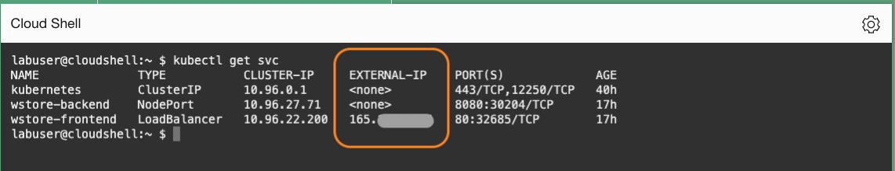
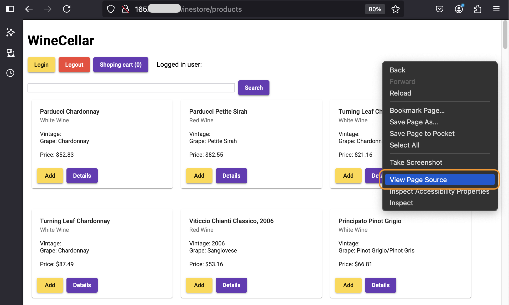
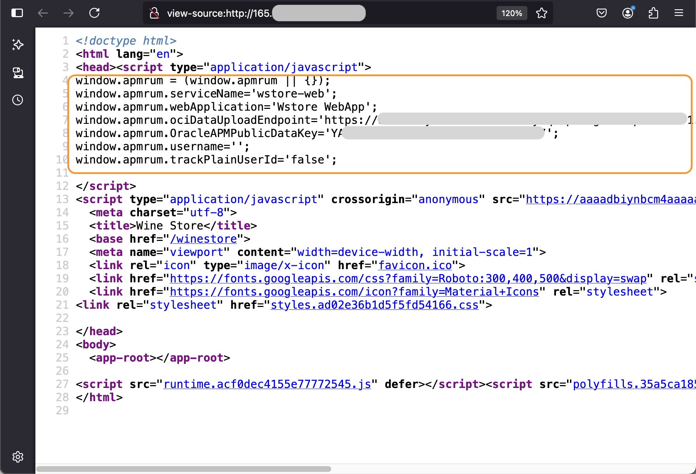
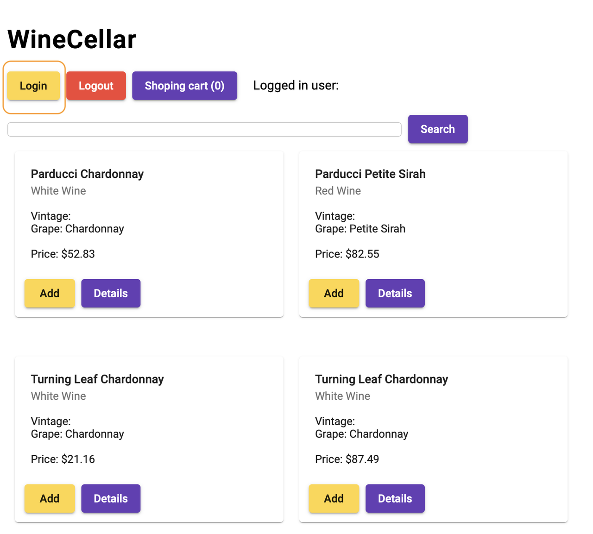
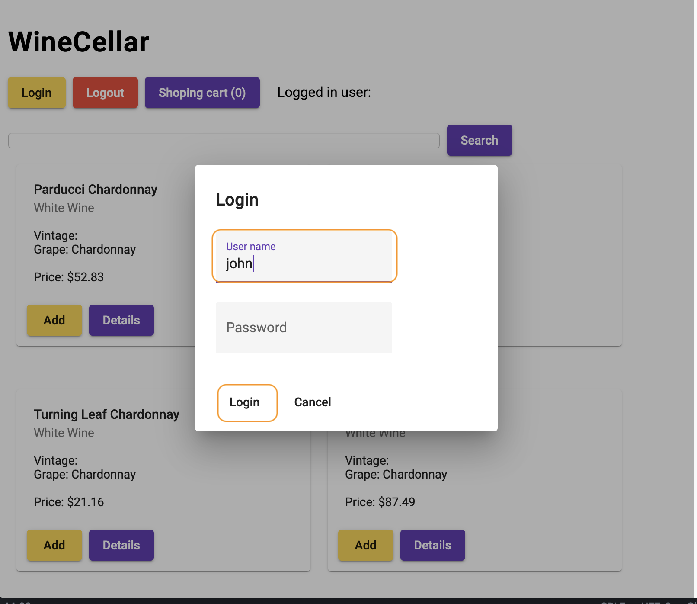
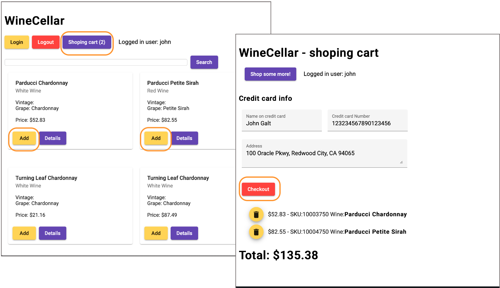
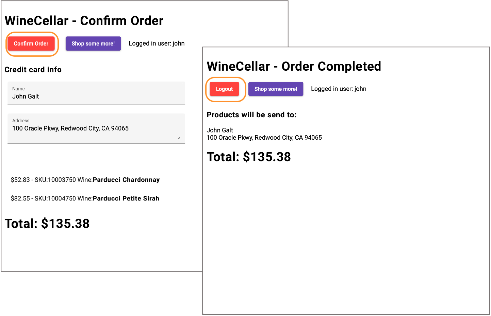
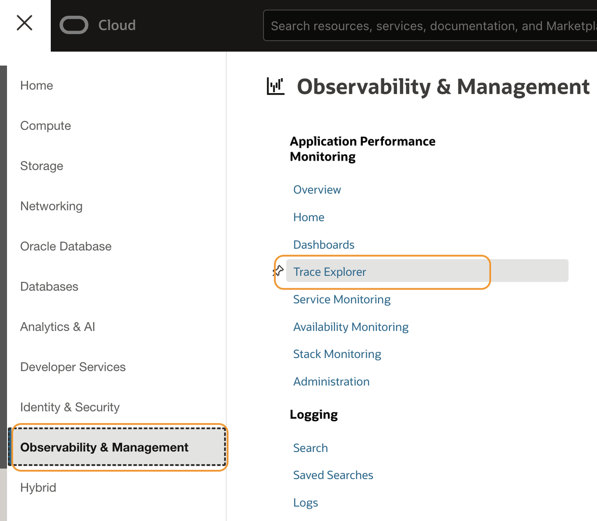
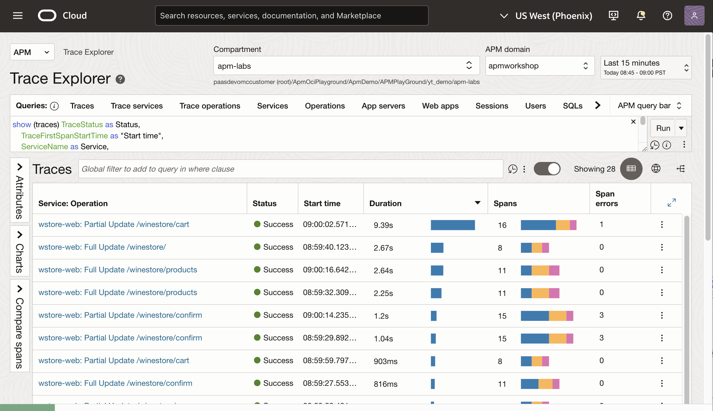

# Verify APM Agent setup and data collection 

## Introduction

In the previous lab, you instrumented the application with an APM java agent, which captures traces and spans generated by the server, using OpenTelemetry Operator. You have also added browser injection that is automatically configured by the APM Java agent. In this lab, you will ensure the APM agents are added to the application and collects traces and spans. 

Estimated time: 5 minutes

### Objectives

* Verify the APM Browser Agent injection in the WineCellar applicatin.
* Generate workload on the application by navigating through the pages.
* Verify data collection on APM Trace Explorer page.  

### Prerequisites

* Completion of the preceding labs in this workshop

## Task 1: Verify the APM Browser Agent injection

1. If you are starting a new Oracle Cloud Shell session, run the oci ce (Container Engine) command that you saved in Lab 3, Task 2, step 5.

2. From the Oracle Cloud shell, enter the following command.

    ``` bash
    <copy>
    kubectl get svc
    </copy>
    ```

    From the output, find the wstore-frontend service. Note down the External-IP.

   


   >**Note:**

   - The IP may be different from the last time when you accessed the WinCellar app because the pods are regenerated.
   - If the application is not starting up, run the **kubectl get pods** command and check the status. It may take a few minutes to see the pods in the running state.

3.	On your laptop, start a browser and access the application with the URL pattern:

    ``` bash
    <copy>
    http://<External IP of the Load Balancer>/winestore/
    </copy>
    ```
4.  WinCellar application launches.

    


5.  Right mouse click on the browser and select a menu item to view the page source.

   

6.  Verify the Browser Agent JavaScript is in the page source.

   


    >**Note:** If you do not see the Browser Agent JavaScript in the source, remove the browser cache, or try with a different browser.

7.  Close the page source.  

## Task 2: Generate workload by navigating to the app


1.  Click **Login**.

    


2.  Enter your name (or john) as username, leave the password blank, and click **Login**.

    


3. Then click around the buttons in the pages, as in the example flow shown below.

    >**Note:** Do not worry if you see the "Failed" messages, or if it takes a long time for the pages to respond. Those are expected because the app is designed to fail every once and often for demo purposes.

    Click **Add** on a couple of products then hit **Shopping Cart**. Then Click **Checkout**.
    
    Click **Confirm Order**, then **Logout**.
    

## Task 3: Verify the collection of traces and spans

1. Navigate through the page content to generate some workload. For example, add a few products to the cart and view the shopping cart.

2. Open the OCI navigation menu, select **Observability and Management**, and then choose **Trace Explorer** under **Application Performance Monitoring**.

    

3. Select the compartment and the APM domain used for the lab. Verify that the traces are collected and displayed on the screen.
    


You may now **proceed to the next lab**.

## Acknowledgements

* **Author** - Yutaka Takatsu, Product Manager, Enterprise and Cloud Manageability
- **Contributors** - Steven Lemme, Senior Principal Product Manager,  
Anand Prabhu, Sr. Member of Technical Staff,  
Avi Huber, Vice President, Product Management
* **Last Updated By/Date** - Yutaka Takatsu, November, 2024
