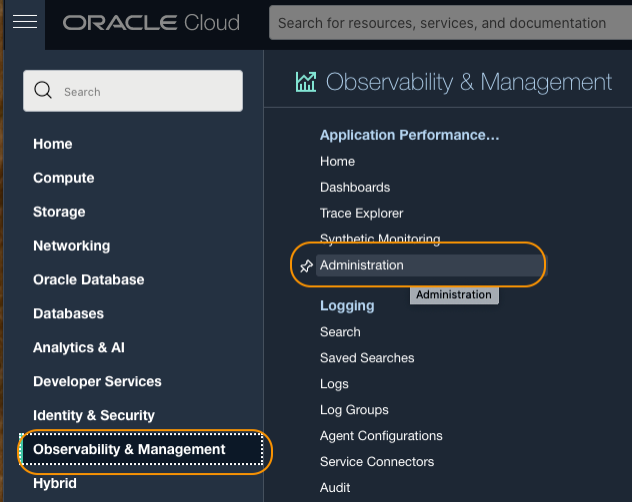

# Instrument the server monitoring on the block volumes

## Introduction

In this lab, you will download the APM Java Agent installer file from the Oracle Cloud console, upload it to the Oracle Cloud shell, transfer it to the Kubernetes container, provision the Java Agent to the block volumes, and finally, deploy the Agent to the Kubernetes pods.

***Please proceed to this lab only if you completed Lab 4 (Free Trial): "Create and configure block volumes".***

***For users who completed Lab 4 (Free Trial): "Create and configure a file system", please complete the previous lab, Lab 5 (Paid Tenancy): "Instrument server monitoring for the file system".***

Estimated time: 10 minutes


### Objectives

* Download the APM Java Agent from the Oracle Cloud console
*	Upload the APM Java Agent to the Cloud shell
*	Copy the Java Agent installer from the Cloud shell to the block volumes
*	Provision the APM Java Agent in the block volumes
*	Deploy the Java Agent to the Kubernetes pods

### Prerequisites

* Completion of the preceding labs in this workshop

## Task 1: Obtain APM Java Agent download link

1.	Open the navigation menu from the Oracle Cloud console, and select **Observability & Management** > **Administration**.

   

2.	Under **Resources** at the lower left side of the screen, click **Download APM Agent**

   

3.	Manually copy the **Agent Version** and paste it to a text file.

   

4. 	Open the Cloud Shell by clicking the **Developer tools** icon > select **Cloud shell** from the top right corner of the Oracle Cloud console. Restore the Cloud Shell if minimized.

   


## Task 2: Download the APM Java Agent to the Cloud shell

1.  Type the following command into the Cloud Shell. Make sure to ***replace*** the **Agent version** with the copied text from the previous steps.

    ``` bash
    <copy>
    cd ~/; wget https://repo1.maven.org/maven2/com/oracle/apm/agent/java/apm-java-agent-installer/<Agent version>/apm-java-agent-installer-<Agent version>.jar
    </copy>
    ```

    E.g., cd ~/; wget https://repo1.maven.org/maven2/com/oracle/apm/agent/java/apm-java-agent-installer/1.8.3326/apm-java-agent-installer-1.8.3326.jar


    >**Note:** If you received **No such file or directory** error, it may be a new version of the agent is being updated. Please run the following URL on a browser and find the Agent version available at the Maven central.
      ``` bash
      <copy>
      https://repo1.maven.org/maven2/com/oracle/apm/agent/java/apm-java-agent-installer
      </copy>
      ```
       


2.	Hit the enter key and verify the message to ensure the successful file transfer.

3.  Type the ls command. Confirm that the java agent file installer is in the home directory.

    ``` bash
    <copy>
    ls ~
    </copy>
    ```
   

## Task 3: Copy the Java Agent installer to the file system

1.	Run the commands below to copy the Java Agent installer file to the block volumes. Ensure to ***replace*** the **apm-agent-version** with that of the APM Java Agent you have, before the command execution. Note that you created PVCs in two different Block Volumes, so you will need to copy the agent installer file to both volumes.  

    a) Copy the installer file to the volume **apmlab-fss**

    ``` bash
    <copy>
    kubectl cp apm-java-agent-installer-<apm-agent-version>.jar wstore-front-0:/apmlab-fss/
    </copy>
    ```
    b) Repeat to Copy the installer file to the volume **apmlab-fss2**

    ``` bash
    <copy>
    kubectl cp apm-java-agent-installer-<apm-agent-version>.jar wstore-back-0:/apmlab-fss2/
    </copy>
    ```


    > - e.g., kubectl cp apm-java-agent-installer-1.8.3326.jar wstore-front-0:/apmlab-fss/  
    - The command copies the Agent installer to the **wstore-front**, but it can be copied to any pod as the way we set up, all pods share the same file system.


2.	Use the kubectl commands below to remotely run the ls command in the containers in the Kubernetes pods.

    ``` bash
    <copy>
    kubectl exec -it wstore-front-0 -- bash -c "cd /apmlab-fss && ls "
    </copy>
    ```

    ``` bash
    <copy>
    kubectl exec -it wstore-back-0 -- bash -c "cd /apmlab-fss2 && ls "
    </copy>
    ```

    If you see the java agent installer file in the location, the file transfer was successful.

   

    >**Note:** The APM version may be different from what is shown in the example.

## Task 4: Provision of the APM Java Agent


1.	Execute the command below to provision the APM Java agent. ***Replace*** the **APM Domain Private key** and **APM Domain Endpoint**, with the values saved in Lab2, Task2. Please also ***change*** the **apm-agent-version** in the file name to the version of the agent you have. Note that you will need to provision the agent in both volumes, **apmlab-fss** and **apmlab-fss2**.

    a) Provision the Java agent to the frontend volume **apmlab-fss**
    ``` bash
    <copy>
    kubectl exec -it wstore-front-0 -- bash -c "cd /apmlab-fss && java -jar ./apm-java-agent-installer-<apm-agent-version>.jar provision-agent -service-name=WS-svc -destination=.  -private-data-key=<APM Domain Private Key> -data-upload-endpoint=<APM Domain Endpoint>"
    </copy>
    ```
    b) Provision the Java agent to the backend volume **apmlab-fss2**
    ``` bash
    <copy>
    kubectl exec -it wstore-back-0 -- bash -c "cd /apmlab-fss2 && java -jar ./apm-java-agent-installer-<apm-agent-version>.jar provision-agent -service-name=WS-svc -destination=.  -private-data-key=<APM Domain Private Key> -data-upload-endpoint=<APM Domain Endpoint>"
    </copy>
    ```


    E.g., kubectl exec -it wstore-front-0 -- bash -c "cd /apmlab-fss && java -jar apm-java-agent-installer-1.8.3326.jar provision-agent -service-name=WS-svc -destination=. -private-data-key=ABCDEFG12345ABCDEF123456ABCDE -data-upload-endpoint=https://abcdefgt12345aaaaaaaaabcdef.apm-agt.us-phoenix-1.oci.oraclecloud.com"

    With a successful installation, you should see the output similar to below.

   


2.	Execute the below command to verify ***oracle-apm-agent*** directory is created under the **apmlab-fss** and **apmlab-fss2** directories.

    ``` bash
    <copy>
    kubectl exec -it wstore-front-0 -- bash -c "cd /apmlab-fss && ls "
    </copy>
    ```
    ``` bash
    <copy>
    kubectl exec -it wstore-back-0 -- bash -c "cd /apmlab-fss2 && ls "
    </copy>
    ```
    

## Task 5: Deploy the Java Agent

The next step is to deploy the Java Agent. First, update the **wstore.yaml** file by adding the java runtime argument that points to the APM Agent jar file bootstrap location, then apply to the Kubernetes pods. Notice that the service names, **wstore-front** and **wstore-back**, that are used to display in the APM Trace Explorer, are also added to the command for the statefulsets.

1.  Use any editor to open the wstore.yaml file.

    ``` bash
    <copy>
    vi ~/sb-hol/wstore.yaml
    </copy>
    ```
2. Find the following line in each statefulset, where Java runtime arguments are set. (Look for lines 49 and 80, assuming the volumes were added as expected in the previous steps).

    >command: ["java", "-jar", "./wineStore.jar", "--spring.config.location=file:/spring/wstore.properties"]


3. Hit **i**. Locate line 49, then insert the following arguments after the **command: ["java",**.

    ``` bash
    <copy>
     "-javaagent:/apmlab-fss/oracle-apm-agent/bootstrap/ApmAgent.jar", "-Dcom.oracle.apm.agent.service.name=wstore-front",
    </copy>
    ```

4. Next, locate line 80, and insert the following arguments after the **command: ["java",**.

    ``` bash
    <copy>
     "-javaagent:/apmlab-fss2/oracle-apm-agent/bootstrap/ApmAgent.jar", "-Dcom.oracle.apm.agent.service.name=wstore-back",
    </copy>
    ```
    The image below shows the **wstore-back** statefulset after the successful editing, for example. Please note that you will need to add the arguments to both statefulsets, **wstore-front** and **wstore-back**, and the service names have to be configured differently.

      


5.	Recreate the Kubernetes pods by applying the **wstore-deploy-agent.yaml** file.

    ```bash
    <copy>
    kubectl apply -f ~/sb-hol/wstore.yaml --validate=false
    </copy>
    ```

    Verify the service and the statefulsets are configured.

        

6.	Run the following command to check the status of the pods. Make sure they are in the Running state and Ready. If the status is pending, re-run the command. If they do not come back after a few minutes, review the file to ensure the editing was done correctly.  

    ```bash
    <copy>
    kubectl get pods
    </copy>
    ```
    

    Once the pods are in the Running state, the APM Java Agent is active and listening to the WineCellar application. It captures backend traces and spans which you can view in the APM Trace Explorer.

You may now **proceed to the next lab**.

## Acknowledgements

* **Author** - Yutaka Takatsu, Product Manager, Enterprise and Cloud Manageability
- **Contributors** - Steven Lemme, Senior Principal Product Manager,  
Anand Prabhu, Sr. Member of Technical Staff,  
Avi Huber, Vice President, Product Management
* **Last Updated By/Date** - Yutaka Takatsu, March 2023
