# View traces and spans in APM Trace Explorer

## Introduction

In this lab, you will learn how to use the APM Trace Explorer to trace the workload generated with the WineCellar demo application.

Estimated time: 10 minutes

Watch the video below for a quick walk-through of the lab.
[View traces and spans in APM Trace Explorer](videohub:1_ax6iqqu1)

### Objectives

*	Examine values in the span dimensions for the frontend browser and the backend Spring Boot server
* Use dimensions to automatically update the query and filter the selection

### Prerequisites

* Completion of preceding labs in this workshop.

## Task 1: Examine traces in APM Trace Explorer

1.  From the OCI menu, From the OCI menu, select **Observability & Management** > **Trace Explorer**

2.  On the Trace Explorer page, select **apmworkshop** for the **Compartment** and the **APM Domain**.

   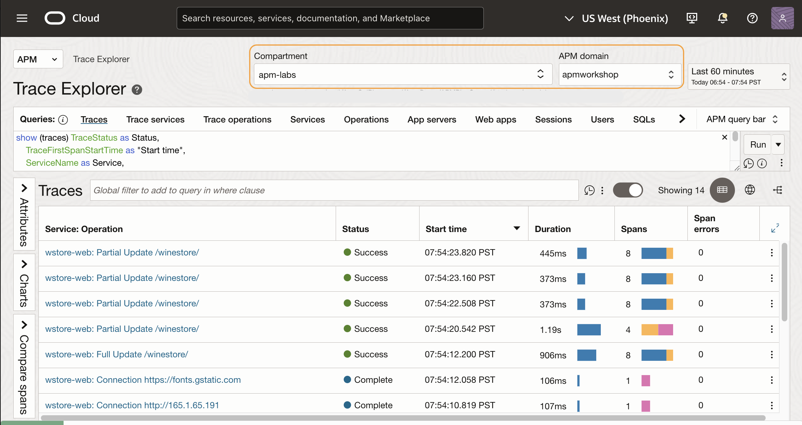

3.	By default, traces are displayed in the order by the start time. Right mouse click on the **Duration** column, select **Sort Descending** to show the traces by duration in descending order. This will bring the slowest trace to the top of the list.

   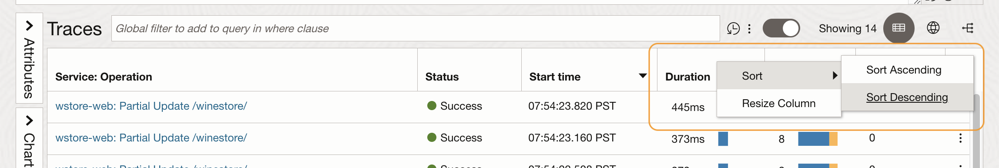

4. Hover the mouse over the bar in the **Spans** column at the top row. Verify three services are included in the trace, and each color represents a service, wstore-back, wstore-front, and wstore-web, which you defined in the previous labs.

  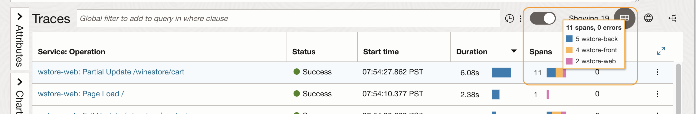

5.	Click the trace link at the **Service:Operationame** column.

   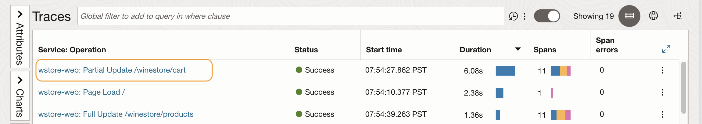

   >**Note:** If you do not see a slow trace with a duration of 10 seconds or more, you can navigate the WineStore demo app a few times until you see the programmed slowness in the checkout service.

6. **Trace Details** page opens. Review the trace information on the upper screen. E.g., Status, Trace ID, Whether it has an error or not, how many spans and services are involved, or the duration of the trace.
   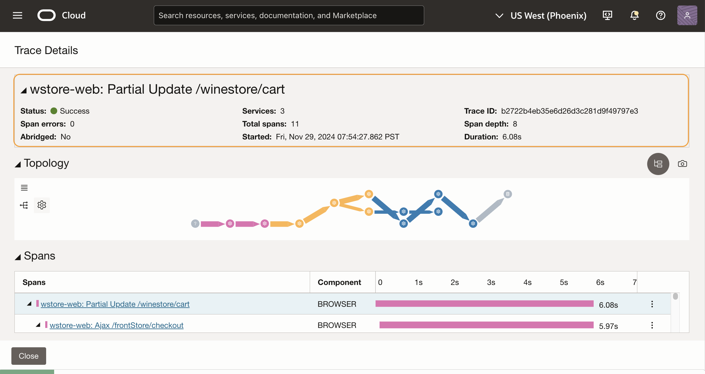

7. In the **Topology** view, you can see how the operations are connected within the trace. Different colors indicate different services. Hover the mouse on the icons and the arrows that connect the icons. Review the information in the callouts.
  

  In this example, it seems that the checkout service is where the most time was spent in the trace.

  >**Note:** The operations may look differently in the trace you selected.

8. Scroll down the page to show the **Spans** view. Spans in the trace are displayed in a Gantt chart. A span at the top of the list is the root span, and the child spans are nested below the root span.

  

  In this example, one of the operations is taking 5 seconds alone, out of the total duration of 6 seconds. This seems to be the bottleneck of the slowness.

9. Click the operation name link.

  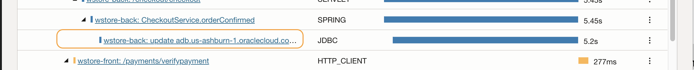

10. This opens a **Span Details** view. Review the span information, such as the operation name, which service it belongs to, start date and time, start time after the trace started, duration of the span, Trace ID, and Span ID.

  

  From the operation name, this is a JDBC span that is generated by requesting a call to the database.

11. Scroll down and review the collected dimension values. In this example, there are 67 dimensions collected. E.g., App server, Host, Kubernetes, and performance information. In addition, it has database information, because this is a JDBC span.

  

12. Click **Close** to close the **Span Details** view.

13. Click the **Close** to close the **Trace Details** view.. This will bring you back to the Trace Explore the main view.

  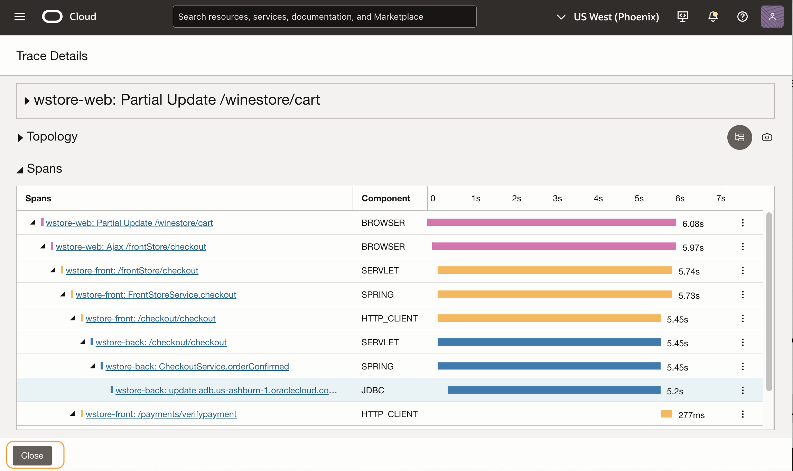

## Task 2: Filter traces with dimensions

1. Click **Attributes** from the left side of the Trace Explorer main screen. This will slide out the Attribute pane.

  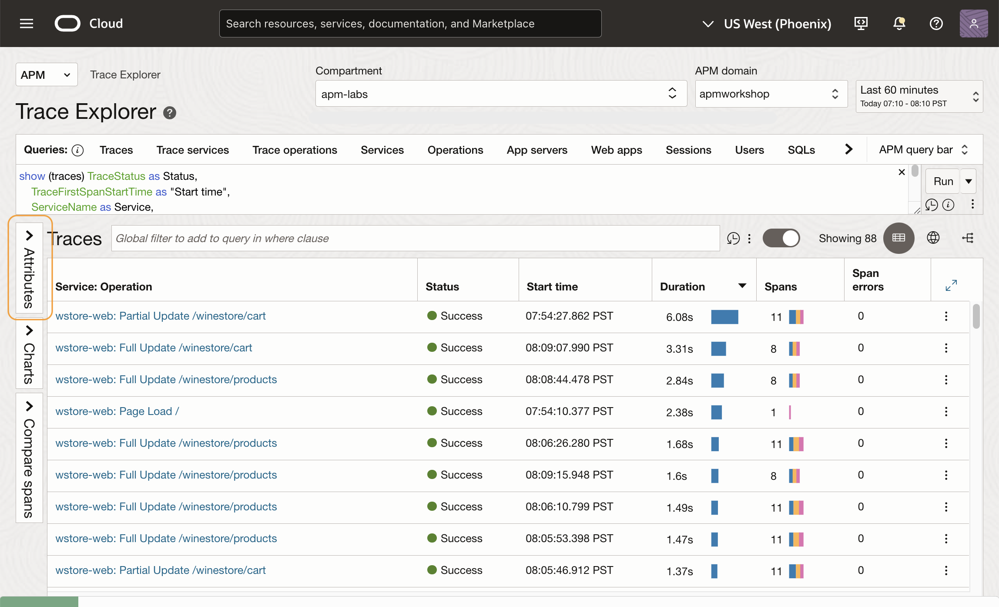

2. Type '**apdex**' into the search field. Then click **ApdexLevel** from the list.

  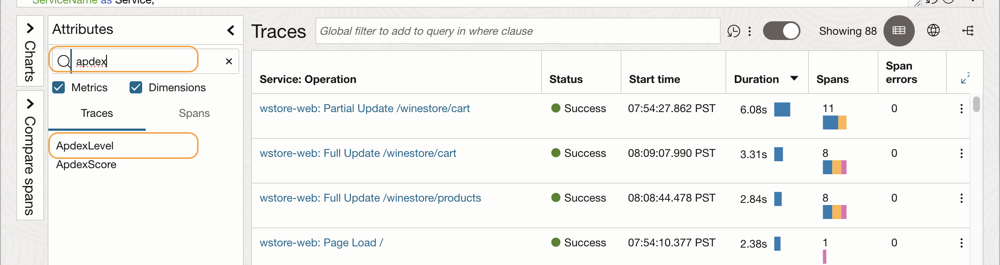

3. **Dimension ApdexLevel Values** window opens. Apdex or Application Performance Index measures customer satisfaction based on applications' page or service performance. Review the values and counts. In this example, there are 8 frustrated traces, 8 tolerating traces, and 62 satisfied traces.

  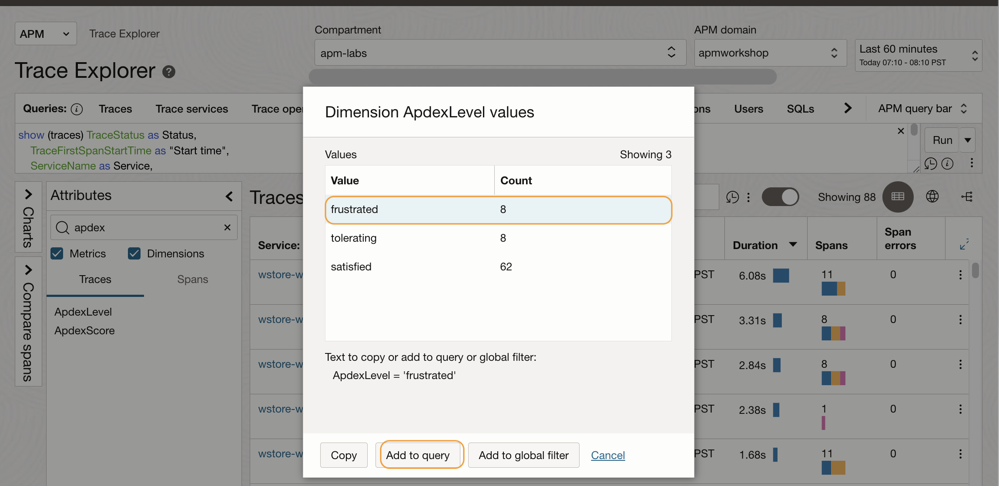

  Select **frustrated** from the list, then click **Add to Query**.

4. Notice that the condition  **("ApdexLevel" = 'frustrated')** has been inserted to the query. 

  

5. Traces view is refreshed and shows only traces that **ApdexLevel** is frustrated.

  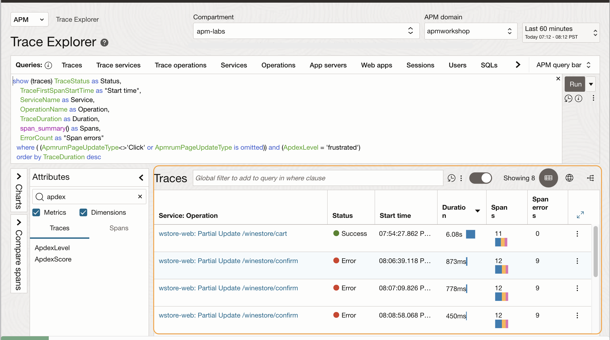

## Conclusions

In this workshop, you learned how to use the Kubernetes OpenTelemetry Operator to automatically deploy an APM Java agent to a microservices web application. You also explored how to configure the APM Browser agent within a custom resource definition and use the APM Trace Explorer to view traces and spans. For more information on APM, refer to the OCI documentation, **[Application Performance Monitoring](https://docs.oracle.com/en-us/iaas/application-performance-monitoring/index.html)**.

## Acknowledgements

* **Author** - Yutaka Takatsu, Product Manager, Enterprise and Cloud Manageability
- **Contributors** - Steven Lemme, Senior Principal Product Manager,  
Anand Prabhu, Sr. Member of Technical Staff,  
Avi Huber, Vice President, Product Management
* **Last Updated By/Date** - Yutaka Takatsu, November, 2024
