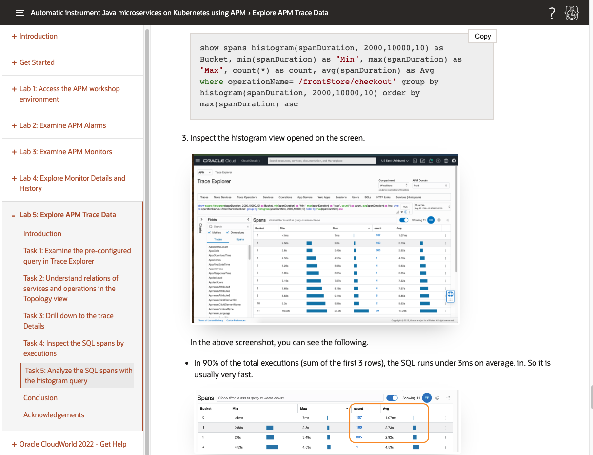
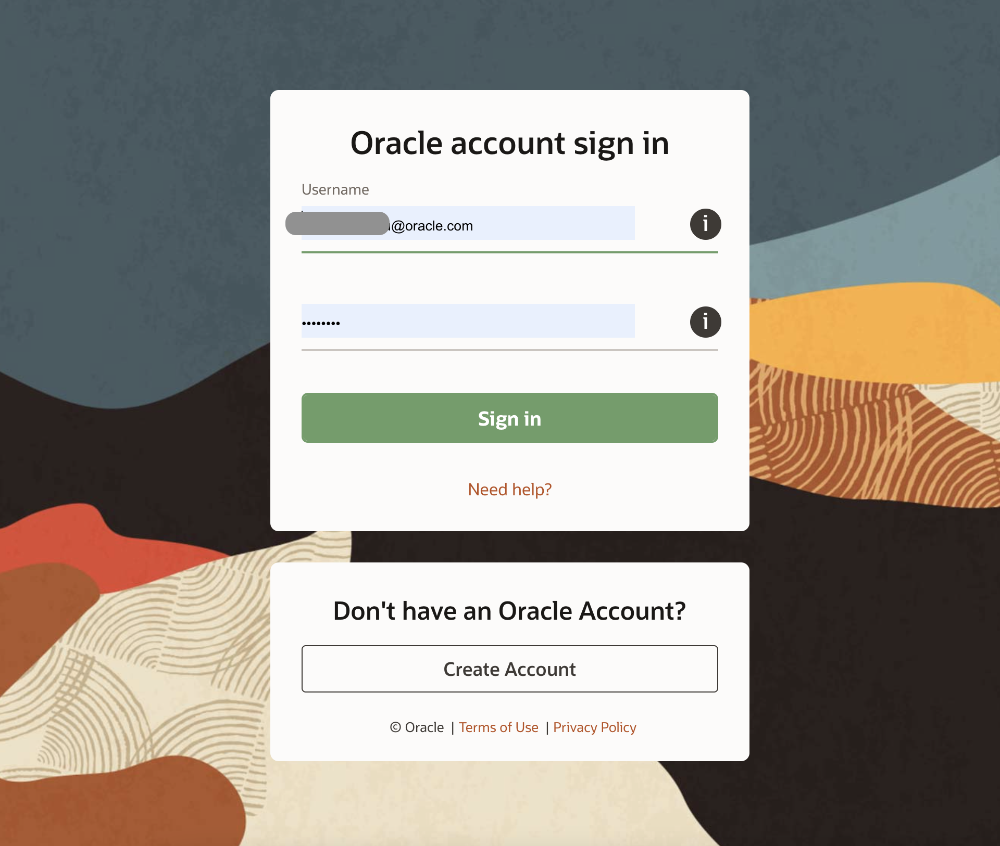
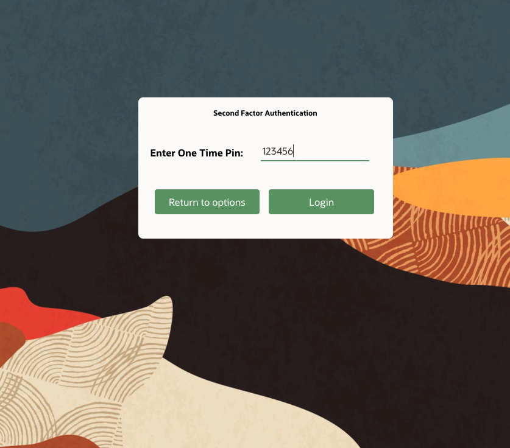
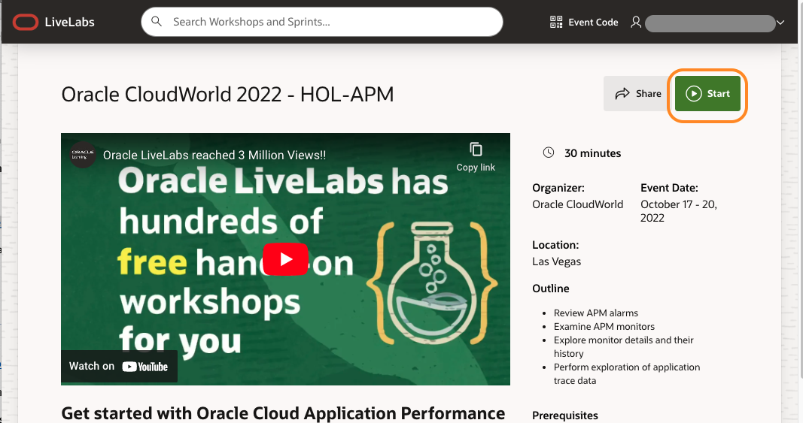
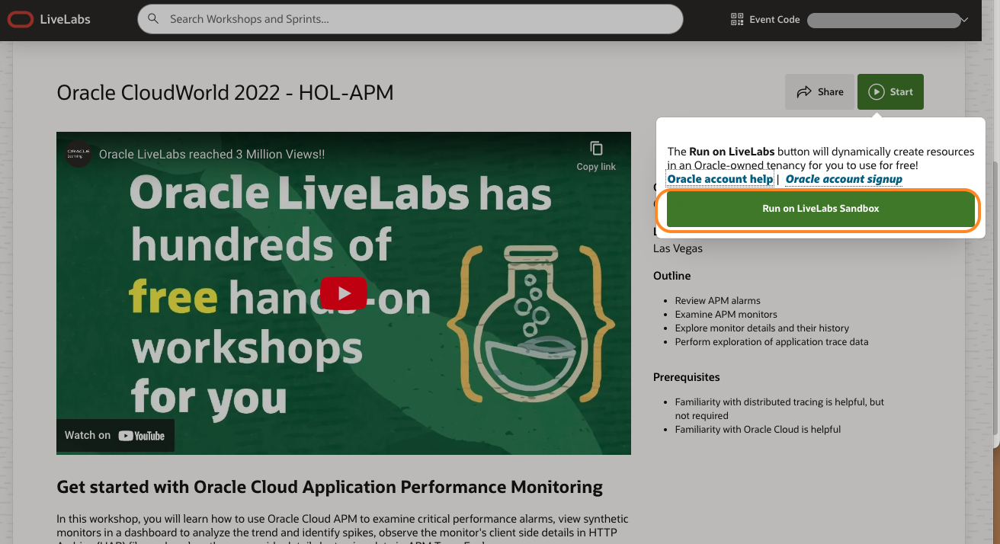

# Learn more about APM

## Introduction

Congratulations! You have completed the workshop.

To learn more about APM, please visit **Get started with Oracle Cloud Application Performance Monitoring** workshop.

  
  

In this workshop, you will learn how to use Oracle Cloud APM to examine critical performance alarms, view synthetic monitors in a dashboard to analyze the trend and identify spikes, observe the monitor's client-side details in HTTP Archive (HAR) file, and explore the server-side details by tracing data in APM Trace Explorer.

### Objectives

* Review APM alarms
* Examine APM synthetic monitors
* Explore monitor details and their history
* Perform exploration of application trace data

### Prerequisites

* Familiarity with distributed tracing is helpful, but not required
* Familiarity with Oracle Cloud is helpful

## Task 1: Access the workshop

1. Click the link following URL to access the workshop: **[Get started with Oracle Cloud APM](https://apexapps.oracle.com/pls/apex/r/dbpm/livelabs/view-workshop?wec=2681-VVAB-USGL-IJWF)** Workshop.
Alternatively, open a new browser tab, copy the following URL, paste it to the address bar, and hit enter.

   ``` bash
   <copy>
   https://apexapps.oracle.com/pls/apex/r/dbpm/livelabs/view-workshop?wec=2681-VVAB-USGL-IJWF
   </copy>
   ```

2. Login with an Oracle account.  

  

    >**Note:** If you do not have an account or forgot your Oracle account credentials, please refer to the next lab, **Oracle CloudWorld 2022 - Get Help**, section **Your Oracle Account**.  

3. Enter the code you got for two-factor authentication.

  

4. Workshop home page opens. Click the **Start** button.

  

    >**Note:** The event code for the workshop is **2681-VVAB-USGL-IJWF**, however, you do not need to re-enter it, because it is already included in the URL.

5. Click **Run on LiveLabs SandBox**.

  

6. Check the checkbox, click **Submit Reservation**, and follow the instructions to reserve the workshop.

  

## Acknowledgements

* **Author** - Yutaka Takatsu, Product Manager, Enterprise and Cloud Manageability
- **Contributors** - Steven Lemme, Senior Principal Product Manager,  
Anand Prabhu, Sr. Member of Technical Staff,  
Avi Huber, Vice President, Product Management
* **Last Updated By/Date** - Yutaka Takatsu, October 2022
