# Create and configure Block Volumes

## Introduction

In this lab, you will create block volumes in the Oracle Cloud Infrastructure, and mount the volumes to the Kubernetes pods. ***Select this lab if you are using Free Trial.***

Estimated time: 15 minutes


### Objectives

* Create block volumes in the Oracle Cloud
*	Create a YAML file, which defines Storage Class and Persistent Volume Claim
*	Mount the volume to the Kubernetes cluster by applying the YAML, which recreates the Kubernetes pods with the new storage configuration

### Prerequisites

* If you are using a Free Trial, select this lab, because creating 2 Block Volumes storage is included in the Oracle Free Tier.
* Completion of the preceding labs in this workshop


## Task 1: Mount the file system to Kubernetes pods

   1. If you closed the Oracle Cloud shell window, please re-open it. Click the **Developer tools** icon from the top right corner in the Oracle Cloud console menu bar, then select **Cloud shell** to start a Cloud Shell environment which will appear at the bottom of your page.
      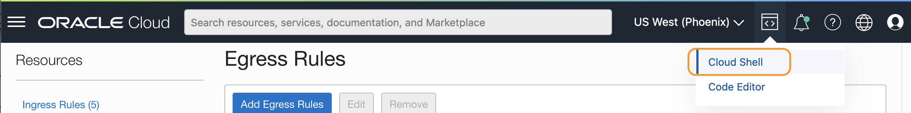

       >	**Note:** If the Cloud Shell is already running but the window is minimized, you can restore the window by clicking the **Restore** icon on the toolbar.
         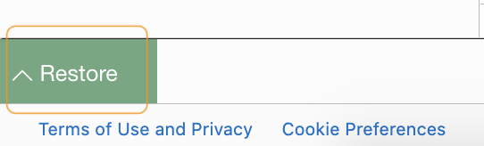


   2.  If the previous Cloud Shell session is expired, run the oci ce (Container Engine) command that you saved in Lab 3, Task 2, step 5.


      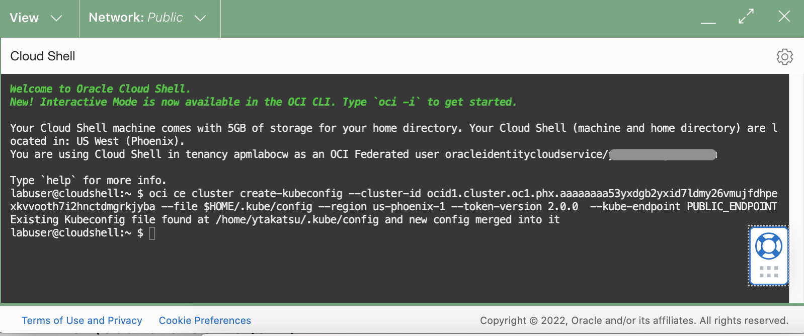

   3.	Create a YAML file, **apmlab-pvc.yaml** using an editor such as the vi editor tool.

       ``` bash
       <copy>
       vi ~/sb-hol/apmlab-pvc.yaml
       </copy>
       ```

       >**Note:** If you are using the vi editor, type ***i*** to enter Insert mode, and make the text editable. Use allow keys to navigate the text and make changes to where you set the cursor. To save a file, press the Esc key, then type ***:wq*** to write and quit the file. If you do not wish a change, press Esc then type ***:q!*** to discard your changes. Please refer to the editor's references for more usage.
       Alternatively, you can use a built-in code editor to edit files. To use the code editor, select the **Developer tools** icon from the toolbar>  select **Code Editor**.
         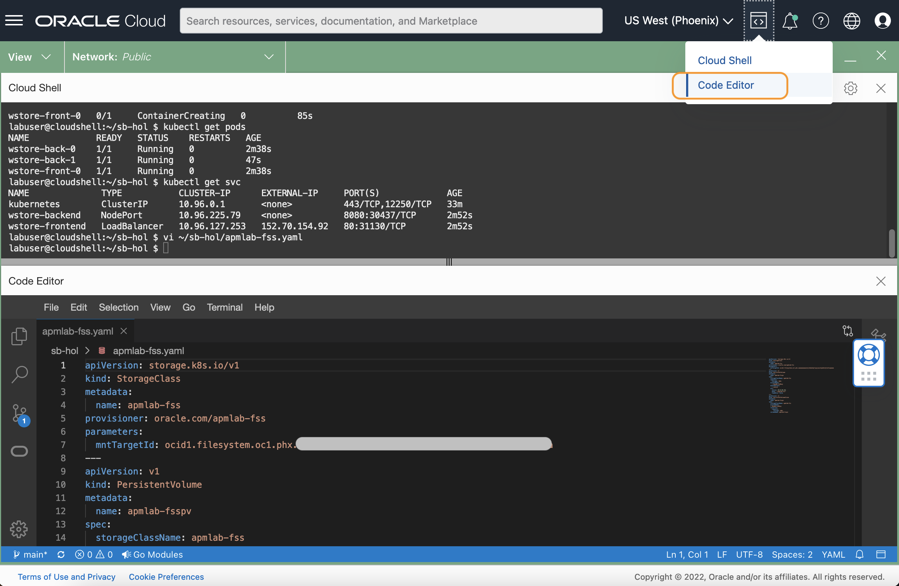

   4. Hit **i** to enter the editing mode. Copy the below contents that create Kubernetes objects (StorageClass, PersistentVolumeClaim) in your OKE, and paste it into the file. Then save the file.


        apiVersion: v1
        kind: PersistentVolumeClaim
        metadata:
          name: apmlab-fsspv
        spec:
          storageClassName: "oci-bv"
          accessModes:
            - ReadWriteOnce
          resources:
            requests:
              storage: 50Gi
        ---
        apiVersion: v1
        kind: PersistentVolumeClaim
        metadata:
          name: apmlab-fsspv2
        spec:
          storageClassName: "oci-bv"
          accessModes:
            - ReadWriteOnce
          resources:
            requests:
              storage: 50Gi


   >**Note:** Refer to the screenshot image below to see what it should look like after the file is modified. Verify that the Kubernetes objects, such as StorageClass and PersistentVolumeClass are configured in the YAML file.
          	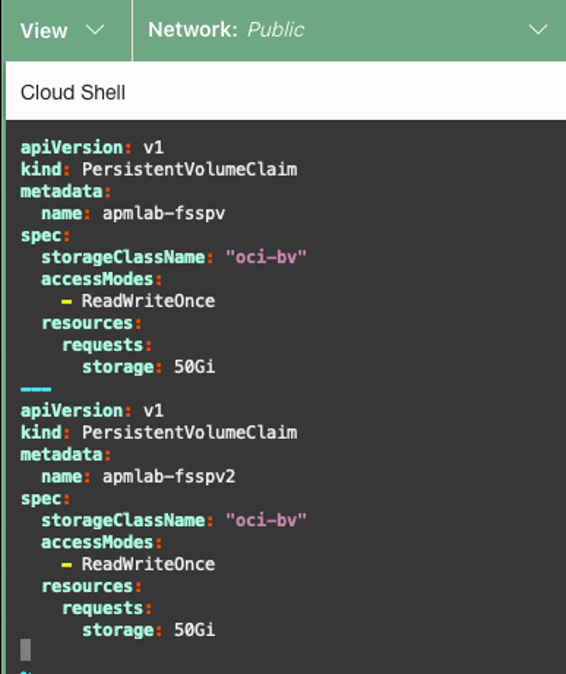

## Task 2: Apply changes to the container

1.	Execute the following command to add the storage objects to the Kubernetes cluster.

      ``` bash
      <copy>
      kubectl create -f apmlab-pvc.yaml
      </copy>
      ```
2. Verify the Storage Class, PV and PVC are created.

    

    >**Note:** If you need to modify the YAML file after once applied, first run the command below to remove the objects, modify the file, then rerun the above command to re-apply the YAML.  
    kubectl delete -f ~/sb-hol/apmlab-pvc.yaml


## Task 3: Add volumes to Kubernetes pods

1.	Next, you will need to map the PV to the pods. Open **wstore.yaml** file with an editor.

    ``` bash
    <copy>
    vi ~/sb-hol/wstore.yaml
    </copy>
    ```

2. Scroll down the file. You will see there are two statefulsets, **wstore-front** and **wstore-back**, defined in the YAML file.

3. Within each statefulset, find a line that defines the container port: "**- containerPort: 8080**" (line 51 and line 75).

   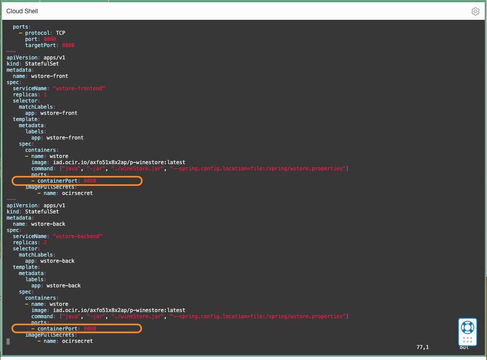

4. Hit **i** to enter the edit mode. Carefully insert the following code below the **containerPort**. Note that the changes have to be made in both statefulsets, **wstore-back** and **wstore-front**.


  * Insert below under “- containerPort: 8080” (line 51)


                volumeMounts:
                - name: data
                  mountPath: /apmlab-fss
              volumes:
              - name: data
                persistentVolumeClaim:
                  claimName: apmlab-fsspv


  * Insert below under “- containerPort: 8080” (line 75).

NOTE the contents are different from the above (a).


                volumeMounts:
                - name: data
                  mountPath: /apmlab-fss2
              volumes:
              - name: data
                persistentVolumeClaim:
                  claimName: apmlab-fsspv2


  * Change the replicas of backend from 2 to 1.


            serviceName: "wstore-backend"
            replicas: 1

  Save the file.


    > ***Suggested Editing Tips:***
     - Use your mouse to select the text above, and manually copy and paste it into a text file.
     - Auto copy is not provided as it may break the indentation.
     - Copy the entire area from the text box, including the space preceding the text.
     - In the yaml file, place your mouse cursor at the beginning of the line, then paste the code.
     - Make sure to keep the same space indentation when pasting the code into the file.
     - "VolumeMounts:" aligns with "ports:"
     - "Volumes:" aligns with "imagePullSecrets:"
     - Refer to the screenshot image below to see how it should look, after the file is modified.
     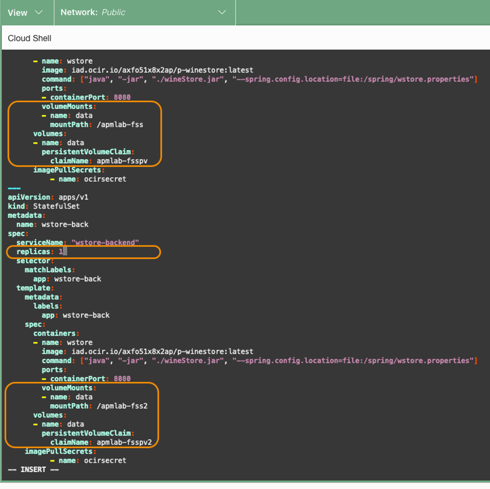


5.	Run the following command. This will recreate the pods, with the new object configurations.

    ``` bash
    <copy>
    kubectl apply -f ~/sb-hol/wstore.yaml --validate=false
    </copy>
    ```
    Verify that the service for wstore-frontend and both statefulsets are configured.

   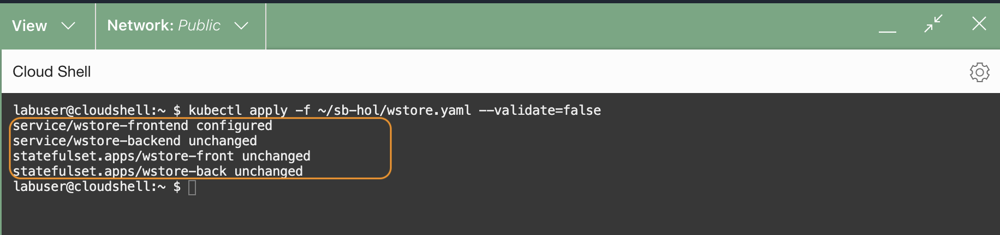

6.  Check the status of the PVCs.

    ``` bash
    <copy>
    kubectl get pvc
    </copy>
    ```
   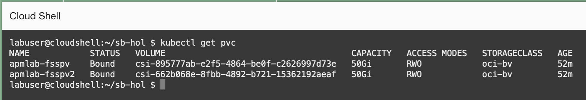

7.	Run the following commands to ensure the pods are in the running state. Verify the **AGE** column to ensure the pods are restarted.

    ``` bash
    <copy>
    kubectl get pods

    </copy>
    ```

    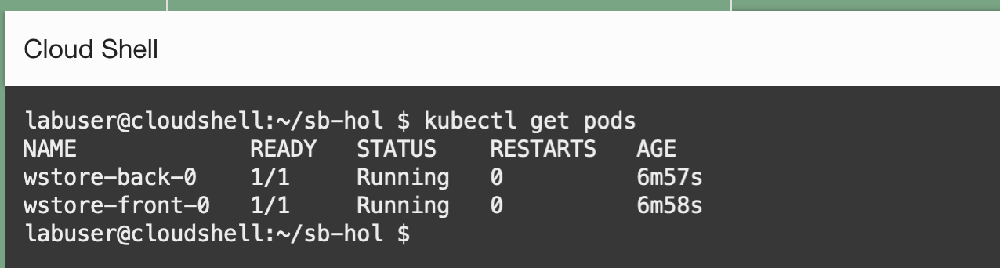


     >**Note:** Troubleshooting: If the pods do not come back with the running state in a minute or two, review the configuration in the file to make sure they have the right indentation.

9.	Execute the following command to access the Kubernetes pods.

    ``` bash
    <copy>
     kubectl exec -it wstore-front-0 -- bash -c "cd / && ls "
    </copy>
    ```

    Make sure that you see the ***apmlab-fss*** directory that is the file system mounted to this location.

    


    >***Debugging TIPS***: If you cannot find the apmlab-fss directory, or the pods do not start running, execute the following command from the Cloud Shell to troubleshoot.   
    kubectl get events --sort-by=.metadata.creationTimestamp

10. Run the following command and copy the EXTERNAL-IP from the frontend service.

    ``` bash
    <copy>
    kubectl get svc
    </copy>
    ```
    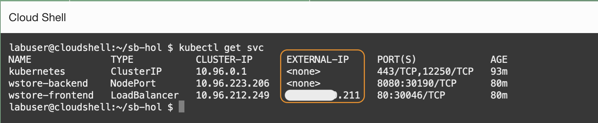

11. Run the following URL and verify the application is running.
    ``` bash
    <copy>
    http://<EXTERNAL-IP>/winestore/
    </copy>
    ```

    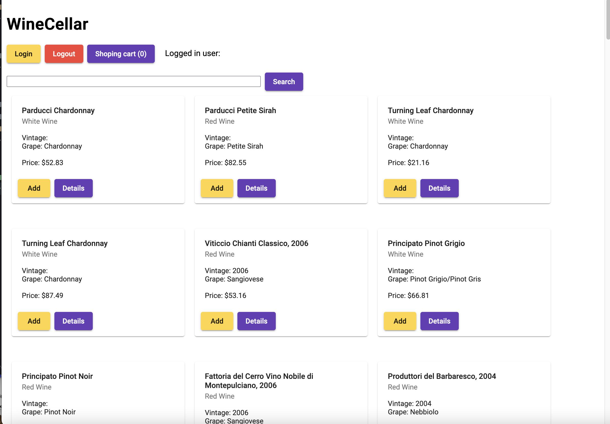


You may now **proceed to Lab 5 (Free Trial): Instrument server monitoring on the block volumes**.


## Acknowledgements

* **Author** - Yutaka Takatsu, Product Manager, Enterprise and Cloud Manageability
- **Contributors** - Steven Lemme, Senior Principal Product Manager,   
Anand Prabhu, Sr. Member of Technical Staff,  
Avi Huber, Vice President, Product Management
* **Last Updated By/Date** - Yutaka Takatsu, March 2023
