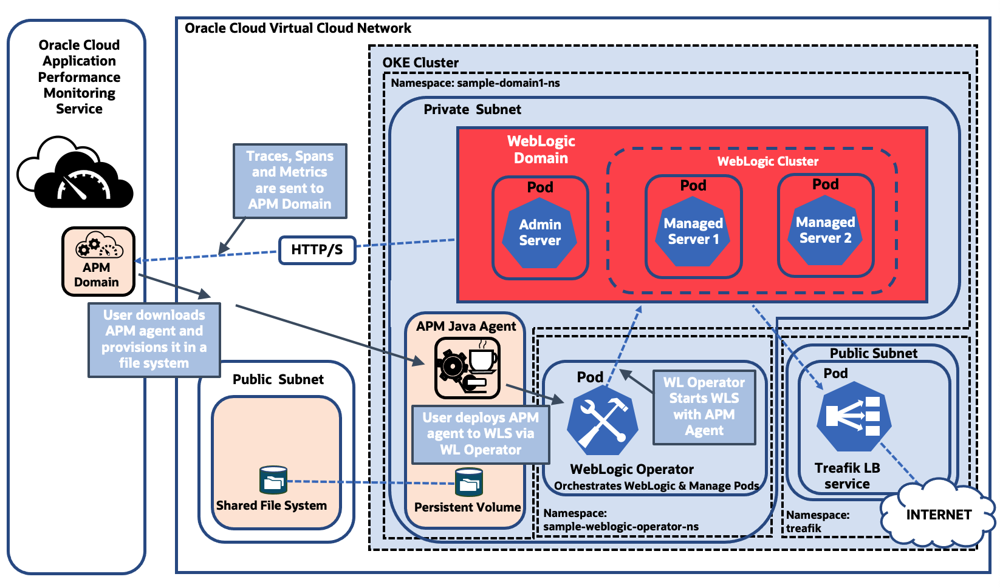

# Introduction

## About this Workshop

This workshop walks you through how to configure a WebLogic-on-Kubernetes for monitoring with the Oracle Application Performance Monitoring (APM) service. This enables automatic OpenTracing instrumentation and metrics collection that is used to provide full, end-to-end monitoring and diagnostics for the application.   

In this workshop, you will provision the APM Java agent in a file system mounted in the Oracle Cloud, deploy the agent to the Kubernetes cluster, instrument the APM Browser agent by inserting JavaScript code to a webpage and view traces and spans in APM Trace Explorer.

> **Note:** The same approach demonstrated for WLS on Kubernetes can be used to configure other types of java application servers, such as Spring Boot, deployed on Kubernetes.

  

Estimated Workshop Time: 80 minutes

### About Oracle Cloud Infrastructure Data Flow
Data Flow is a cloud-based serverless platform with a rich user interface. It allows data engineers and data scientists
to create, edit, and run Apache Spark workloads at any scale without the need for clusters, an operations team, or highly 
specialized Spark knowledge. Being serverless means there is no infrastructure for you to deploy or manage. 
It is entirely driven by REST APIs, giving you easy integration with applications or workflows. You can:

* Connect to Apache Spark data sources.
* Create reusable Apache Spark applications.
* Launch Apache Spark jobs in seconds.
* Create Apache Spark applications using SQL, Python, Java, Scala, or spark-submit.
* Manage all Apache Spark applications from a single platform.
* Process data in the Cloud or on-premises in your data center.
* Create Big Data building blocks that you can easily assemble into advanced Big Data applications.

The diagram below provides an overview of the OCI Data Flow Service, its features, components, and some of the other OCI services it integrates with.

  

In the workshop, you will learn how to create spark batch and streaming application with manufacturing usecase example

### Objectives

In this workshop, you will:
* Create an APM domain, obtain Data Upload Endpoint and Data Keys
* Create a file system in the Oracle Cloud Infrastructure, and mount it in the Kubernetes pods
* Download, provision and deploy the APM Java agent
* Apply custom storage configuration to the Kubernetes pods
* Change the display name format of the spans by editing the agent configuration file
* Instrument APM Browser agent by automatic injection
* Use APM Trace Explorer to view traces, spans, and span dimensions

### Prerequisites

* An Oracle Free Tier with a 30-day free trial or Paid Cloud Account - Please view this workshop's LiveLabs landing page to see which environments are supported.


If you are running the workshop in a Paid Cloud Account, ensure you have the permissions below:
* Oracle Cloud resources and permissions to create a file system. See **[Creating File Systems](https://docs.oracle.com/en-us/iaas/Content/File/Tasks/creatingfilesystems.htm)** and **[Service Limits](https://docs.oracle.com/en-us/iaas/Content/General/Concepts/servicelimits.htm#top)** in the Oracle Cloud documentation.
*	Oracle Cloud Account Administrator role or manage apm-domains permission in the target compartment. See **[Perform Oracle Cloud Infrastructure Prerequisites (APM)](https://docs.oracle.com/en-us/iaas/application-performance-monitoring/doc/perform-oracle-cloud-infrastructure-prerequisite-tasks.html)** in the Oracle Cloud documentation.

### More APM Workshops

-	**[Use OpenTracing for Microservices with Helidon Utilizing Oracle Application Performance Monitoring](https://apexapps.oracle.com/pls/apex/r/dbpm/livelabs/view-workshop?wid=917)**  Workshop
-	**[Trace a Native Cloud App Utilizing Oracle Application Performance Monitoring](https://apexapps.oracle.com/pls/apex/dbpm/r/livelabs/view-workshop?wid=916)** Workshop

## Acknowledgements

- **Author** - Yutaka Takatsu, Product Manager, Enterprise and Cloud Manageability
- **Contributors** - Steven Lemme, Senior Principal Product Manager,  
Avi Huber, Senior Director, Product Management
- **Last Updated By/Date** - Yutaka Takatsu, August 2022
