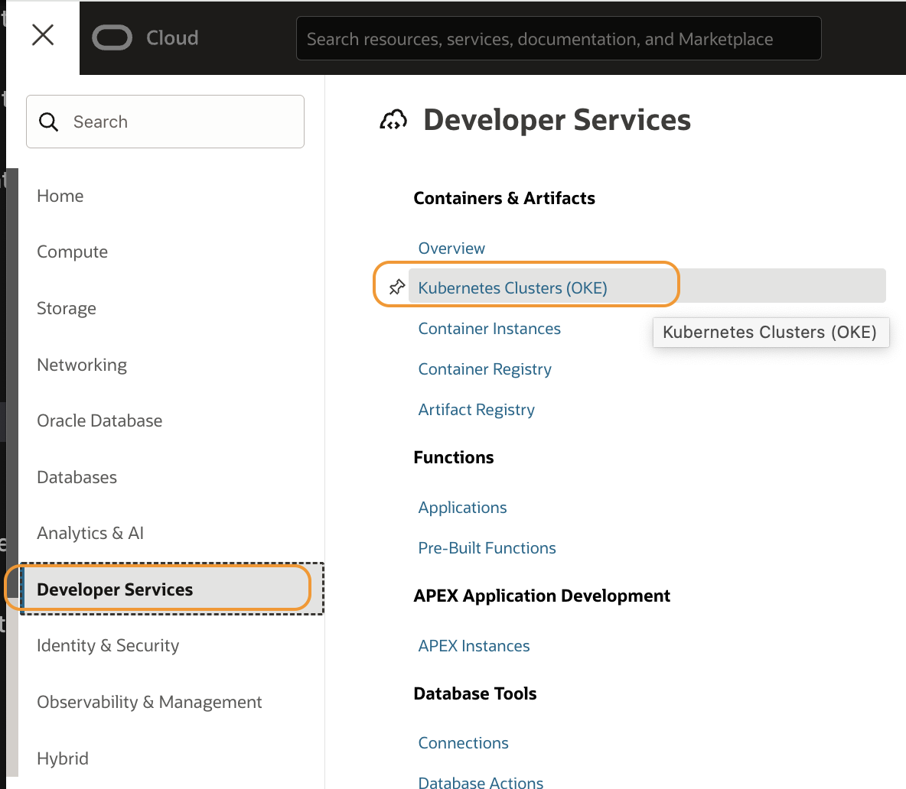
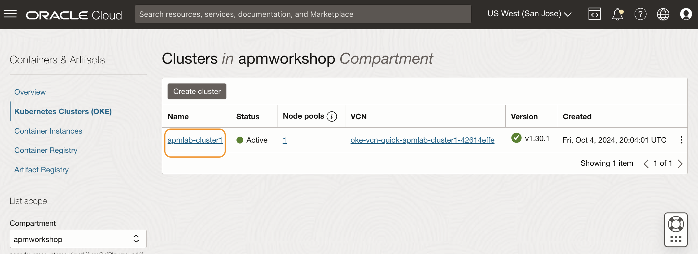
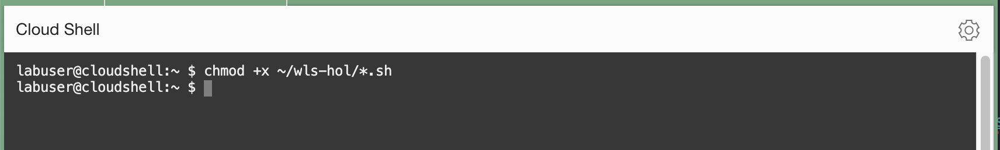
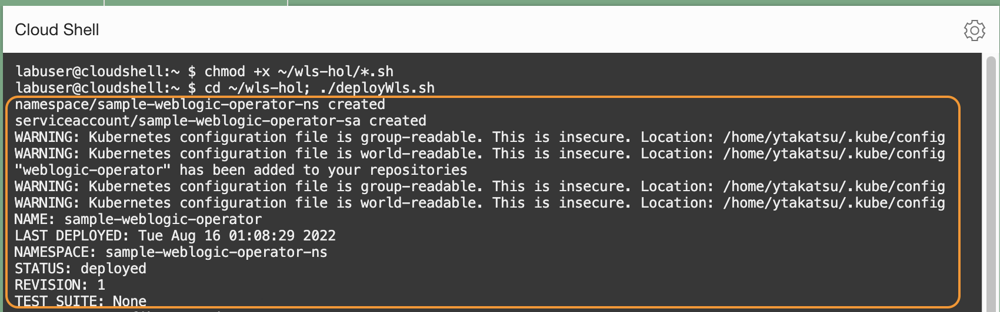

# Build a microservices application

## Introduction

This workshop uses a WebLogic demo application as a target application to trace against. In this lab, you will deploy the application to the Kubernetes cluster you created in Lab 1.


Estimated time: 10 minutes

### Objectives

* Build a microservices application for monitoring

### Prerequisites

* Completion of the preceding labs in this workshop

## Task1: Verify OKE

1. Go back to the Kubernetes cluster page where you left Lab 1, and check the status of the cluster. Open the navigation menu from the top left corner (aka. hamburger menu) in the Oracle Cloud console, and select **Developer Services** > **Kubernetes Clusters (OKE)**.

   

2. Click the **apmlab-cluser1** link from the table.

   

3. If the status of the cluster is **Active**, creation was successful. If it is still in a **Creating** status, it may take a few more minutes to complete. (Usually, it takes 7 to 10 minutes to finish the jobs to create a cluster).

   

## Task2: Access the OKE in the Oracle Cloud shell


1. Click **Access Cluster** on the cluster details page.

  

2. Make sure the **Cloud Shell Access** is selected. Click the **Copy** link from the command to access kubeconfig for the cluster.

  

3. Then click **Launch Cloud Shell**.

  

4. Oracle Cloud Shell window opens at the lower side of the browser screen.

  

5. Paste the copied command to the command shell prompt. Then hit enter.   

  

  >**Note:** Save the command to a text file on your laptop, and execute it whenever you start a new Cloud Shell session, while working in the labs in this workshop.

## Task3: Download configuration files

1. Download the zip file to the home directory in the Cloud Shell.

    ``` bash
    <copy>
    cd ~; wget https://objectstorage.us-phoenix-1.oraclecloud.com/n/axfo51x8x2ap/b/apmocw-bucket-2022/o/wls-hol.zip
    </copy>
    ```
    

3. Unzip the file. This will create a directory **wls-hol**.

    ``` bash
    <copy>
    unzip ~/wls-hol.zip
    </copy>
    ```

  

## Task4: Set up the WebLogic Domain and a demo application on the OKE

1. Execute the following command from the Cloud Shell.

    ``` bash
    <copy>
    ls ~/wls-hol
    </copy>
    ```
  

    >**Note:** Verify there are the following files in the folder.
    - apmlab-fss.yaml
    - deleteWls.sh
    - deployWls.sh
    - domain.yaml
    - traefik-config.yaml
    - traefik-values.yaml

2. Add executable permission to the shell script files in the folder by running the following command.

    ``` bash
    <copy>
    chmod +x ~/wls-hol/*.sh
    </copy>
    ```
  

3. Execute the command below to run a shell script from the **wls-hol** directory. This will create a WebLogic domain on the OKE in your tenancy. The process may take a few minutes to complete.

    ``` bash
    <copy>
    cd ~/wls-hol; ./deployWls.sh
    </copy>
    ```

  

  Ensure that you see the message 'Cluster configuration complete!' and the URL to launch a demo application.

  

4. Run the kubectl command below to display the information of the services created.

    ``` bash
    <copy>
    kubectl get svc --all-namespaces
    </copy>
    ```
    The output will be similar to the image below. The namespace of the WebLogic Server services in this workshop is **sample-domain1-ns**. It may take a few minutes to see all services.

    

5. Run the command below to display the statuses of the  pods. Wait for all pods are Ready and in the Running state.

    ``` bash
    <copy>
    kubectl get pod -n sample-domain1-ns
    </copy>
    ```

    


5. From the command output from the step 4 above, locate the LoadBalancer service. Note down the External-IP.

    

6. On your computer, open a new browser tab and access the application with the following URL pattern:

    ``` bash
    <copy>
    http://<External IP of the Load Balancer>/opdemo/?dsname=testDatasource
    </copy>
    ```
    Make sure the WebLogic Operator Demo application launches as in the image below. This is the target web application you will use to configure the APM Java Agent in this workshop.

    


You may now **proceed to the next lab**.

## Acknowledgements

* **Author** - Yutaka Takatsu, Product Manager, Enterprise and Cloud Manageability
- **Contributors** - Steven Lemme, Senior Principal Product Manager,  
Anand Prabhu, Sr. Member of Technical Staff,  
Avi Huber, Vice President, Product Management
* **Last Updated By/Date** - Yutaka Takatsu, August 2022
