# Create and configure a file system

## Introduction

In this lab, you will create a file system in the Oracle Cloud Infrastructure. You will also create security rules to allow network traffic and mount the file system to the Kubernetes pods.  

Estimated time: 15 minutes

### Objectives

* Create a file system in the Oracle Cloud
*	Create security rules in the network
*	Create a YAML file, which defines Storage Class, Persistent Volume, and Persistent Volume Claim
*	Mount the volume to the Kubernetes cluster by applying the YAML, which recreates the Kubernetes pods with the new storage configuration

### Prerequisites

* OCI quota and permissions to create a file system and associated resources. See **[Creating File Systems](https://docs.oracle.com/en-us/iaas/Content/File/Tasks/creatingfilesystems.htm)** and **[Service Limits](https://docs.oracle.com/en-us/iaas/Content/General/Concepts/servicelimits.htm#top)** in the Oracle Cloud documentation.
* Completion of the preceding labs in this workshop

## Task1: Create a file system in the Oracle Cloud

1.  Minimize the Cloud Shell window by clicking the Minimize button. Close the **Access Your Cluster window** if still open.

   

2.	From the OCI menu, select **Storage** > **File Systems**.

   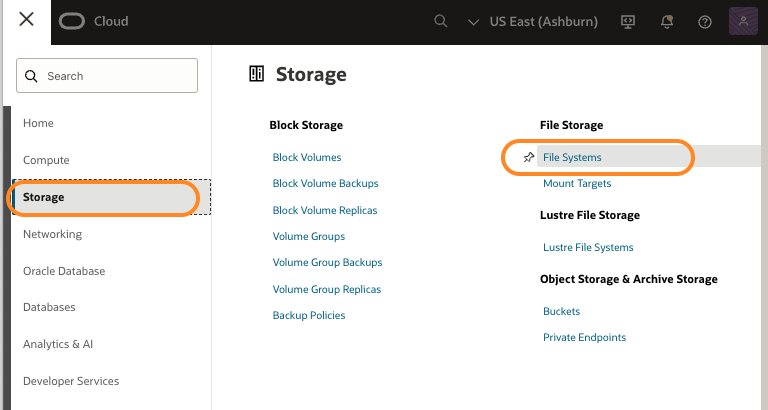

3.	Make sure you are in the compartment **apmworkshop**. If not, select it from the pulldown menu.

   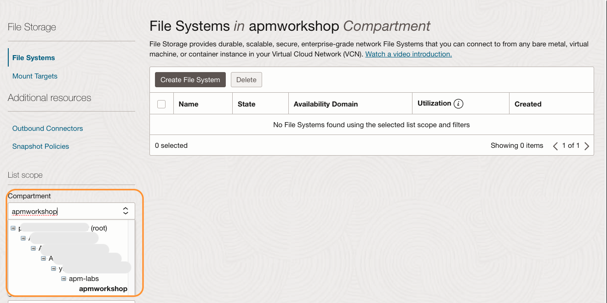

4.  Click **Create File System**

   

5. On the **Create File System** page, ensure the **File System for NFS** is selected. In the **File System Information** section, click **Edit Details**.

   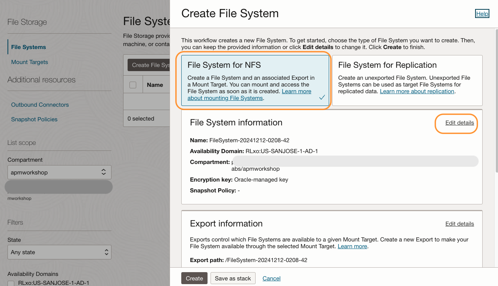

6.	On the Create File System page, enter **apmlab-fss** into the **Name** field.

    Make sure the **apmworkshop** is selected in the **Compartment**. Leave the other fields in the section with default values.   
    ***Do NOT click the Create button yet.***

   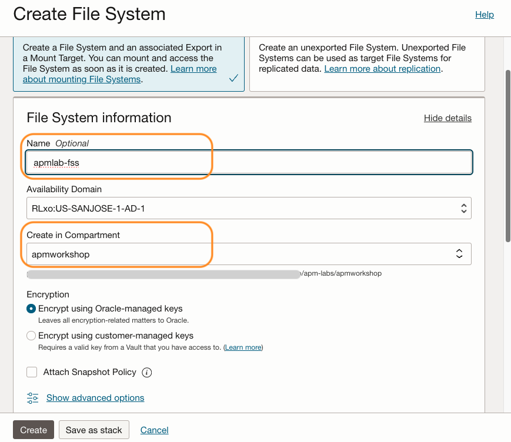

7. Scroll down the **Create File System** page and find the **Export Information** section. Verify that the **Export Path** is set to **/apmlab-fss**. This is where the file system will be mounted. You will provision an APM Java agent at this location. In the **Mount Target Information** section, click **Edit Details** to expand the section.

   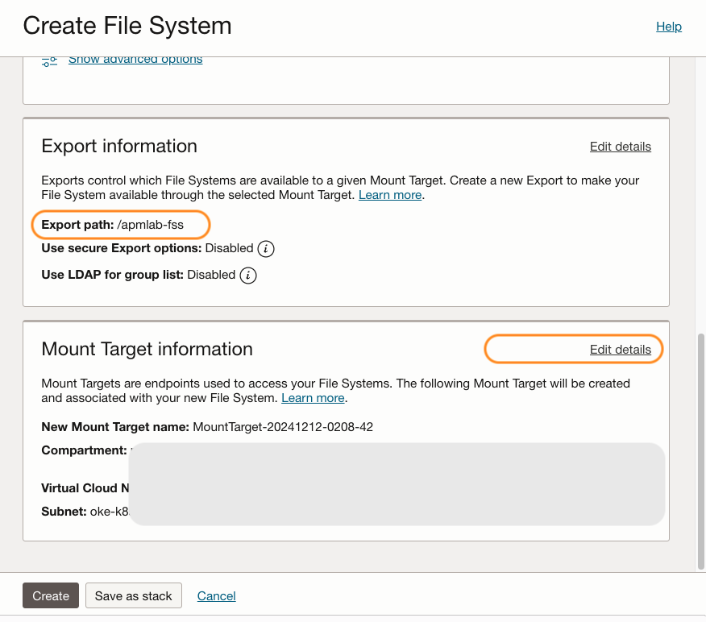

8. In the **Mount Target Information** section, click the link **Click here to enable compartment selections**.

   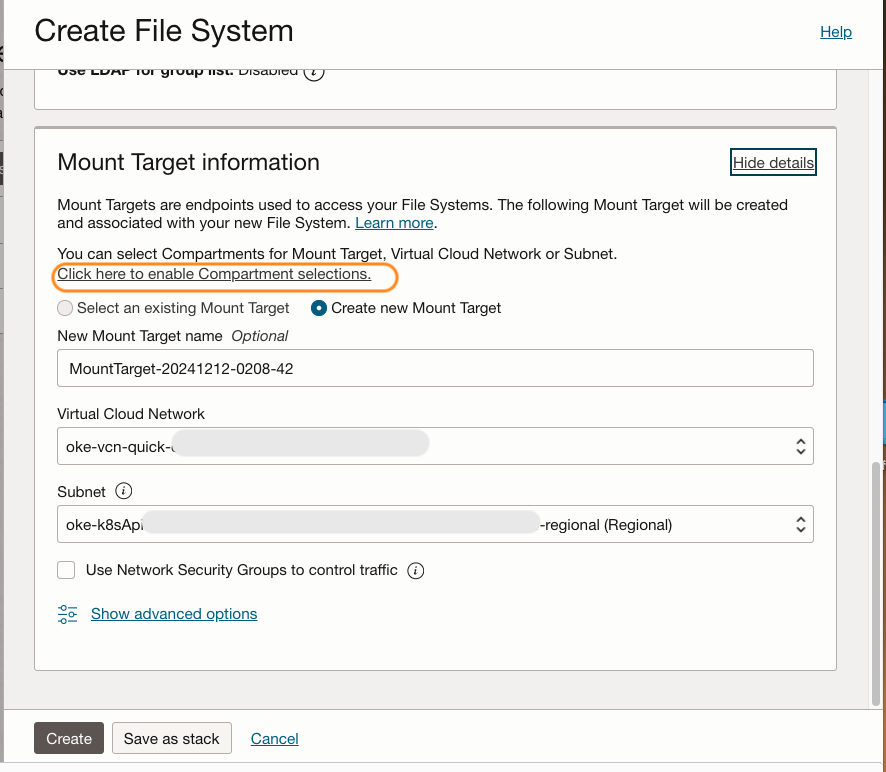

9. In the Mount Target Information section, ensure that the **Create New Mount Target** is selected. Then locate the **Create in Compartment** field, and ensure the **apmworkshop** compartment is selected.
   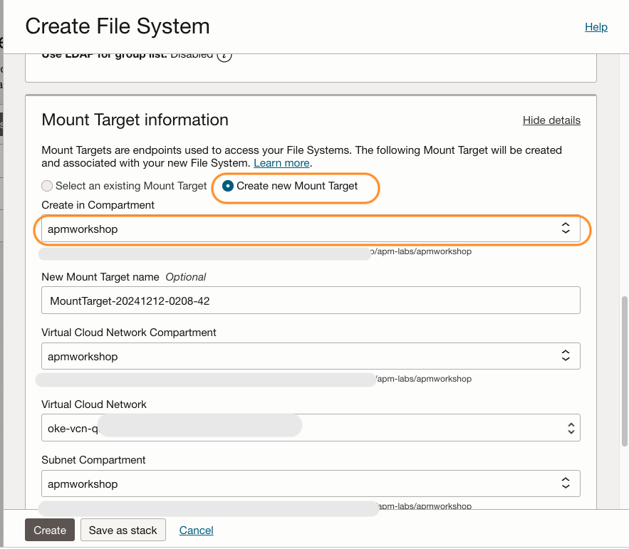
10. Leave the other fields by default and click **Create**.

   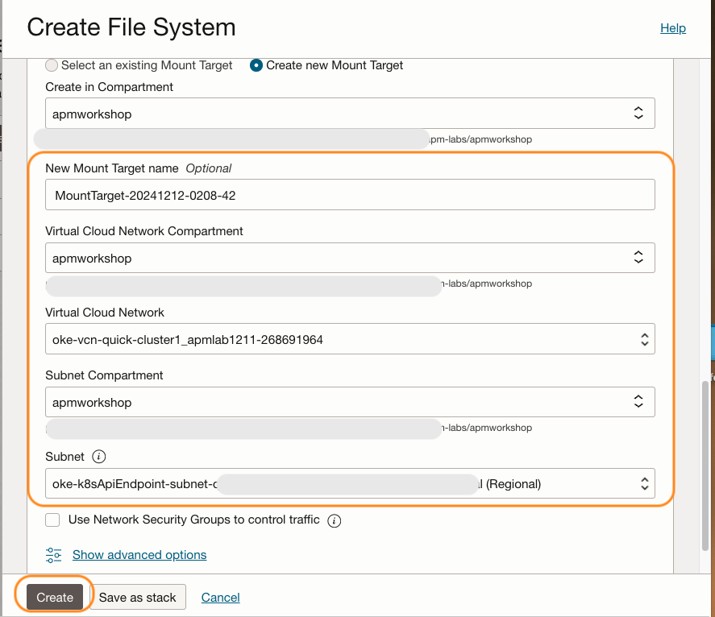

11.	A new File System is created.  Scroll down to find the **Exports** section. Click the link to the **Mount Target** just created.

   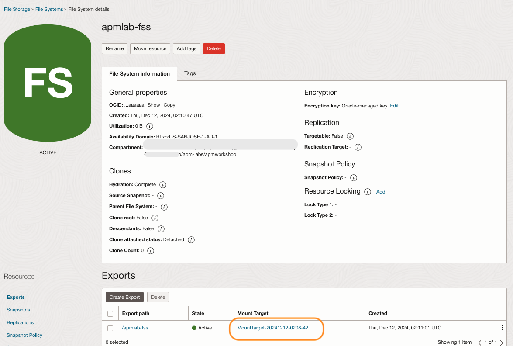

12.	Click **Copy** next to the **OCID**. Save the value in a text file on your computer. Also, take note of the **IP Address** as you will need these values in the next steps.

   

## Task2: Create security rules in the network

1. In the Mount Target Information section point your mouse cursor over the **“i”**  icon next to **Subnet** and review the message. As the message indicates, security rules must be configured before mounting the file system, and that is what you will be doing next.

   

2.	Click the **Subnet** link to open the Subnet page.

   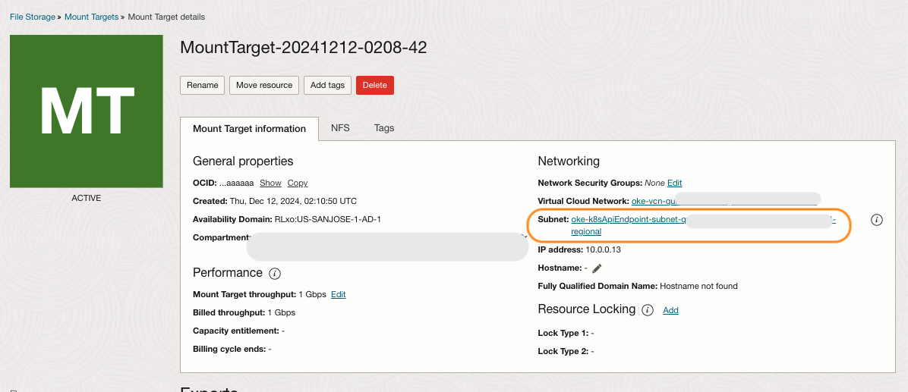


3.	In the **Subnet Details page**, scroll down and find the **Security Lists** section, then click the link to the security list.

   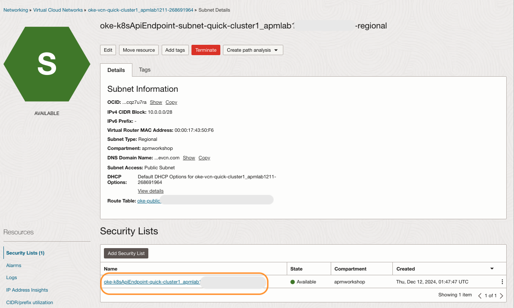

4.	Click the **Add Ingress Rules** button

   

5.	In the **Add Ingress Rules** dialog, enter the following information:

     *	Stateless: **No**
     *	Source Type: **CIDR**
     *	Source CIDR: **0.0.0.0/0**
     *	IP Protocol: **TCP**
     *	Source Port Range:  leave as default (All)
     *	Destination Port Range: **111,2048-2050** 	
     *	Description: **Ingress security rule for apmlab-fss**

   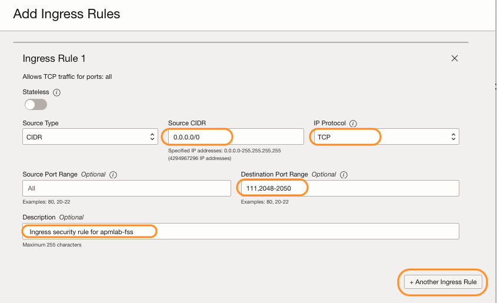

6.	Click the **+ Another Ingress Rule** button and create an additional rule for **UDP**, with the destination port range **111,2048**. Use the same values with the rule created above for the rest of the fields.  

    Click the **Add Ingress Rules** button which creates 4 ingress rules in the security list.

   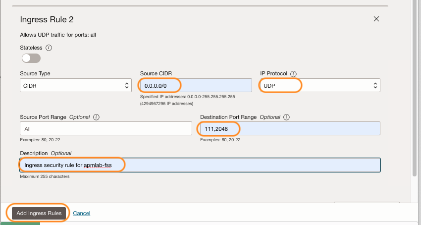

7.	After the configuration, your **Ingress Rules** have 4 additional security rules as in the image below.

   

8.	Click **Egress Rules**, which is located on the left side of the screen.

   

9.	Click the **Add Egress Rules** button.

   

10.	In the **Add Egress Rules** dialog, enter the following information:

    *	Stateless: **No**
    *	Source Type: **CIDR**
    *	Source CIDR: **0.0.0.0/0**
    *	IP Protocol: **TCP**
    *	Source Port Range:  leave as default (All)
    *	Destination Port Range: **111,2048-2050**
    *	Description: **Egress security rule for apmlab-fss**

   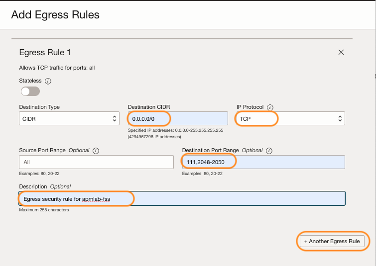

11.	Click the **+ Another Egress Rule** button and create an additional rule for **UDP**, with the destination port **111**. Use the same values with the rule created above for the rest of the fields.<br><br> Click **Add Egress Rules** button which creates 3 egress rules in the security list.

   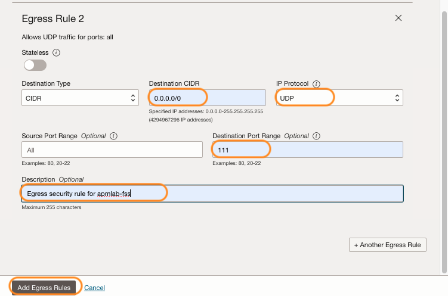

12.	After the configuration, your **Egress Rules** have 3 additional security rules as in the image below.

   

## Task3: Mount the file system to Kubernetes pods

1. Click the **Developer tools** icon from the top right corner in the Oracle Cloud console menu bar, then select **Cloud shell** to start a Cloud Shell environment which will appear at the bottom of your page.
   

    >**Note:** If the Cloud Shell is already running but the window is minimized, you can restore the window by clicking the **Restore** icon on the toolbar.
      


2.  If the previous Cloud Shell session is expired, run the oci ce (Container Engine) command that you saved in Lab 3, Task 2, step 5.


   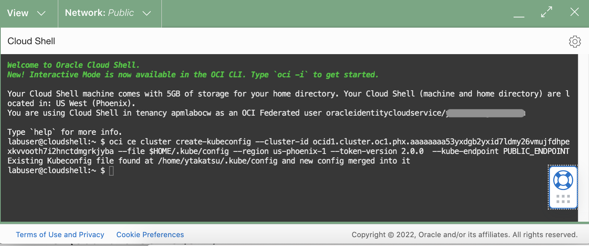

3.	Use any text editor (such as the vi editor tool) to open the **apmlab-fss.yaml** file for editing.

    ``` bash
    <copy>
    vi ~/wls-hol/apmlab-fss.yaml
    </copy>
    ```

    >**Note:** If you are using the vi editor, type ***i*** to enter Insert mode, and make the text editable. Use allow keys to navigate the text and make changes to where you set the cursor. To save a file, press the Esc key, then type ***:wq*** to write and quit the file. If you do not wish a change, press Esc then type ***:q!*** to discard your changes. Please refer to the editor's references for more usage.     Alternatively, you can use a built-in code editor to edit files. To use the code editor, select the **Developer tools** icon from the toolbar>  select **Code Editor**.
      

4. Review the file contents that create Kubernetes objects (StorageClass, PersistentVolume, PersistentVolumeClaim) in your OKE. Replace the **mntTargetID** and **server IP** with the values copied in Lab 3, Task 1, step 11 in this Workshop. Save the change and close the file.

        apiVersion: storage.k8s.io/v1
        kind: StorageClass
        metadata:
          name: apmlab-fss
        provisioner: oracle.com/apmlab-fss
        parameters:
          mntTargetId: <OCID of your Mount Target >
        ---
        apiVersion: v1
        kind: PersistentVolume
        metadata:
          name: apmlab-fsspv
        spec:
          storageClassName: apmlab-fss
          capacity:
            storage: 10Gi
          accessModes:
            - ReadWriteMany
          mountOptions:
            - nosuid
          nfs:
            server: <Server IP of your Mount Target>
            path: "/apmlab-fss"
            readOnly: false
        ---
        apiVersion: v1
        kind: PersistentVolumeClaim
        metadata:
          name: apmlab-fsspv
        spec:
          storageClassName: apmlab-fss
          accessModes:
          - ReadWriteMany
          resources:
            requests:
              storage: 10Gi
          volumeName: apmlab-fsspv

     >**Note:** Refer to the screenshot image below to see what it should look like after the file is modified. Verify that the Kubernetes objects, such as StorageClass, PersistentVolume, and PersistentVolumeClass are configured in the YAML file.
       	


## Task4: Apply changes to the container

1.	Execute the following command to add the storage objects to the Kubernetes cluster.

    ``` bash
    <copy>
    kubectl apply -f ~/wls-hol/apmlab-fss.yaml -n sample-domain1-ns
    </copy>
    ```

2. Verify the Storage Class, PV and PVC are created.

   

    >**Note:** If you need to modify the YAML file after once applied, first run the command below to remove the objects, modify the file, then rerun the above command to re-apply the YAML.  
    kubectl delete -f ~/wls-hol/apmlab-fss.yaml


## Task5: Add volumes to Kubernetes pods

1. Open the **domain.yaml** file that locates in the home directory, with any editor, such as the vi tool.

    ``` bash
    <copy>
    vi ~/wls-hol/domain.yaml
    </copy>
    ```

2.	Find the **volumes:** section (line 79). At this point, the section is commented out.

    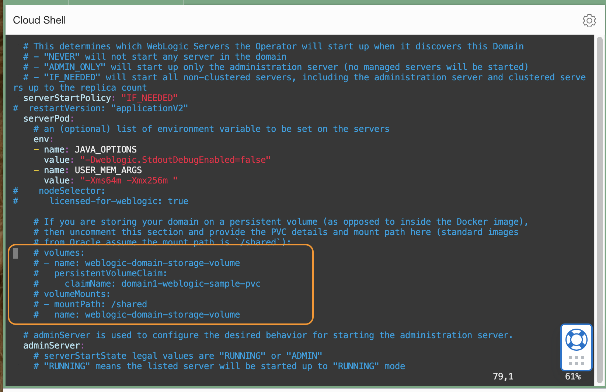

3.	Hit **i** to enter the edit mode. Create a new line above **volumes:** and carefully insert the following code below.

            volumes:
            - name: apmlab-nfs
              persistentVolumeClaim:
                claimName: apmlab-fsspv
            volumeMounts:
            - mountPath: "/apmlab-fss"
              name: apmlab-nfs


      > ***Suggested Editing Tips:***
       - Use your mouse to select the text above, and manually copy and paste it into a text file.
       - Auto copy is not provided as it may break the indentation.
       - Copy the entire area from the text box, including the space preceding the text.
       - In the yaml file, place your mouse cursor at the beginning of the line, then paste the code.
       - Make sure to keep the same space indentation when pasting the code into the file.
        - The lines “volumes:” and "volumeMounts:" align with the line “env:”.
       - Refer to the screenshot image below to see how it should look after the file is modified.
       


4.	Run the following command. This will recreate the pods, with the new object configurations.

    ``` bash
    <copy>
    kubectl apply -f ~/wls-hol/domain.yaml -n sample-domain1-ns
    </copy>
    ```

    

5.	Run the following command to ensure the pods are in the running state. You may need to wait for a few minutes to see if all the pods are restarted and their status updated.

    ``` bash
    <copy>
    kubectl get pods -n sample-domain1-ns
    </copy>
    ```

    

    >**Note:** Verify the **AGE** column to ensure the pods are restarted. It may take a few minutes to have all the pods restarted.


6.	Execute the following command to access the Kubernetes pods.

    ``` bash
    <copy>
    kubectl exec -it sample-domain1-admin-server -n sample-domain1-ns -- bash -c "cd / && ls "
    </copy>
    ```

    Make sure that you see the ***apmlab-fss*** directory that is the file system mounted to this location.

    


    >***Debugging TIPS***: If you cannot find the apmlab-fss directory, or the pods do not start running, execute the following command from the Cloud Shell to troubleshoot.   
    kubectl get events --sort-by=.metadata.creationTimestamp


You may now **proceed to the next lab**.

## Acknowledgements

* **Author** - Yutaka Takatsu, Product Manager, Enterprise and Cloud Manageability
- **Contributors** - Steven Lemme, Senior Principal Product Manager,   
Anand Prabhu, Sr. Member of Technical Staff,  
Avi Huber, Vice President, Product Management
* **Last Updated By/Date** - Yutaka Takatsu, December 2024
