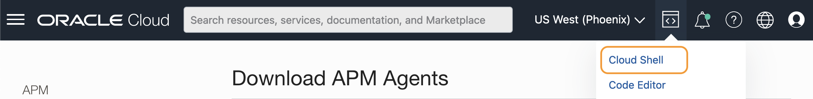

# Instrument the server monitoring

## Introduction

In this lab, you will download the APM Java Agent installer file from the Oracle Cloud console, upload it to the Oracle Cloud shell, transfer it to the Kubernetes container, provision the Java Agent to the file system, and finally, deploy the Agent to the Kubernetes pods.

Estimated time: 10 minutes

### Objectives

* Download the APM Java Agent from the Oracle Cloud console
*	Upload the APM Java Agent to the Cloud shell
*	Copy the Java Agent installer from the Cloud shell to the file system
*	Provision the APM Java Agent in the shared file system directory
*	Deploy the Java Agent to the Kubernetes pods

### Prerequisites

* Completion of the preceding labs in this workshop

## Task1: Obtain APM Java Agent download link

1.	Open navigation menu from the Oracle Cloud console, select **Observability & Management** > **Administration**.

   

2.	Under **Resources** at the lower left side of the screen, click **Download APM Agent**

   

3.	Mouse-click the **Java Agent** link. Select **Copy Link Address** (or Copy Link, depends on the browser you use). This will save the download link to the memory on your computer. Paste the copied link to a text file.

   

4. 	Open the Cloud Shell by clicking the **>..** icon from the top right corner of the Oracle Cloud console. Restore the Cloud Shell if minimized.

   


## Task2: Download the APM Java Agent to the Cloud shell

1.  Type the following command to the Cloud Shell.

    ``` bash
    <copy>
    cd ~/; wget <copied APM Java Agent link>
    </copy>
    ```
    If the link is still in the clipboard of your computer, simply type **wget** in the Cloud Shell home directory, then paste the APM Java Agent download link.

   

2.	Hit the enter key and verify the message to ensure the successful file transfer.

   

3.  Type the ls command. Confirm that the java agent file installer is in the home directory.

    ``` bash
    <copy>
    ls ~
    </copy>
    ```
   

## Task3: Copy the Java Agent installer to the file system

1.	Run the command below to copy the Java Agent installer file to the file system. Ensure to ***replace*** the **apm-agent-version** with that of the APM Java Agent you have, before the command execution.

    ``` bash
    <copy>
    kubectl cp apm-java-agent-installer-<apm-agent-version>.jar sample-domain1-ns/sample-domain1-admin-server:/apmlab-fss/
    </copy>
    ```

    > - e.g., kubectl cp apm-java-agent-installer-1.6.2363.jar sample-domain1-ns/sample-domain1-admin-server:/apmlab-fss/

2.	Use the kubectl command below to remotely run the ls command in the container in the Kubernetes pod.

    ``` bash
    <copy>
    kubectl exec -it sample-domain1-admin-server -n sample-domain1-ns -- bash -c "cd /apmlab-fss && ls "
    </copy>
    ```

    If you see the java agent installer file in the location, the file transfer was successful.

   

    >**Note:** The APM version may be different from what is shown in the example.

## Task4: Provision of the APM Java Agent


1.	Execute the command below to provision the APM Java agent. ***Replace*** the **APM Domain Private key** and **APM Domain Endpoint**, with the values saved in Lab2, Task2. Please also ***change*** the **apm-agent-version** in the file name to the version of the agent you have.

    ``` bash
    <copy>
    kubectl exec -it sample-domain1-admin-server -n sample-domain1-ns -- bash -c "cd /apmlab-fss && java -jar ./apm-java-agent-installer-<apm-agent-version>.jar provision-agent -service-name=WLS-server -destination=.  -private-data-key=<APM Domain Private Key> -data-upload-endpoint=<APM Domain Endpoint>"
    </copy>
    ```
    E.g., kubectl exec -it sample-domain1-admin-server -n sample-domain1-ns -- bash -c "cd /apmlab-fss && java -jar apm-java-agent-installer-1.6.2363.jar provision-agent -service-name=WLS-server -destination=. -private-data-key=ABCDEFG12345ABCDEF123456ABCDE -data-upload-endpoint=https://abcdefgt12345aaaaaaaaabcdef.apm-agt.us-phoenix-1.oci.oraclecloud.com"

    With a successful installation, you should see the output similar to below.

   

2.	Execute the below command to verify ***oracle-apm-agent*** directory is created under the apmlab-fss directory.

    ``` bash
    <copy>
    kubectl exec -it sample-domain1-admin-server -n sample-domain1-ns -- bash -c "cd /apmlab-fss && ls "
    </copy>
    ```

    


## Task5: Disable the maintenance spans

In this task, you will add exclusions to the data capture in the APM Agent, for the JAXRS server probe that generates static spans in this particular WebLogic setup. This is an optional task if you are monitoring the real-life environment, but for the lab purpose, we would like to suppress the spans generated from the server maintenance, so that you can focus on the spans related to the browser navigations.

Because there is no editing tool inside the container, you will copy an APM agent configuration file from the container to the Cloud Shell, edit the file, then copy it back to the container. We plan to add the exclusion by default, to the product in the future.

1.	Copy **ProbeConfig.acml** from the container. ***Replace*** the apm-agent-version before running the command.

    ``` bash
    <copy>
    kubectl cp sample-domain1-ns/sample-domain1-admin-server:/apmlab-fss/oracle-apm-agent/config/<apm-agent-version>/ProbeConfig.acml ~/ProbeConfig.acml
    </copy>
    ```   

    >**Note:** The file path includes the APM Java Agent version. Change the directory name to the Agent version you have.  
    E.g., kubectl cp sample-domain1-ns/sample-domain1-admin-server:/apmlab-fss/oracle-apm-agent/config/**1.6.2363**/ProbeConfig.acml ~/ProbeConfig.acml

    run the "ls" command from the Home directory and confirm the file was transferred.  
    ```bash
    <copy>
    ls ~
    </copy>
    ```

   

2.	Open **ProbeConfig.acml** with an editor

    ```bash
    <copy>
    vi ~/ProbeConfig.acml
    </copy>
    ```

3.	Make the following changes and save the file.

    - Find **JAXRS\_SERVER** under the **enabled\_probes** section (line 11),
    - change  
    JAXRS\_SERVER : **true**  to  
    JAXRS\_SERVER : **false**   

   

4.	Copy **ProbeConfig.acml** back to the container. Ensure to ***change*** the directory name to the Agent apm-agent-version you have before running the command.

    ```bash
    <copy>
    kubectl cp  ~/ProbeConfig.acml sample-domain1-ns/sample-domain1-admin-server:/apmlab-fss/oracle-apm-agent/config/<apm-agent-version>/ProbeConfig.acml
    </copy>
    ```

    >**Note:** kubectl cp  ~/ProbeConfig.acml sample-domain1-ns/sample-domain1-admin-server:/apmlab-fss/oracle-apm-agent/config/**1.6.2363**/ProbeConfig.acml

   

## Task6: Deploy the Java Agent

Next, you will deploy the Java Agent by modifying the domain.yaml file to point to the APM Agent jar file bootstrap location.

1.	Open the Cloud shell, if not opened. Open the ***domain.yaml*** from the home directory with any editor.

    ```bash
    <copy>
    vi ~/wls-hol/domain.yaml
    </copy>
    ```

2.	Find the **JAVA_OPTIONS** section (line 69). You will see a java runtime parameter **"-Dweblogic.StdoutDebugEnabled=false"** is set (line 70).

        

3.	Add the Java Agent jar location by replacing the value to:

    ```bash
    <copy>
    "-javaagent:/apmlab-fss/oracle-apm-agent/bootstrap/ApmAgent.jar -Dweblogic.StdoutDebugEnabled=false"
    </copy>
    ```

        

    Save and close the file.

4.	Recreate the Kubernetes pod by applying the yaml.

    ```bash
    <copy>
    kubectl apply -f ~/wls-hol/domain.yaml -n sample-domain1-ns
    </copy>
    ```

        

5.	Run the following command to check the status of the pods. Carefully look at the **AGE** column, and make sure they are restarted, and in the Running state and Ready.

    ```bash
    <copy>
    kubectl get pods -n sample-domain1-ns
    </copy>
    ```
       

    Once the pods are in the Running state, the APM Java Agent is active and listening to the WebLogic Server. It captures backend traces and spans which you can view in the APM Trace Explorer. Verify the AGE column to ensure they are restarted. It may take 5 or more minutes to have all servers restarted.


You may now **proceed to the next lab**.

## Acknowledgements

* **Author** - Yutaka Takatsu, Product Manager, Enterprise and Cloud Manageability
- **Contributors** - Steven Lemme, Senior Principal Product Manager,  
Anand Prabhu, Sr. Member of Technical Staff,  
Avi Huber, Vice President, Product Management
* **Last Updated By/Date** - Yutaka Takatsu, August, 2022
