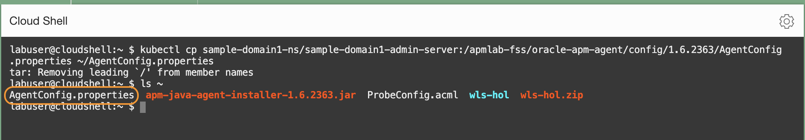
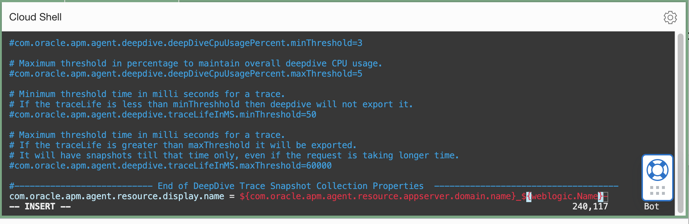
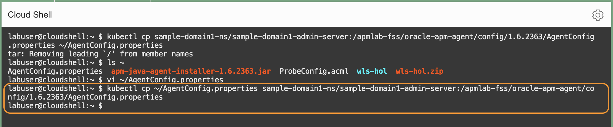
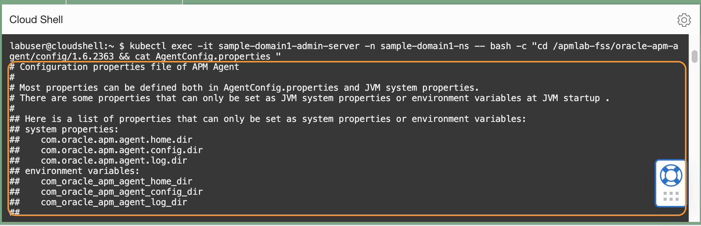
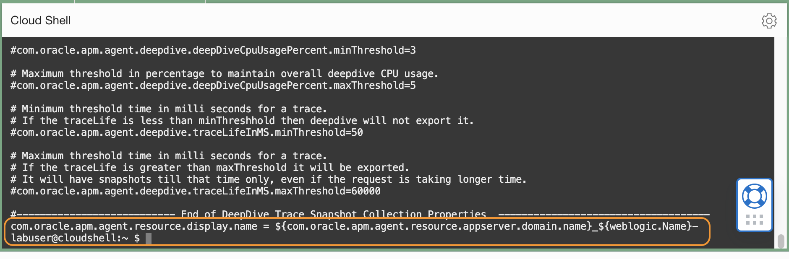

# Change the display name format of the spans

## Introduction

In this lab, you will change the display format of the span names that show up in the APM Trace Explorer. By default, the display name format is **Domain Name-Host Name-Port-Managed Server Name**. You will change the format to **Domain Name-Managed Server Name** to leave out the hostname and the port.

You will modify the **AgentConfig.properties** file, located in the APM Agent directory, which resides in the file system associated with the container.  However, because there is no editing tool inside the container, you will copy the file from the container to the Cloud Shell, edit the file, then copy it back to the container.

Estimated time: 5 minutes

### Objectives

* Obtain the configuration file from the container
*	Open the file in the Cloud shell, change the display format
*	Transfer the file back to the container

### Prerequisites

* Completion of Tasks 1 to 4 in this workshop.


## Task1: Configure the Java Agent configuration file to enable the injection


1. Run the oci ce (Container Engine) command that you saved in Lab 3, Task 2, step 5.

2. Execute the following command to copy **AgentConfig.properties**  from the container to the home directory. Make sure to ***change*** the directory name to the Agent apm-agent-version you have before running the command.


    ``` bash
    <copy>
    kubectl cp sample-domain1-ns/sample-domain1-admin-server:/apmlab-fss/oracle-apm-agent/config/<apm-agent-version>/AgentConfig.properties ~/AgentConfig.properties
    </copy>
    ```   

    >**Note:** The file path includes the APM Java Agent version. Change the directory name to the Agent version you have.  
    E.g., kubectl cp sample-domain1-ns/sample-domain1-admin-server:/apmlab-fss/oracle-apm-agent/config/**1.6.2363**/AgentConfig.properties ~/AgentConfig.properties

    run the "ls" command from the Home directory and confirm the file was transferred.  
    ```bash
    <copy>
    ls ~
    </copy>
    ```

   

3.	Open **AgentConfig.properties** with an editor

    ```bash
    <copy>
    vi ~/AgentConfig.properties
    </copy>
    ```

4.	Scroll down to the bottom of the file, and add the following line:

    ```bash
    <copy>
    com.oracle.apm.agent.resource.display.name = ${com.oracle.apm.agent.resource.appserver.domain.name}_${weblogic.Name}
    </copy>
    ```

    

5.	Copy **AgentConfig.properties** back to the container. ***Change*** to the apm-agent-version you have.

    ```bash
    <copy>
    kubectl cp  ~/AgentConfig.properties sample-domain1-ns/sample-domain1-admin-server:/apmlab-fss/oracle-apm-agent/config/<apm-agent-version>/AgentConfig.properties
    </copy>
    ```

    >**Note:** kubectl cp  ~/AgentConfig.properties sample-domain1-ns/sample-domain1-admin-server:/apmlab-fss/oracle-apm-agent/config/**1.6.2363**/AgentConfig.properties

   

6. Verify the successful file transfer, by running the following command. ***Change*** the apm-agent-version.

    ``` bash
    <copy>
    kubectl exec -it sample-domain1-admin-server -n sample-domain1-ns -- bash -c "cd /apmlab-fss/oracle-apm-agent/config/<apm-agent-version> && cat AgentConfig.properties "
    </copy>
    ```
    Review the file content.

    

    Ensure you see the changes made in the previous step.

    

    No restart on the Agent or the application is necessary, because the changes made on the configuration files in the directory will be picked up dynamically by the APM Agent.


## Acknowledgements

* **Author** - Yutaka Takatsu, Product Manager, Enterprise and Cloud Manageability
- **Contributors** - Steven Lemme, Senior Principal Product Manager,  
Anand Prabhu, Sr. Member of Technical Staff,  
Avi Huber, Vice President, Product Management
* **Last Updated By/Date** - Yutaka Takatsu, August 2022
