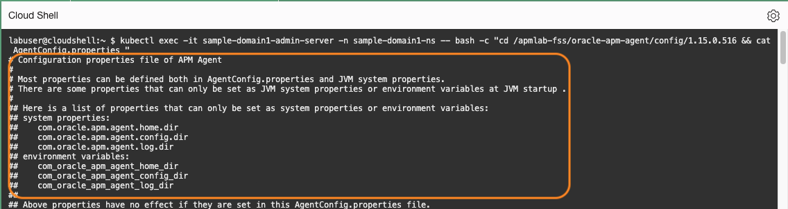
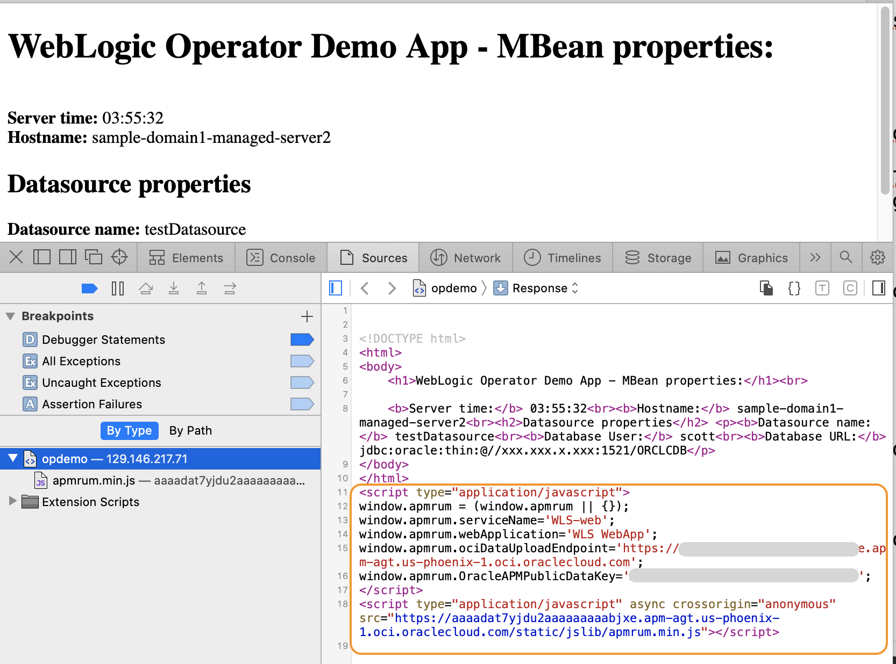

# Instrument the browser monitoring

## Introduction

In the previous labs, you instrumented the application with an APM java agent, which captures traces and spans generated by the server. In this lab, you will configure an APM browser agent that captures traces and spans generated by the browser. You will configure a java agent configuration file to add an automatic injection of a javascript to the application's webpage that deploys the APM browser agent.

The automatic injection is an APM feature that automates the Browser Agent instrumentation for Java applications.  

In this lab, you will configure **AgentConfig.properties**. In production, you can do this task together with the previous lab, where you configure display names for spans/operations because you will be editing the same file. But for learning purposes, adding browser injection is called out as a dedicated lab in this workshop.

Estimated time: 5 minutes

### Objectives

* Instrument browser by injecting JavaScript code to the webpage

### Prerequisites

* Completion of the preceding labs in this workshop

## Task1: Configure the Java Agent configuration file to enable the injection


1. If the Oracle Cloud shell session is expired, run the oci ce (Container Engine) command that you saved in Lab 3, Task 2, step 5.


2. Execute the following command to copy **AgentConfig.properties**  from the container to the home directory. Ensure to ***change*** the directory name to the Agent apm-agent-version you have before running the command.


    ``` bash
    <copy>
    kubectl cp sample-domain1-ns/sample-domain1-admin-server:/apmlab-fss/oracle-apm-agent/config/<apm-agent-version>/AgentConfig.properties ~/AgentConfig.properties
    </copy>
    ```   

    >**Note:** The file path includes the APM Java Agent version. Change the directory name to the Agent version you have.  
    E.g., kubectl cp sample-domain1-ns/sample-domain1-admin-server:/apmlab-fss/oracle-apm-agent/config/**1.6.2363**/AgentConfig.properties ~/AgentConfig.properties

    run the "ls" command from the Home directory and confirm the file was transferred.  
    ```bash
    <copy>
    ls ~
    </copy>
    ```

   

3.	Open **AgentConfig.properties** with an editor

    ```bash
    <copy>
    vi ~/AgentConfig.properties
    </copy>
    ```

4.	Find a section **Start of Browser Agent (RUM) Injection Properties**

   

    - Hit **i** to enter the edit mode, uncomment the following properties, and make changes as suggested below.
        - com.oracle.apm.agent.rum.enable.injection=**true**
        - com.oracle.apm.agent.public.data.key= **&lt;Public data key of your APM domain&gt;**
            -  Ensure to enter the ***Public key***, not the Private key of your domain.
        - com.oracle.apm.agent.rum.web.application=**WLS WebApp**
        - com.oracle.apm.agent.rum.service.name=**WLS-web**

    - Save and close the file with **esc + :wq**.

    

5.	Copy **AgentConfig.properties** back to the container. ***Change*** the directory name to the Agent apm-agent-version you have before running the command.

    ```bash
    <copy>
    kubectl cp  ~/AgentConfig.properties sample-domain1-ns/sample-domain1-admin-server:/apmlab-fss/oracle-apm-agent/config/<apm-agent-version>/AgentConfig.properties
    </copy>
    ```

    >**Note:** kubectl cp  ~/AgentConfig.properties sample-domain1-ns/sample-domain1-admin-server:/apmlab-fss/oracle-apm-agent/config/**1.6.2363**/AgentConfig.properties

   

6. Verify the successful file transfer, by running the following command. ***Change*** the apm-agent-version before running the command.

    ``` bash
    <copy>
    kubectl exec -it sample-domain1-admin-server -n sample-domain1-ns -- bash -c "cd /apmlab-fss/oracle-apm-agent/config/<apm-agent-version> && cat AgentConfig.properties "
    </copy>
    ```
    Review the file content.

    

    Ensure you see the changes made in the previous step.

    

## Task2: Verify the JavaScript in the browser source page

1.  Type the following command and note down the external IP of the **traefik operator** service.

    ``` bash
    <copy>
    kubectl get svc -n traefik
    </copy>
    ```
    

2. On your computer, open a new browser tab and access the application with the following URL pattern:

    ``` bash
    <copy>
    http://<External IP of the Load Balancer>/opdemo/?dsname=testDatasource
    </copy>
    ```
    WebLogic Operator Demo application launches.

    

3.  Right mouse click on the page and select a menu item to view the page source   

    

4.  Verify JavaScript with parameters, which are configured in the previous steps, is inserted into the page.

    

5.  Close the browser window.

You may now **proceed to the next lab**.

## Acknowledgements

* **Author** - Yutaka Takatsu, Product Manager, Enterprise and Cloud Manageability
- **Contributors** - Steven Lemme, Senior Principal Product Manager,  
Anand Prabhu, Sr. Member of Technical Staff,  
Avi Huber, Vice President, Product Management
* **Last Updated By/Date** - Yutaka Takatsu, January 2022
