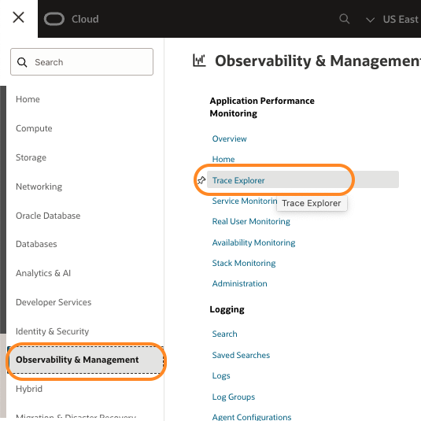
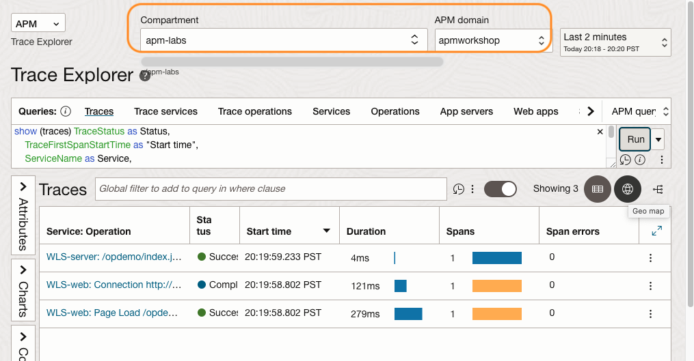
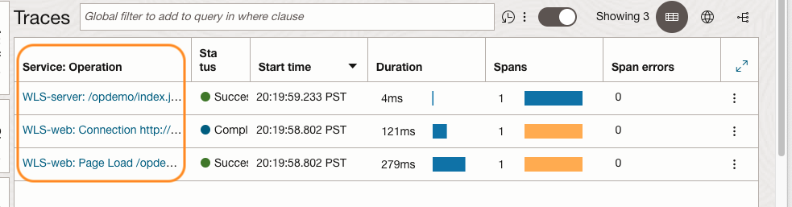
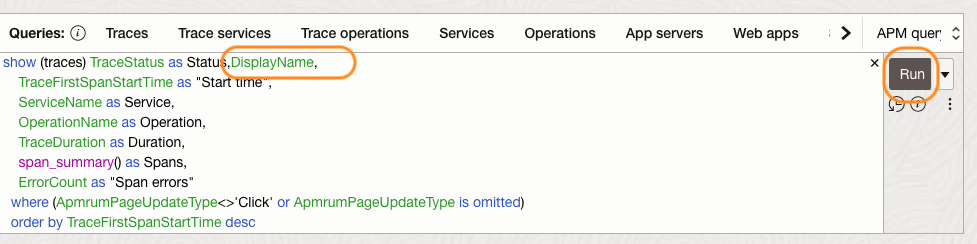
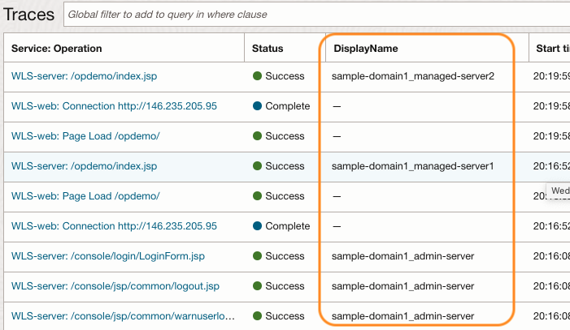
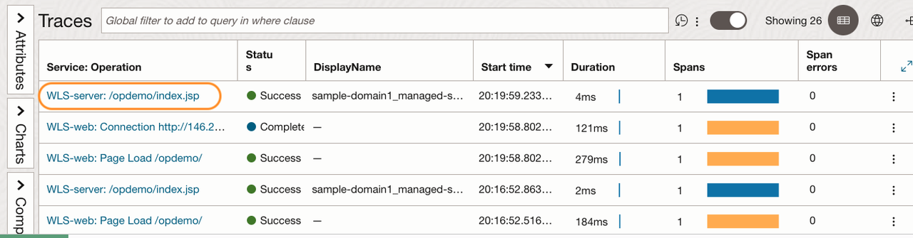
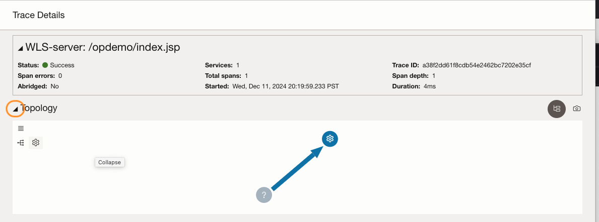
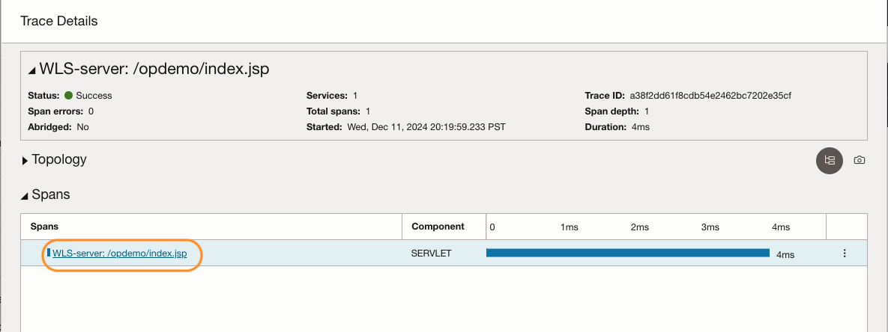
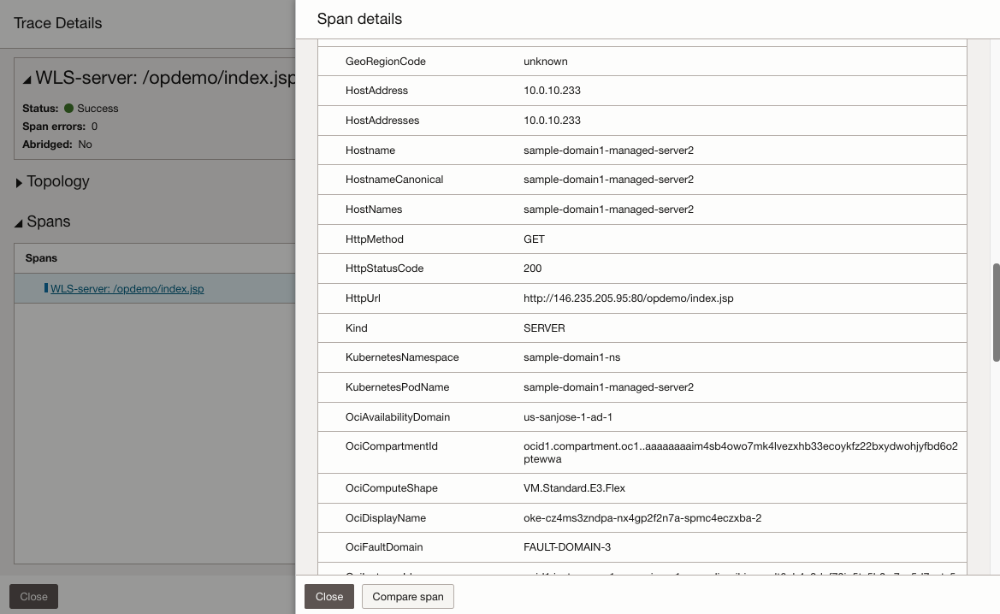

# View traces and spans in APM Trace Explorer

## Introduction

In this lab, you will learn how to use the APM Trace Explorer to trace the workload generated with the WebLogic Kubernetes Operator demo application.

Estimated time: 10 minutes

### Objectives

* Open APM Trace Explorer from the Oracle Cloud console
*	Verify traces and spans generated by the APM Java agent and the APM Browser agent
*	Examine values in the span dimensions for the WebLogic Server and browser
* Confirm the changes to the display names of the spans that are configured in Lab 6

### Prerequisites

* Completion of preceding labs in this workshop.


## Task1:  Open APM Trace Explorer in the Oracle Cloud console


1. If the Oracle Cloud shell session is expired, run the oci ce (Container Engine) command that you saved in Lab 3, Task 2, step 5.


2. From the navigation menu in the Oracle Cloud console, select **Observability & Management** > **Trace Explorer**.

   


3. On the Trace Explorer page, select the **Compartment** and the **APM Domain**. Review the traces captured. Operation

      

4. In the **Traces** view, review the **service: Operation: Operation** column of the traces. The traces with **WLS-Server** are the server-side traces. They are captured by the APM Java agent. The traces with **WLS-web** are the client-side traces, which are captured by the APM Browser agent.  

      

5.	In the query box, add **DisplayName,** (Including the comma) at the end of the first line, as in the screenshot example. Then click Run on the right side of the field.

       ``` bash
       <copy>
       DisplayName,
       </copy>
       ```

      

6.	A new column, **DispalyName** is added to the table, and values are added to the server-side traces. The format is DomainName + Server as configured in Lab 6.

    

    >**Note:** Browser traces do not have values as the configuration was applied to the server traces.

## Task2:  Verify spans and dimensions on the Trace Details page

1.	In the Traces pane, click the link to the trace with the Operation name **opdemo/index.jsp** from the table.

    

2.	On the **Trace Details** page, click the triangle icon next to **Topology**.

    

3. Click the span in the **Spans** view.

    

4.	Review the backend dimensions and values, including the WebLogic, Kubernetes, and Oracle Cloud information.

    


## Conclusions

In this workshop, you’ve learned how to use a file system by adding the APM Java agent to the microservices web application. You have also learned how to configure the APM Browser agent, and how to use APM Trace Explorer to view traces and spans. For more information on APM, refer to the OCI documentation, **[Application Performance Monitoring](https://docs.oracle.com/en-us/iaas/application-performance-monitoring/index.html)**.


## Acknowledgements

* **Author** - Yutaka Takatsu, Product Manager, Enterprise and Cloud Manageability
- **Contributors** - Steven Lemme, Senior Principal Product Manager,  
Anand Prabhu, Sr. Member of Technical Staff,  
Avi Huber, Vice President, Product Management
* **Last Updated By/Date** - Yutaka Takatsu, August 2022
