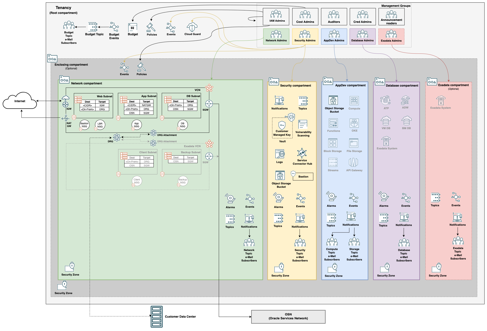

# Introduction


This set of labs will walk you through deploying a secure cloud architecture compliant with the [CIS OCI Foundations Benchmark v1.2](https://www.cisecurity.org/benchmark/oracle_cloud/). Upon completion of the labs, a full set of OCI resources will be created as a base to build a secure enterprise workload.

## Prerequisites

This lab has the following pre-requisites:

- A [free tier](https://www.oracle.com/cloud/free/) _or_ paid OCI tenancy
- An account in the Administrators group

## The CIS OCI Landing Zone Architecture

### Overview

The CIS OCI Landing Zone is an architecture and related Terraform files [publicly hosted on GitHub](https://github.com/oracle-quickstart/oci-cis-landingzone-quickstart). The output of the files can be modified by changing configurations in the [quickstart-input.tfvars](https://github.com/oracle-quickstart/oci-cis-landingzone-quickstart/blob/main/config/quickstart-input.tfvars) file, or as we will do, entering the files into Resource Manager and entering configurations in the provided GUI. This will provision a full set of resources as a base for development in OCI.

### Cost

All resources deployed by the Landing Zone are included services, meaning no cost, with one exception which will not be used for the labs.

### Architecture Components

The Landing Zone will deploy a full set of resources for a production cloud, including:

- Identity and Access Management Controls
- Networking Resources
- Logging Services
- Bastion Service
- Cloud Events
- Alarms
- Notifications
- Object Storage
- Budget Controls

The resulting architecture will look similar to this diagram: 

### IAM Components

One of the best features of the Landing Zone is a pre-defined set of groups, policies, and compartments are created for you. These resources have been created to fit most use cases and provide a solid base for enacting separation of duties.

#### Compartments

[Compartments](https://www.ateam-oracle.com/post/oracle-cloud-infrastructure-compartments) are flexible, logical containers that house different resources. In the Landing Zone, compartments are used to enable segregation of duties by separating resources based on role. Different groups will be granted permissions to these compartments based on their duties. An optional enclosing compartment is configurable so multiple Landing Zones can be deployed in a single cloud tenancy. A common use case for this is using enclosing compartments for environment type (Development, Testing, Production) with a different Landing Zone in each environment enclosing compartment.

Compartments include:

- Network
- Security
- Application Development
- Database
- _Exadata (optional)_
- _Enclosing (optional)_

#### Groups

Groups are the IAM objects on which permissions are granted. A user's membership of one or more groups will allow them to perform different functions in OCI. Without being a member of at least one group with permissions assigned, users will have no permissions to anything within OCI.

Groups provisioned by the Landing Zone are:

- Network Admins
- Security Admins
- AppDev Admins
- Database Admins
- IAM Admins
- Cost Admins
- Auditors
- Cred Admins
- Announcement Readers
- _Exadata Admins (optional)_

#### Policies

The connector between groups, compartments, and permissions in OCI are called _Policies_. Policies are human-readable statements that combine a group, a location (compartment), a resource (or set of resources), and a verb defining the level of access. The policy defining tenant-level Administrator access looks like this:

```Allow __Administrators__ to __manage all-resources__ in __tenancy__```

This policy uses __tenancy__ as the location as it encompasses all compartments in the tenant. If we want to give the group Sample_Admins full control of all resources in the Sample compartment, it would look like this:

```Allow __Sample_Admins__ to __manage all-resources__ in __compartment Sample__```

These are a few simple examples. A more detailed explanation of policies in OCI can be found in [the OCI Documentation for IAM Policies](https://docs.oracle.com/en-us/iaas/Content/Identity/policieshow/how-policies-work.htm).

## On Separation of Duties

A quick note on the principal of separation of duties as it pertains to the Landing Zone. Administrators with full access to all resources should be kept to the bare minimum to maintain security. Responsibility should be spread across multiple people and roles to prevent misuse. Admins should be granted the barest set of permissions as required to perform their duties. The Landing Zone is designed around this concept, which is the driving idea behind the design of compartments and IAM objects (users, policies).

An effort has been made to provide a default set of useful groups to carry out common roles across organizations. However, it is unlikely that this or any application will fit all organizations without any customization. The policies dictating permissions for these groups should be modified to suit organizational needs. What should _not_ be done is assigning all roles to any individuals, granting them elevated access.

## A Note About Terraform

The CIS OCI Landing Zone uses [Terraform](https://developer.hashicorp.com/terraform/intro) to deploy all resources into a tenancy. Terraform is an Infrastructure as Code tool used for provisioning cloud objects in an automated manner. This simplifies the setup of the Landing Zone and shortens the time to production in OCI.

Terraform can be used with a variety of clients to fit different deployment methods. For lab, we will leverage __OCI Resource Manager__ to simplify the use of Terraform in OCI. The OCI Resource Manager is an Oracle-managed service that is based on Terraform and uses Terraform configuration files to automate deployment and operations for the OCI resources supported by the OCI Terraform provider. It reduces the complexity of using Terraform in OCI as well as storing state in the cloud instead of on a developer laptop.

Most things in OCI can be provisioned with Terraform. While beyond the scope of this lab, more information on using Terraform in OCI can be found [here](https://docs.oracle.com/en-us/iaas/Content/API/SDKDocs/terraform.htm).
