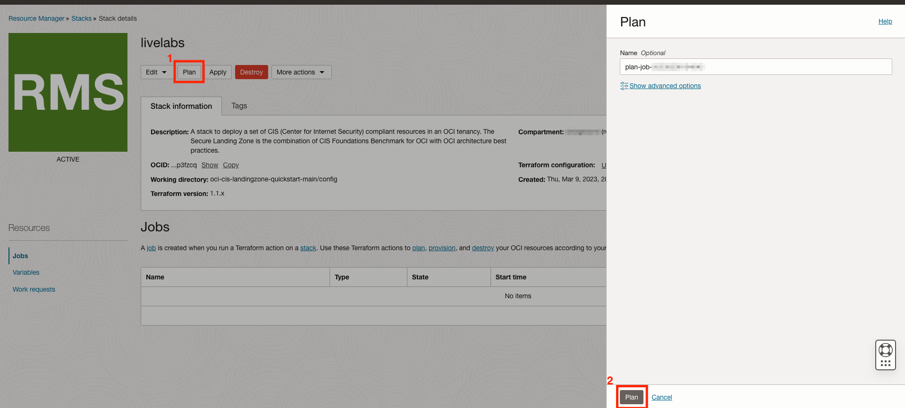
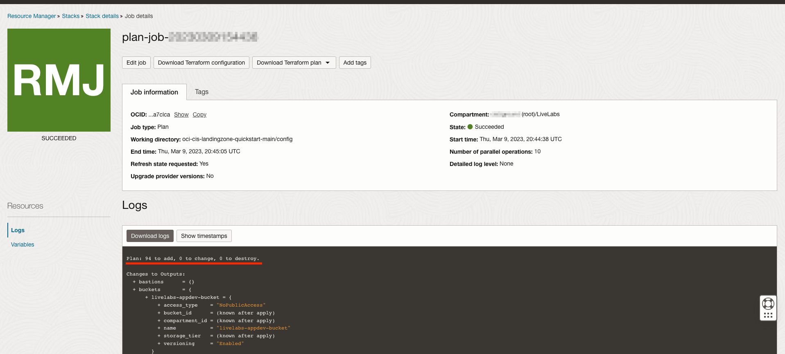
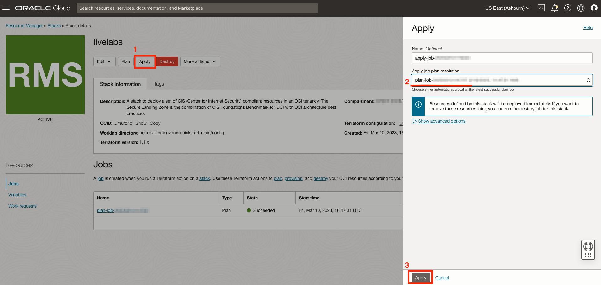
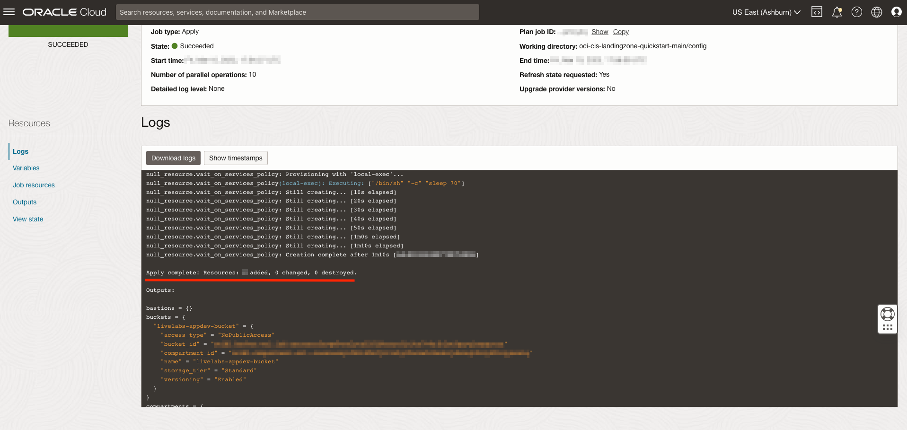
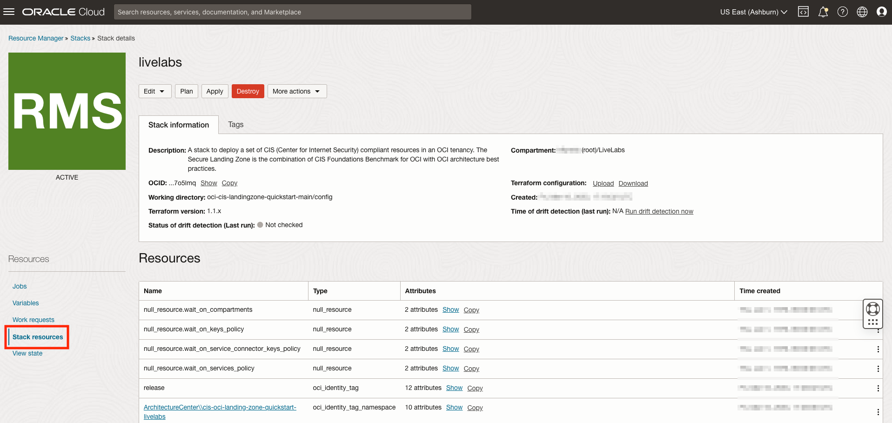
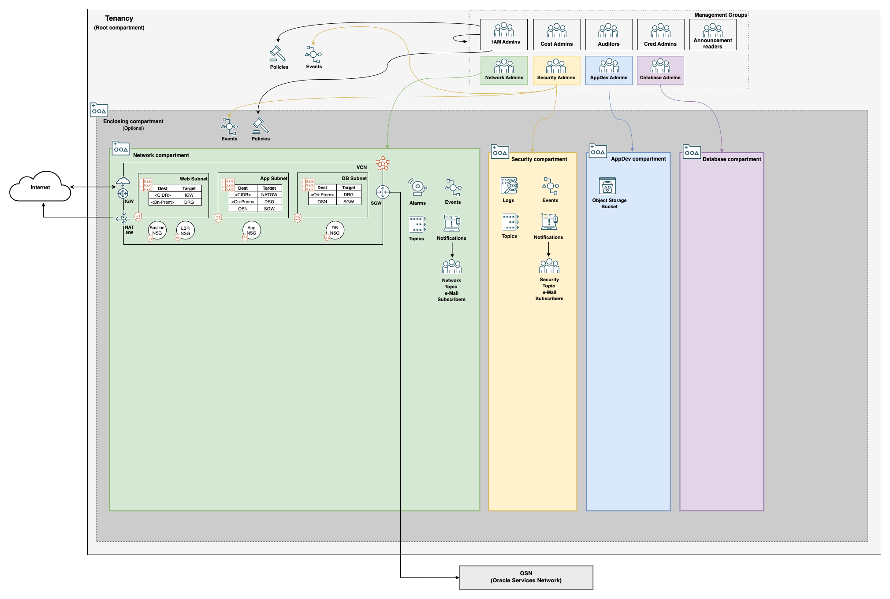

# Lab 3: Apply and Inspect Resources

Terraform should be used in two stages, plan and apply. In this lab, we will produce and check a plan before applying. Once the plan is verified, it will be used to apply and create the Landing Zone.

## Concepts

### Plan

Plan will tell us what the Terraform is intending to do. It will generate as much information about the end state and created resources as it is able. This gives us an opportunity to do a review and confirm that the Terraform is doing what was intended. In addition, we generate a file with the plan that we can use to create the resources in the next step. Going to apply without the plan will require the plan to be done ad hoc, removing the ability to turn back if needed.

### Apply

Apply will do the work of putting the plan into practice. The apply can, and normally should, take a plan file as input. On running the plan, a full log of what has been done will be generated. The plan has to infer some information, or defer to the apply since it can't control things like what ID resources will be given. The apply log will have all information related to the deployment.

## Practice

1. From the _Stack Details_ page, we will click the __Plan__ button, followed by the __Plan__ button. 
2. Wait for a bit until the plan succeeds and plan logs are available under _Logs_. Take a look to familiarize yourself with the log format. Scroll down until you see the line `Plan: X to add, 0 to change, 0 to destroy`. The exact number to add may vary, but should be in the ballpark of the screenshot below: 
3. Once satisfied by the plan logs, we put it into motion by starting the Apply process. Start by navigating back to the _Stack details_ page. Click __Apply__ and a side menu will populate. Select your plan job from the _Apply job plan resolution_ drop down and click __Apply__ again. The apply process can take up to 20 minutes, so some patience is required. 
4. Once the apply is complete, check to make sure the resources created match with your plan output. 

## Review

From the _Stack details_ page we can see a list of resources created by the Resource Manager stack. 

To summarize, the stack will have deployed:

- Network, AppDev, Database, and Security compartments
- 3-tier Virtual Cloud Network (VCN)
- Network Security Groups for web, application, and database tier assets
- VCN Flow Logs
- Internet, NAT, and Service Gateways
- IAM Groups
- [Dynamic IAM Groups](https://docs.oracle.com/en-us/iaas/Content/Identity/Tasks/managingdynamicgroups.htm)
- [IAM Policies for assigning permissions to groups](https://docs.oracle.com/en-us/iaas/Content/Identity/Tasks/managingpolicies.htm)
- Event rules and notifications for IAM and Network changes
- Object Storage Logs

A diagram of what has been created would look something like this: 

Take a few moments to explore the resources created. Ask yourself how these resources will make your environment more secure. Think about how a generic workload would be deployed on top of this architecture. Where would your workload components go, and what roles would manage them?

## Next Step

In the next lab, we will introduce another compartment, group, and supporting resources for Oracle Exadata.
