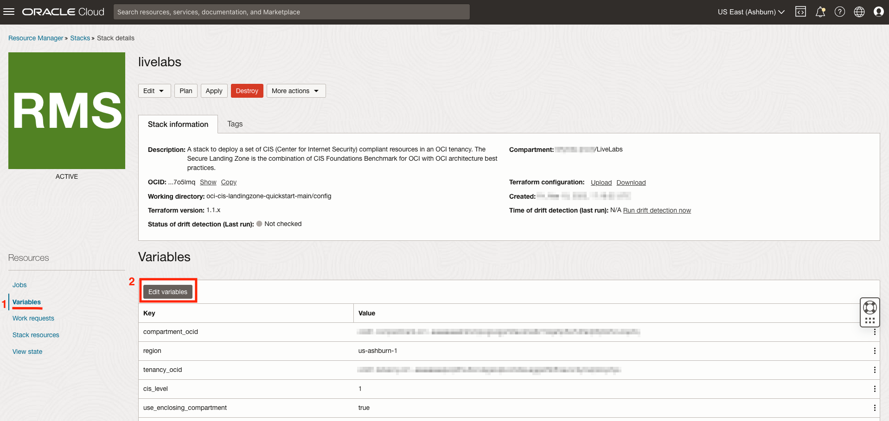
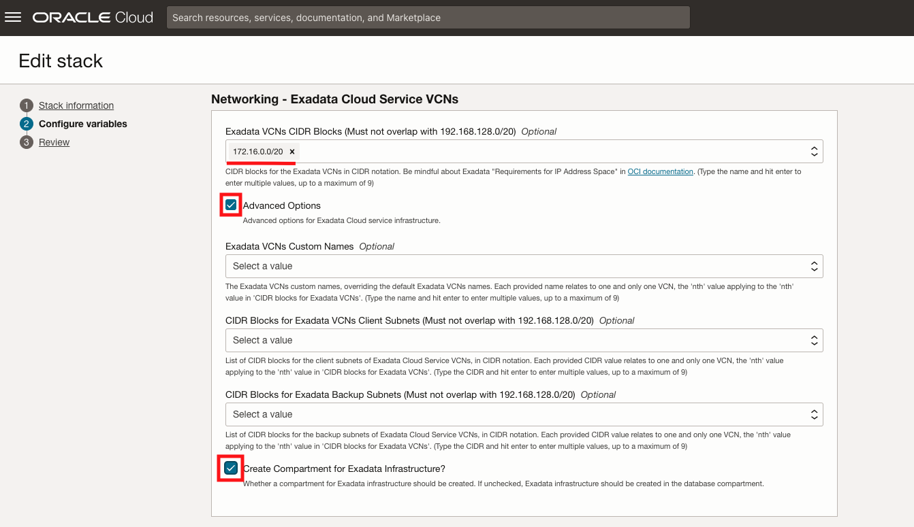
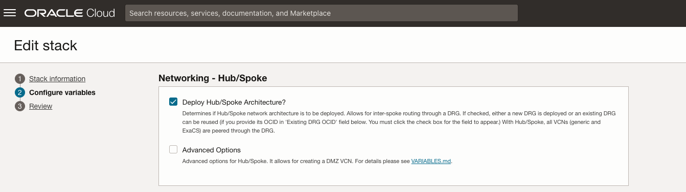
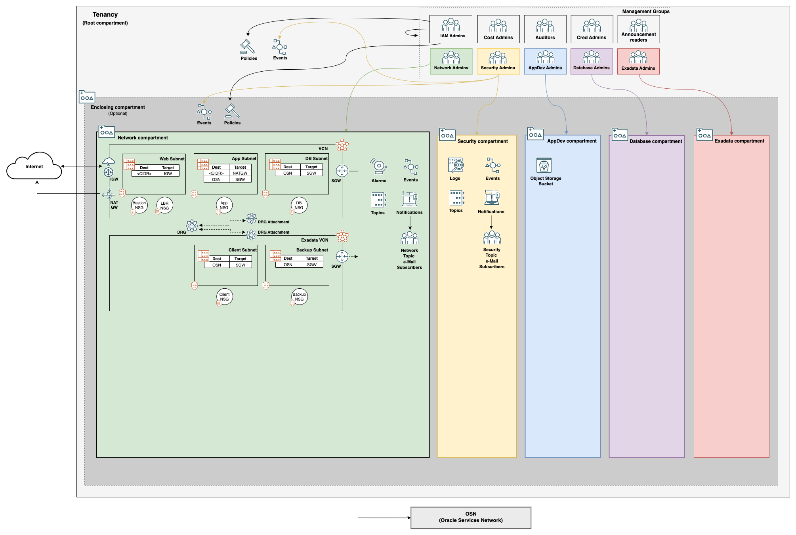
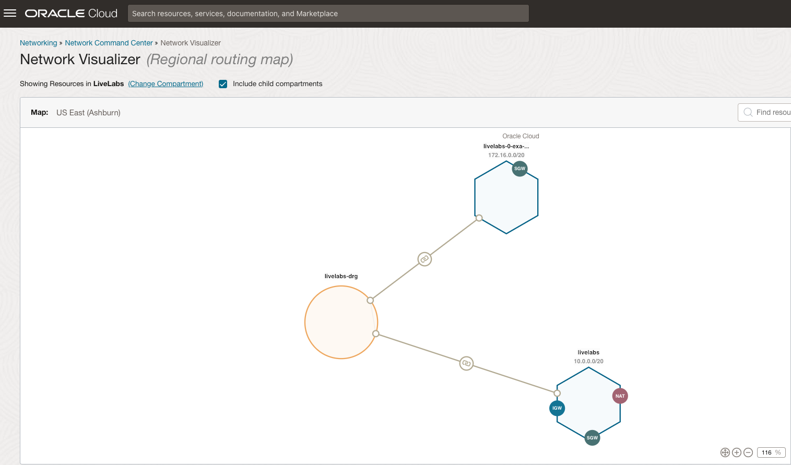

# Lab 4: Create Compartment for Exadata

## Introduction

Oracle Exadata is an extreme performance database that supports the most critical workloads for enterprise organizations. Often organizations will want special controls around who can interact with the Exadata(s).

There are configurations that can be applied in the Landing Zone to accommodate Exadata workloads. These configurations mainly do two things. The first is to grant permissions to Exadata infrastructure to a select group of administrators via an additional group and compartment. The second is to create a new network with security rules in place for Exadata.

In this lab, we will modify our previous Landing Zone to create a compartment and role specifically for housing and controlling Exadata.

Estimated Lab Time: 15 minutes

### Objectives

In this lab, you will:

- Reconfigure Stack Variables
- Create and validate an updated Plan
- Apply a Plan in place

### Prerequisites

Previous Labs

## Task 1: Edit Configurations

1. Navigate back to your _OCI Resource Manager Stack_ in the OCI console.

2. Select __Variables__ from the left side-menu, then click the __Edit variables__ button. 

3. Wait a moment for the page to populate, then enter `172.16.0.0/20` for the Exadata VCN CIDR.

4. Check the __Advanced Options__ box, and then check __Create Compartment for Exadata Infrastructure__ box. 

5. Check the __Deploy Hub/Spoke Architecture?__ box under the _Networking - Hub/Spoke_ section. This will create a Dynamic Routing Gateway to route traffic between our 3-tier VCN and the Exadata VCN. 

6. Scroll down and click __Next__ and review the new configurations. Make sure _Run apply_ is unchecked, and if acceptable, click __Save changes__.

7. Follow the same process of planning and applying the configurations in the previous lab. __Remember to check the plan output for destroys__. There should not be any resource destroyed as part of this process.

## Task 2: Review Exadata Resources

Your Landing Zone should now look like this diagram: 

There are a few notable changes that have been made:

- First, there is now a compartment created to house the Exadata infrastructure and a new admin group to manage it. This allows for further control over who is able to access and change these critical cloud resources from an IAM perspective.

- Second, a VCN was deployed to host the Exadata resources. This includes a client and backup subnet required to use Exadata in OCI. Having a separate network for Exadata allows network separation between any other VCNs running independent workloads and your Exadata databases.

- Third, we now have a Dynamic Routing Gateway (DRG) to route traffic between the VCNs in OCI. Since the VCNs are separate, they are unable to communicate without a channel to connect within OCI. The DRG serves as that channel, and can be used to implement Hun & Spoke network architectures. Using the _Network Visualizer_ tool allows us to picture this connection. 

In the next lab, we will see how to use the compliance checker script included in the Landing Zone to monitor CIS compliance in OCI.

## Acknowledgements

- __Author__ - KC Flynn
- __Contributors__ - Andre Correa, Johannes Murmann, Josh Hammer, Olaf Heimburger
- __Last Updated By/Date__ - KC Flynn April 2023
