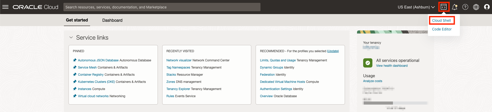
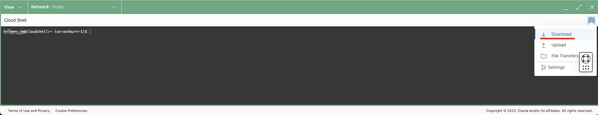
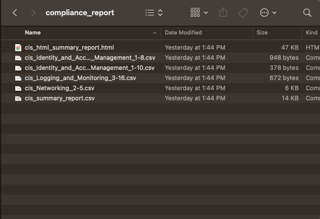
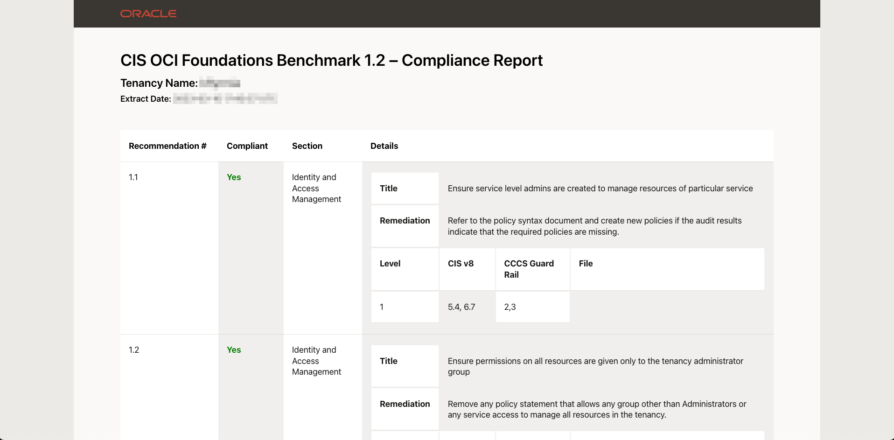

# Lab 5: Run CIS Compliance Checker Script

In this lab the Landing Zone should be successfully deployed. As time goes on and development or maintenance has been done to the Landing Zone environment, how do you ensure that compliance to CIS controls is maintained? One way is to run the [CIS Compliance Script](https://github.com/oracle-quickstart/oci-cis-landingzone-quickstart/blob/main/compliance-script.md) included in the Landing Zone.

## Running the Script

The compliance script can be run anywhere with the correct permissions and options. For this lab, we will keep it simple by running the script in [Cloud Shell](https://docs.oracle.com/en-us/iaas/Content/API/Concepts/devcloudshellintro.htm#Cloud_Shell).

1. Open the Cloud Shell from the OCI console. If this is the first time using the Cloud Shell, there may be a short wait while resources are provisioned 
2. Copy and run the following command in the Cloud Shell to download the script: `wget https://raw.githubusercontent.com/oracle-quickstart/oci-cis-landingzone-quickstart/main/scripts/cis_reports.py`
3. Run the script by entering `python cis_reports.py --level 1 --report-directory compliance_report -dt` and wait for a few moments while the script collects data
4. Once complete, there will be a directory named *compliance_report* in your home directory. Compress this directory by running `zip compliance_report.zip -r compliance_report` in the Cloud Shell
5. Download the file by opening the Cloud Shell menu in the top-right corner and selecting *Download* 
6. Enter `compliance_report.zip` into the input box and click *Download*
7. Unzip and peruse the report at your leisure

## Report Contents

The report directory will contain a variable number of files depending on the state of your OCI tenancy. The summary file contains the list of checks and if they passed or failed. Open the *cis_html_summary_report.html* file to view the contents in your web browser. Take a few moments to browse the contents.

Failed checks will have links to files included with the report on the specific resources that failed the check. The last several pages of the report will have observations, recommendations, and remediation for failed checks.

## Next Step

Finally, the last lab will walk through how to destroy the Landing Zone for quick and easy clean up. If you want to preserve the Landing Zone as a development environment or reference, simply end the lab here. Either way, we hope this content has been helpful.
