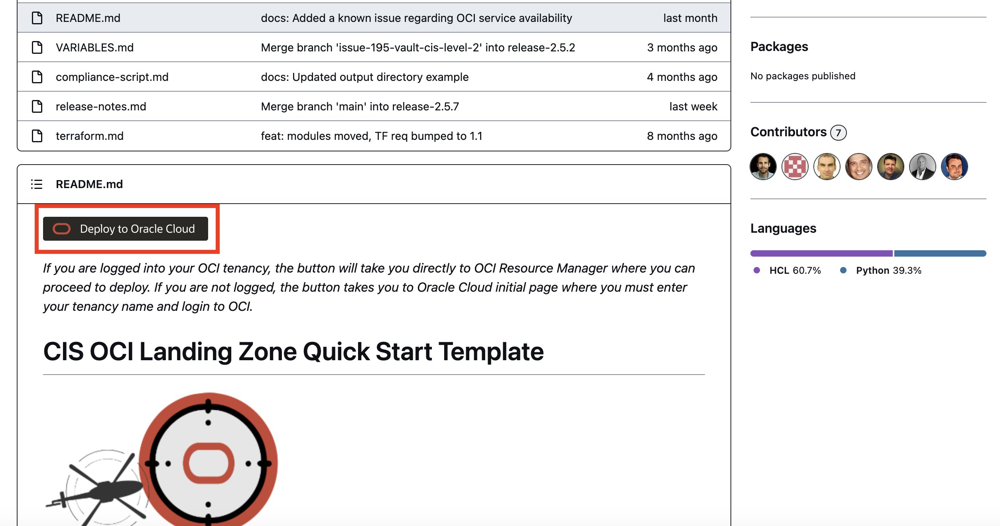
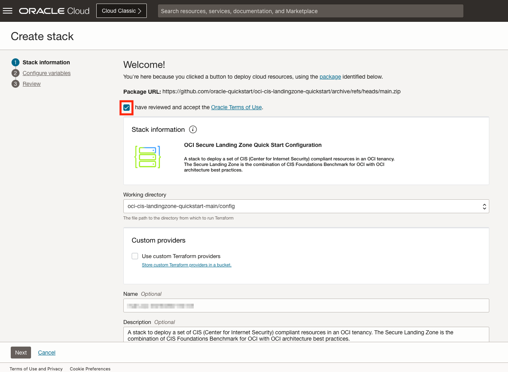

# Upload Landing Zone Terraform files to Resource Manager

## Introduction

In this Lab we will upload the files for the OCI CIS Landing Zone from the public GitHub repository into Resource Manager. The process for this is simple.

Estimated Lab Time: 5 minutes

### Objectives

In this lab you will:

- Load OCI CIS Landing Zone files into OCI Resource Manager
- Create a Resource Manager Stack

## Task 1: Upload Landing Zone to Resource Manager

1. Navigate to the Oracle Quickstart OCI CIS Landing Zone Repository on GitHub [https://github.com/oracle-quickstart/oci-cis-landingzone-quickstart](https://github.com/oracle-quickstart/oci-cis-landingzone-quickstart)

2. Find the __Deploy to Oracle Cloud__ button and click it. 

3. If you are not already logged into your OCI tenancy, you will be taken to the login screen for authentication. Once authenticated, you will be presented with the __Create Stack__ menu for creating Resource Manager Stacks.

4. Check the _I have reviewed and accept the Oracle Terms of Use_ checkbox, and after a few seconds your screen should look something like this: 

    - _Working directory_ should be set to __oci-cis-landingzone-quickstart-main/config__.

    - Set the _Name_ parameter to an appropriate name for the _Stack_. This will be what OCI uses as a display name for the Resource Manager Stack containing the Terraform files, configurations, and state going forward.

    - Make sure that an appropriate Compartment is chosen for the _Create in Compartment_ field as well before moving on.

5. Once satisfied with the current settings for the stack, click the __Next__ button on the bottom-left corner of the UI and move onto _Lab 2: Configure Variables for Basic Deployment_.

## Acknowledgements

- __Author__ - KC Flynn
- __Contributors__ - Andre Correa, Johannes Murmann, Josh Hammer, Olaf Heimburger
- __Last Updated By/Date__ - KC Flynn April 2023
