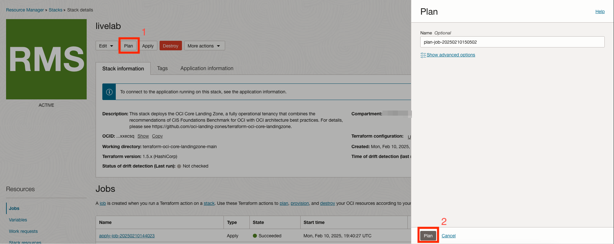
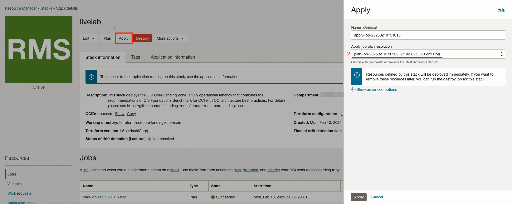
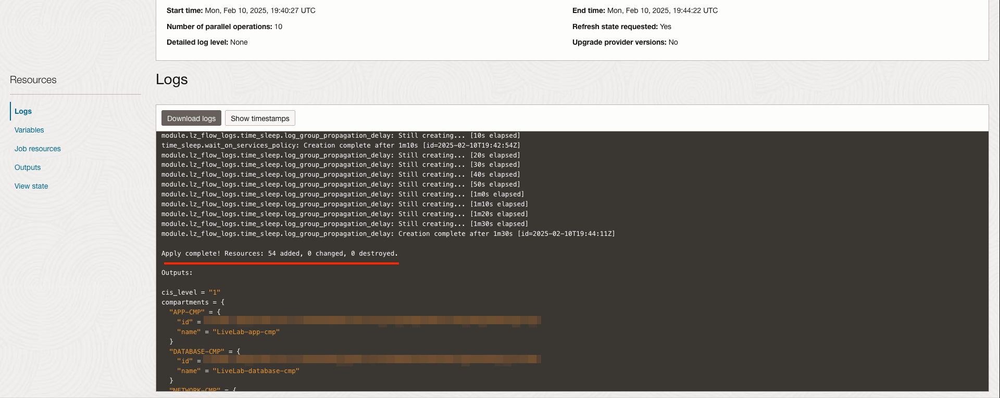
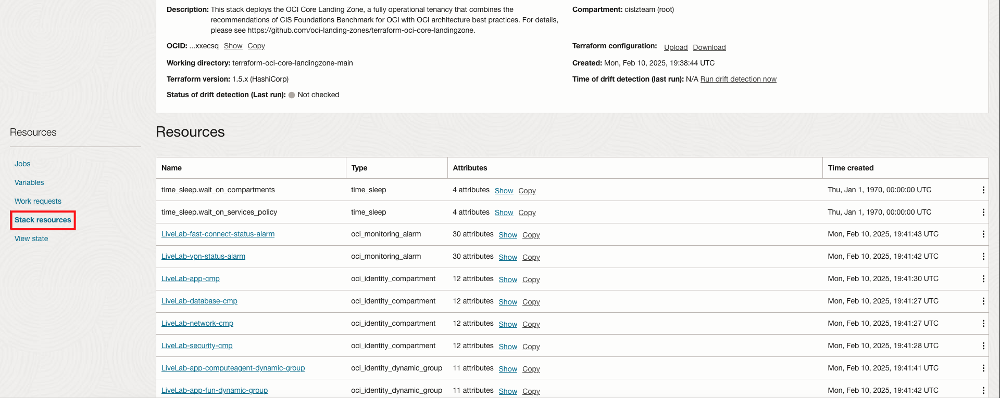
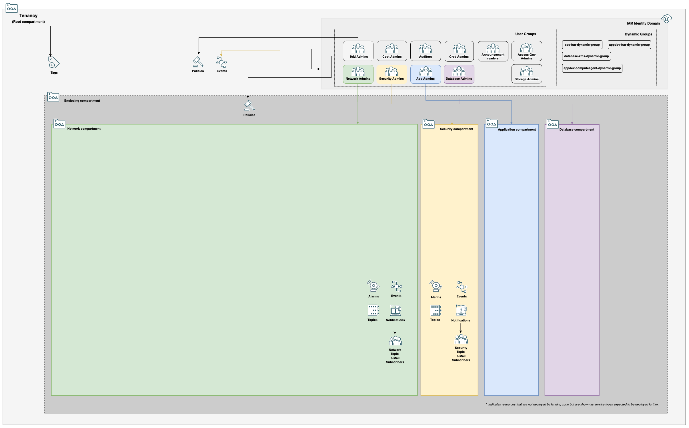

# Apply and Inspect Resources

## Introduction

Terraform should be used in two stages, plan and apply. In this lab, we will produce and check a plan before applying. Once the plan is reviewed, it will be used during the apply process to create the Landing Zone.

Estimated Lab Time: 30 minutes

### About Plan and Apply

#### Plan

Plan will tell us what the Terraform is intending to do. It will generate as much information about the end state and created resources as it is able. This gives us an opportunity to review and confirm that the Terraform is doing what was intended. In addition, we generate a file with the plan that can be used to create the resources in the next step. Applying without a plan will require creating one ad hoc, removing the ability review for unintended changes.

#### Apply

The apply step will do the work of putting the plan into practice. The apply can, and normally should, take a plan file as input. On running the plan, a full log of what has been done will be generated. The plan has to infer some information, or defer to the apply since it can't control things like what [Oracle Cloud ID (OCID)](https://docs.oracle.com/en-us/iaas/Content/General/Concepts/identifiers.htm#Oracle) resources will be given. The apply log will have all information related to the deployment.

### Objectives

The objectives of this lab are:

- Create a Terraform Plan using OCI Resource Manager
- Inspect the Plan for changes
- Use the Plan to Terraform Apply
- Inspect the Apply output

## Task 1: Create a Plan

1. From the _Stack Details_ page, we will click the first __Plan__ button, followed by the second __Plan__ button in the side menu. 
2. Wait until the plan succeeds and plan logs are available under _Logs_. Take a look to familiarize yourself with the log format. Scroll down until you see the line `Plan: X to add, 0 to change, 0 to destroy`. While the exact number may vary, it should be approximately the same as the one in the screenshot below: 

## Task 2: Apply the Plan

1. Once satisfied by the plan logs, we put it into motion by starting the Apply process. Start by navigating back to the _Stack details_ page. Click __Apply__ and a side menu will populate. Select your plan job from the _Apply job plan resolution_ drop down and click __Apply__ again. The apply process can take up to 20 minutes, so some patience is required. 
2. Once the apply is complete, check to make sure the resources created match with your plan output. 

## Task 3: Inspect Created Objects

1. From the _Stack details_ page we can see a list of resources created by the Resource Manager stack. 

    To summarize, the stack will have deployed:

    - Network, AppDev, Database, and Security compartments
    - IAM Groups
    - [Dynamic IAM Groups](https://docs.oracle.com/en-us/iaas/Content/Identity/Tasks/managingdynamicgroups.htm)
    - [IAM Policies for assigning permissions to groups](https://docs.oracle.com/en-us/iaas/Content/Identity/Tasks/managingpolicies.htm)
    - Event rules and notifications for IAM and Network changes

    A diagram of what has been created would look approximately like this: 

2. Take a few moments to explore the resources created. Ask yourself how these resources will make your environment more secure. Think about how a generic workload would be deployed on top of this architecture. Where would your workload components go, and what roles would manage them?

In the next lab, we will introduce a Virtual Cloud Network to the architecture.

## Acknowledgements

- __Author__ - KC Flynn
- __Contributors__ - Andre Correa, Johannes Murmann, Josh Hammer, Olaf Heimburger
- __Last Updated By/Date__ - KC Flynn September 2025
