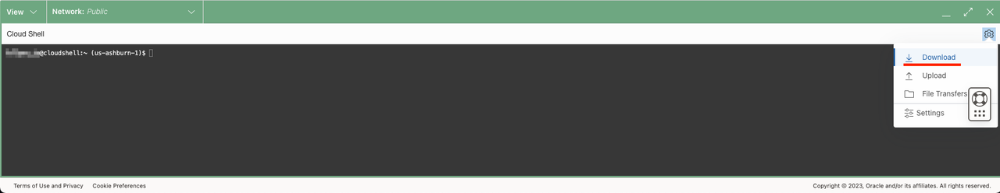
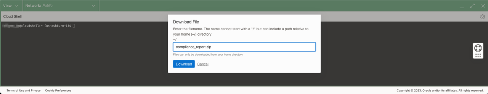
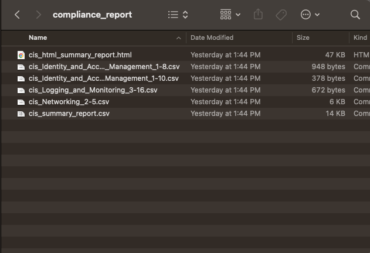
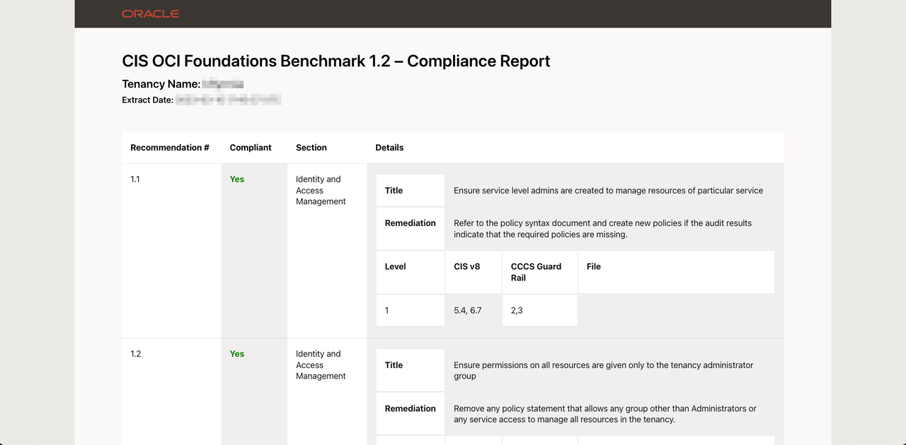

# Run CIS Compliance Checker Script

## Introduction

In this lab the Landing Zone should be successfully deployed. As time goes on and development or maintenance has been done to the Landing Zone environment, how do you ensure that compliance to CIS controls is still maintained? One way is to run the [CIS Compliance Script](https://github.com/oracle-quickstart/oci-cis-landingzone-quickstart/blob/main/compliance-script.md).

Estimated Lab Time: 10 minutes

### Objectives

In this lab, you will:

- Use the Cloud Shell to run the Compliance Checker script
- Download the script output to your local machine
- Inspect the report findings

### Prerequisites

- An account with _read all-resources_ permissions in OCI
- [Access to the OCI Cloud Shell](https://docs.oracle.com/en-us/iaas/Content/API/Concepts/devcloudshellintro.htm#Required_IAM_Policy)

## Task 1: Run the Script

The compliance script can be run anywhere with the correct permissions and options. For this lab, we will keep it simple by running the script in [Cloud Shell](https://docs.oracle.com/en-us/iaas/Content/API/Concepts/devcloudshellintro.htm#Cloud_Shell).

1. Open the Cloud Shell from the OCI console. If this is the first time using the Cloud Shell, there may be a short wait while resources are provisioned.
    
    
    

1. Copy and run the following command in the Cloud Shell to download the script:

    ```text
    <copy>
    wget https://raw.githubusercontent.com/oracle-quickstart/oci-cis-landingzone-quickstart/main/scripts/cis_reports.py
    </copy>
    ```

1. Run the script by entering the following command, then wait a moment while the script collects data.

    ```text
    <copy>
    python cis_reports.py --level 1 --report-directory compliance_report -dt
    </copy>
    ```

## Task 2: Download Findings

1. Once complete, there will be a directory named _compliance\_report_ in your home directory. Compress this directory by running the following command in the Cloud Shell.

    ```text
    <copy>
    zip compliance_report.zip -r compliance_report
    </copy>
    ```

1. Download the file by opening the Cloud Shell menu in the top-right corner and selecting _Download_. 

1. Enter `compliance_report.zip` into the input box and click _Download_. 

1. Unzip and peruse the report at your leisure.

## Task 3: Inspect Report Contents

The report directory will contain a variable number of files depending on the state of your OCI tenancy. The summary file contains the list of checks and if they passed or failed. Open the _cis\_html\_summary\_report.html_ file to view the contents in your web browser. Take a few moments to browse the contents.





Failed checks will have links to files included with the report on the specific resources that failed the check. The last several pages of the report will have observations, recommendations, and remediation for failed checks.

Finally, the last lab will walk through how to destroy the Landing Zone for quick and easy clean up. If you want to preserve the Landing Zone as a development environment or reference, simply end the lab here. Either way, we hope this content has been helpful and thank you for taking the time to learn about the [OCI Core Landing Zone](https://github.com/oci-landing-zones/terraform-oci-core-landingzone).

## Acknowledgements

- __Author__ - KC Flynn
- __Contributors__ - Andre Correa, Johannes Murmann, Josh Hammer, Olaf Heimburger
- __Last Updated By/Date__ - KC Flynn February 2025
