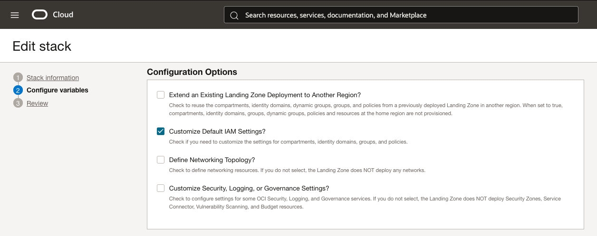
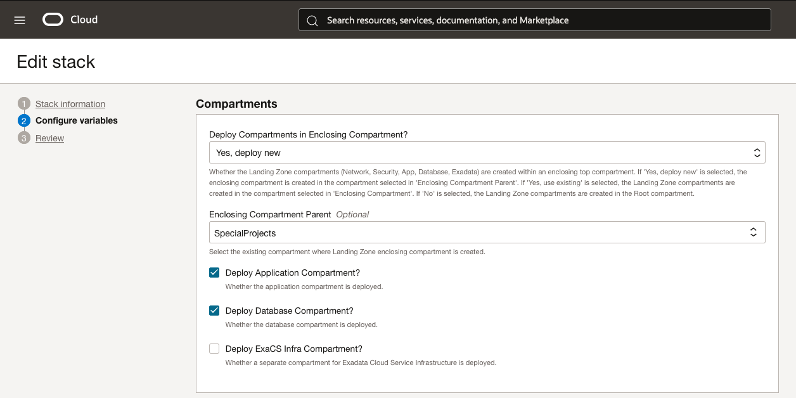
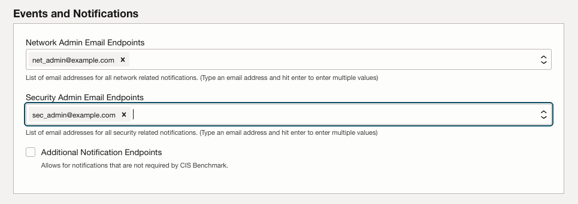
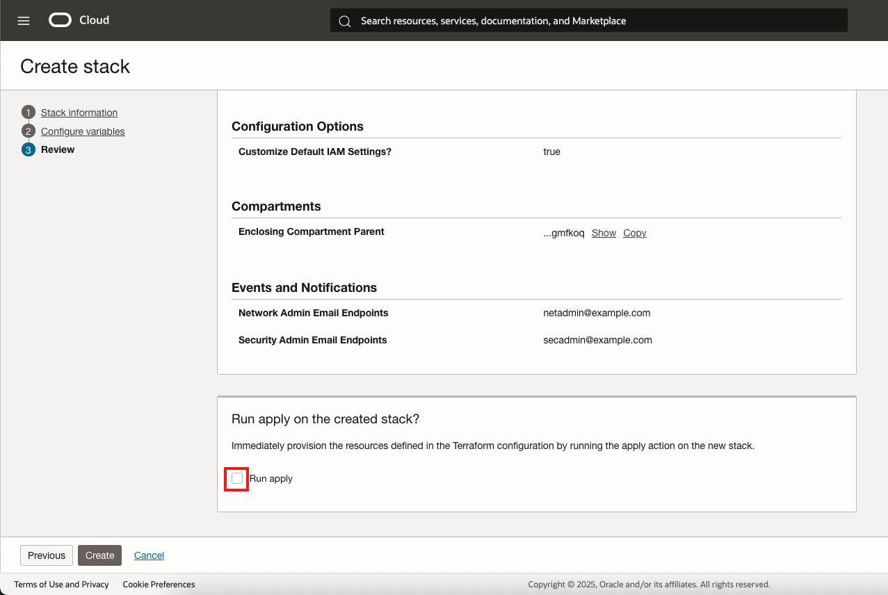

# Configure Variables for Basic Deployment

## Introduction

You should be on the __Configure Variables__ page as defined by the left side-menu. What this page does is allow us to define variables that would otherwise be defined in the [variables file](https://github.com/oci-landing-zones/terraform-oci-core-landingzone/blob/main/templates/cis-basic/main.tf.template) in the main project templates. Resource Manager is translating the fields from the config file into a more friendly interface for usability.

Estimated Lab Time: 10 minutes

### Objectives

In this lab you will:

- Use the Resource Manager interface to enter variable values
- Inspect available configuration options for the Landing Zone

## Task 1: Enter General Variables

This section sets general environmental configurations for the Landing Zone. Inputs from this section will control fundamental parts of the Landing Zone. For this lab, we will only work with a few of these options, which will be explained below.

1. First check the __Free Tenancy?__ box. This will prevent the Landing Zone from deploying Cloud Guard & Security Zones. These services are not available in Free Tier tenancies and may conflict with settings in existing tenancies.

    We recommend enabling and configuring Cloud Guard if eligible. We are not going to use Cloud Guard in this lab.
1. The next field to check is the __Region__. Most likely your current region is entered here automatically. If deployment to another region is desired, select the appropriate value from the drop-down menu. You must be [subscribed to the region](https://docs.oracle.com/en-us/iaas/Content/Identity/Tasks/managingregions.htm#uconsole) prior to deployment.
1. Next, set the __CIS Level__ variable. There are two levels of CIS compliance to choose from. These levels correspond to requirements found in the [CIS OCI Foundations Benchmark v3.0](https://www.cisecurity.org/benchmark/oracle_cloud/). To see a full list of changes between CIS Levels 1 & 2, please refer to the benchmark. CIS Level 2 requires additional encryption necessitating the creation of an [OCI Vault](https://docs.oracle.com/en-us/iaas/Content/KeyManagement/Concepts/keyoverview.htm) and encryption keys. __We will use CIS Level 1 for this lab__.
1. The final field is __Service Label__. This service label will be prepended to everything created by the Landing Zone. As such, we need to choose a succinct value to enter. The requirements for service labels are 2-15 characters, the first being a letter. Resource Manager will display an error message on the field if these rules are violated.

    

## Task 2: Configure Enclosing Compartment

1. Check the box under _Configuration Options_ section labelled __Customize Default IAM Settings?__.

    

1. In the _Compartments_ section, select the __Enclosing Compartment Parent__ compartment from the drop down. Leave the other settings as default. The _Compartments_ section should match the below picture, except for the chosen enclosing compartment.

    

## Task 3: Configure Events and Notifications

There are two required notification contacts as required by CIS controls. An email address for a network admin and a security admin. Once created, these addresses will receive a confirmation email that will need to be accepted before notifications are sent. Upon validating that they want to continue receiving the notifications, they will be sent messages when a network or security (IAM) object is created, modified, or destroyed. There can be multiple endpoints for each service to allow for redundancy if specifying the addresses of individuals.

There are further endpoints defined for admins of other services, but these are not mandatory under the CIS benchmark. For this lab, we will not use them.

1. Enter your email in _Network Admin Email Endpoints_.

2. Enter your email in _Security Admin Email Endpoints_.

## Task 4: Inspect Options

Take a moment to look at the advanced options exposed by configuration in the Core Landing Zone in the _Configuration Options_ section.

For more information on how to utilize additional configuration, take a look at the [Deployment Guide](https://github.com/oci-landing-zones/terraform-oci-core-landingzone/blob/main/DEPLOYMENT-GUIDE.md).

### Finishing Up

1. Click __Next__ to continue to the review page. Quickly double check the variables entered.

2. __Uncheck the _Run apply_ button__.

3. Click the __Create__ button when finished.

Once the Stack configuration is saved, move on to the next lab to continue.

## Acknowledgements

- __Author__ - KC Flynn
- __Contributors__ - Andre Correa, Johannes Murmann, Josh Hammer, Olaf Heimburger
- __Last Updated By/Date__ - KC Flynn September 2025
