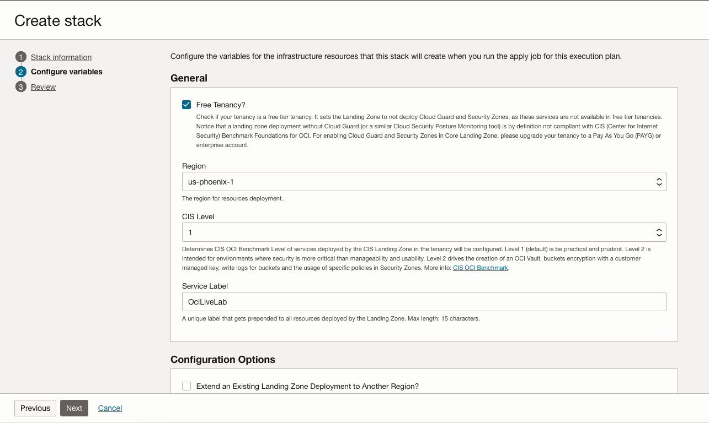

# Configure Variables for Basic Deployment

## Introduction

You should be on the __Configure Variables__ page as defined by the left side-menu. What this page does is allow us to define variables that would otherwise be defined in the [variables file](https://github.com/oci-landing-zones/terraform-oci-core-landingzone/blob/main/templates/cis-basic/main.tf.template) in the main project templates. Resource Manager is translating the fields from the config file into a more friendly interface for usability.

Estimated Lab Time: 10 minutes

### Objectives

In this lab you will:

- Use the Resource Manager interface to enter variable values
- Inspect available configuration options for the Landing Zone

## Task 1: Enter Environment Variables

This section sets general environmental configurations for the Landing Zone. Inputs from this section will control fundamental parts of the Landing Zone. For this lab, we will only work with a few of these options, which will be explained below.

1. The first field to check is the __Region__. Most likely, your current region is entered here automatically. If you want to deploy into another region, just select the appropriate value from the drop-down menu. You must be [subscribed to the region](https://docs.oracle.com/en-us/iaas/Content/Identity/Tasks/managingregions.htm#uconsole) prior to deployment.
1. The second field is __CIS Level__. There are two levels of CIS compliance to choose from. These levels correspond to requirements found in the [CIS OCI Foundations Benchmark v2.0](https://www.cisecurity.org/benchmark/oracle_cloud/). To see a full list of changes between CIS Levels 1 & 2, please refer to the benchmark. The high level summary is that CIS Level 2 requires more strict encryption necessitating the creation of an [OCI Vault](https://docs.oracle.com/en-us/iaas/Content/KeyManagement/Concepts/keyoverview.htm) and encryption keys. __We will use CIS Level 1 for this lab__.

1. The third field is __Service Label__. This service label will be prepended to everything created by the Landing Zone. As such, we need to choose a succinct value to enter. The requirements for service labels are 2-15 characters, the first being a letter. If you violate these rules, the field will let you know.

    

## Task 2: Configure Events and Notifications

There are two required notification contacts as required by CIS controls. An email address for a network admin and a security admin. Once created, these addresses will receive a confirmation email letting the person on the other end know that they are signed up for these notifications. Upon validating that they want to continue receiving the notifications, they will be sent messages when a network or security (IAM) object is created, modified, or destroyed. There can be multiple endpoints for each service to allow for redundancy if specifying the addresses of individuals. More often than not, these notifications go to shared inboxes for their respective teams.

There are further endpoints defined for admins of other services, but these are not mandatory under the CIS benchmark. For this lab, we will not use them.

1. Enter your email in _Network Admin Email Endpoints_.

2. Enter your email in _Security Admin Email Endpoints_.

## Task 3: Inspect Options

### Cloud Guard

1. Uncheck the _Enable Cloud Guard Service?_ button if it is selected. Cloud Guard is a Cloud Security Posture Management tool that is free to use for paid accounts. If Cloud Guard already has targets set, checking this box will cause the deployment to fail. If you are using a free tier account, Cloud Guard is not included and the deployment will fail.

We recommend using Cloud Guard if eligible. For the purposes of this lab, we are not going to use it with the Landing Zone.

### Security Zones, Logging Consolidation, Vulnerability Scanning, and Cost Management

All are useful tools, but for the sake of starting simple will not be a part of the labs.

### Finishing Up

1. Click __Next__ to continue to the review page. Quickly double check the variables entered.

2. __Uncheck the _Run apply_ button__.

3. Click the __Create__ button when finished.

Once the Stack configuration is saved, move on to the next lab to continue.

## Acknowledgements

- __Author__ - KC Flynn
- __Contributors__ - Andre Correa, Johannes Murmann, Josh Hammer, Olaf Heimburger
- __Last Updated By/Date__ - KC Flynn February 2025
