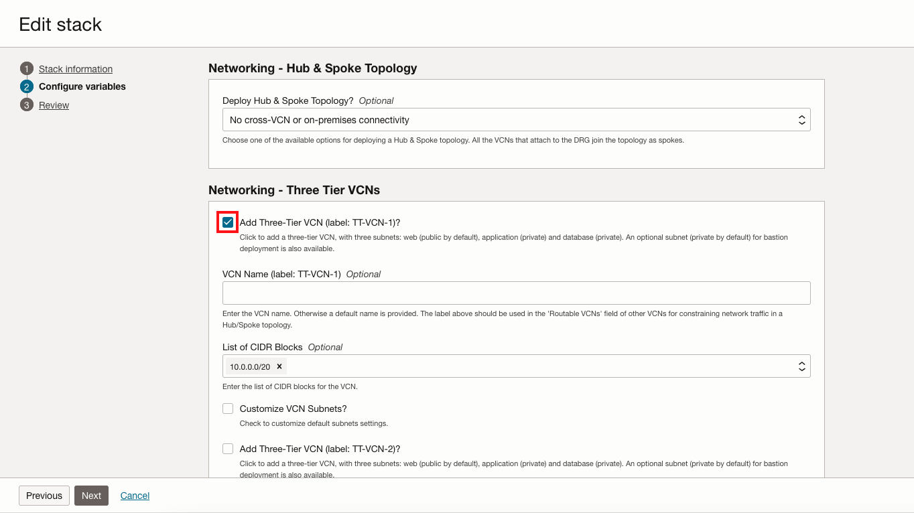
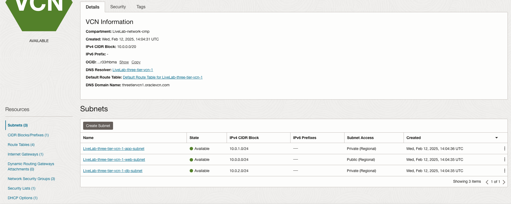
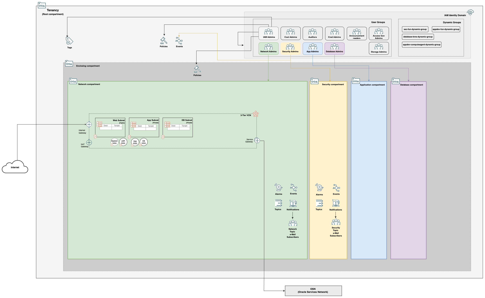

# Deploy a Network on the Landing Zone

## Introduction

We have created the skeleton of the Landing Zone we need to deploy our workload (not included in this lab). We have all the IAM requirements met including compartments, groups, and policies. Now, our workload will need the ability to communicate with clients and components. One or more Virtual Cloud Networks will give us the ability to do so.

### Objectives

- Learn how to modify Landing Zone by changing configuration variables
- Plan and Apply configuration in-place to create a 3-tier network
- Inspect network resources

## Task 1: Configure Network Variables

We will need to return to the configurations that we used to define the Landing Zone. By modifying the configuration variables, we can declare a network that will be added to the Landing Zone.

1. In the *Stacks* menu for the *Resource Manager Stack* we deployed in the previous lab, select __Variables__ under *Resources*.
1. Click the __Edit Variables__ button. Please note that it may take a moment for the variables form to populate.

    

1. Select the __Define Network Topology?__ checkbox in the *Configuration Options* section of the stack variables.

    

1. Four Networking sections will appear. Proceed to *Networking - Three Tier VCNs* and check the __Add Three-Tier VCN (label: TT-VCN-1)?__ button. Note that the display name for the VCN is configurable by using the field *VCN Name (label: TT-VCN-1)*. The VCN name will default to *TT-VCN-1* otherwise. The network CIDR Block(s) can be changed in the *List of CIDR Blocks* field. Further customizations are available in *Customize VCN Subnets?*, but are outside the scope of this lab.

    

1. Select the __Next__ button to move to the *Review* page.
1. Ensure that *Run apply* is __not checked__ and __Save changes__.

## Task 2: Plan and Apply Updated Configuration

With our new configurations in place, we will go through the plan and apply process to deploy a network.

1. You should be on the *Stack details* page after saving the configuration. Click the __Plan__ button and then __Plan__.
1. Check the plan logs to ensure that resources are being added, ensuring that resources are being added and not changed or destroyed. This will mean the deployment will happen in-place, without any resources being terminated and re-created.

    *Note: The exact number of resources to add may vary from the screenshot below.*

    

1. Navigate back to the *Stack details* page and click the __Apply__ button.
1. Select the *Plan* we just created from the __Apply job plan resolution__ drop down and then __Apply__ again.
1. Once the *Apply* is complete, inspect the logs to make sure that the deployed resources match the desired state defined by the configuration.

    

## Task 3: Inspect Changes

1. Navigate from the main menu in the top-left corner of the console to *Networking* > *Virtual cloud networks* to inspect the new 3-tier VCN. Make sure you are in the network compartment to see network resources.

    

1. Click the Three Tier VCN and inspect the network details. Note that subnets, route tables, network security groups, and other objects have been created for the network. These resources determine how the VCN functions and how security is applied by default on the network.

    

1. (*Optional*) From the main menu, go to *Networking* > *Network Visualizer* to see a visualization of the network. If you do not see a network visualization, ensure that the network compartment is currently selected. You should see three different gateways for resources on the network to communicate. An Internet Gateway (IGW) for the web tier, a NAT gateway for private internet access for the App and DB subnets, and finally a Service Gateway (SGW) for private communication with OCI internal services.

    

Your Landing Zone will look something like this now:

In the next lab, we will increase the complexity (and scalability) of our Core Landing Zone network.

## Acknowledgements

- __Author__ - KC Flynn
- __Contributors__ - Andre Correa, Johannes Murmann, Josh Hammer, Olaf Heimburger
- __Last Updated By/Date__ - KC Flynn September 2025
