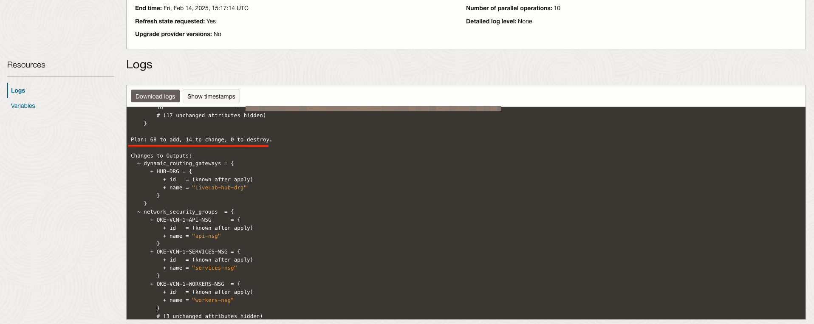
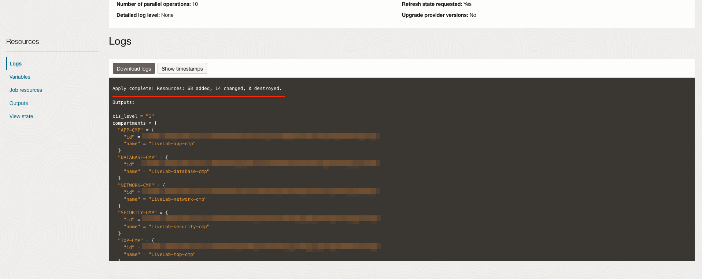
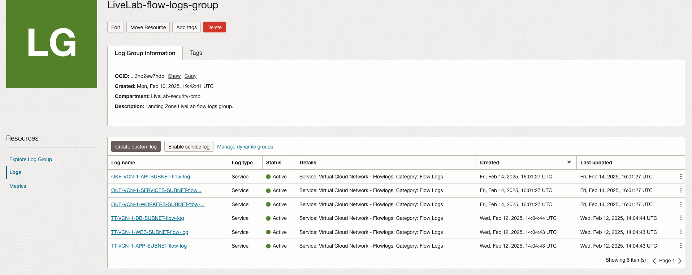

# Deploy a Hub & Spoke Network

## Introduction

A network best practice is to use a hub & spoke network architecture. This allows for a scalable network, as many spoke networks can be added as requirements expand.

In OCI, we use a Dynamic Routing Gateway (DRG) to perform many tasks that create paths to other networks. The DRG will act as an endpoint for FastConnect and IPSec tunnel connections from other clouds or data centers. It will also connect networks internal to OCI, acting as a hub.

We will use the Landing Zone to connect our three tier network to a network for Oracle Kubernetes Engine (OKE). The OKE network will be pre-configured to support Kubernetes workloads. This will allow our workload to scale out from a three tier architecture to a microservices based architecture.

### Objectives

- Learn how to modify Landing Zone by changing configuration variables
- Plan and Apply configuration in-place to create a hub & spoke network
- Inspect network resources

## Task 1: Re-configure Network Variables for Hub & Spoke Network

1. Step into the _Edit variables_ page in the _Stack Details_ > _Resources_ > _Variables_ in the same way we began the previous lab.
1. Under _Network Topology_ we need to select an option that creates a DRG. Multiple Landing Zones could be connected by selecting an option that uses an existing DRG, but we don't have one of those yet.

    Select __VCN or on-premises connectivity routing via DRG (DRG will be created)__.

    Leave _On-Premises Connectivity Type_ set to __None__.

    

1. In _Networking - Three Tier VCNs_ select the checkbox for __Attach this VCN to DRG (Dynamic Routing Gateway)?__. This will attach the network to the DRG. Select __OKE-VCN-1__ in _Routable VCNs_. This will make a route table entry to allow traffic to pass to _OKE-VCN-1_.

    

1. In _Networking - OKE VCNs_, check the __Add OKE VCN (label: OKE-VCN-1)?__ checkbox. Then, check the __Attach this VCN to DRG (Dynamic Routing Gateway)?__ and in _Routable VCNs_ select __TT-VCN-1__. This will create our OKE network, attach it to the DRG, and allow it to pass traffic to our three tier VCN.

    

1. Select the __Next__ button to move to the _Review_ page.
1. Ensure that _Run apply_ is __not checked__ and __Save changes__.

## Task 2: Plan and Apply Changes

1. You should be on the _Stack details_ page after saving the configuration. Click the __Plan__ button and then __Plan__.
1. Check the plan logs to ensure that resources are being added, ensuring that resources are being added and not changed or destroyed. This will mean the deployment will happen in-place, without any resources being terminated and re-created.

    

1. Navigate back to the _Stack details_ page and click the __Apply__ button.
1. Select the _Plan_ we just created from the __Apply job plan resolution__ drop down and then __Apply__ again.
1. Once the _Apply_ is complete, inspect the logs to make sure that the deployed resources match the desired state defined by the configuration.

    

## Task 3: Inspect Changes

1. Navigate from the main menu in the top-left corner of the console to _Networking_ > _Virtual cloud networks_ to see the second VCN added to the Networks page. Make sure you are in the network compartment to see network resources.
1. Next, navigate to _Observability & Management_ > _Log Groups_ and select the _Security_ compartment. Select the _flow-logs-group_ for your Landing Zone. Select _Logs_ under resources to see your subnet flow logs that have been created to log traffic in the Landing Zone VCNs.

    

1. (_Optional_) From the main menu, go to _Networking_ > _Network Visualizer_ to see a visualization of the network. If you do not see a network visualization, ensure that the network compartment is currently selected.

    You should now see multiple networks as spokes with attachments to the DRG. This will facilitate cross-VCN communication, as well as enable scaling as more VCNs are brought online.

    

In our next lab, we will run a script to check the Landing Zone for compliance with the Center for Internet Security (CIS) Benchmark for OCI 2.0.

## Acknowledgements

- __Author__ - KC Flynn
- __Contributors__ - Andre Correa, Johannes Murmann, Josh Hammer, Olaf Heimburger, Gregg MacKeigan
- __Last Updated By/Date__ - KC Flynn August 2025
