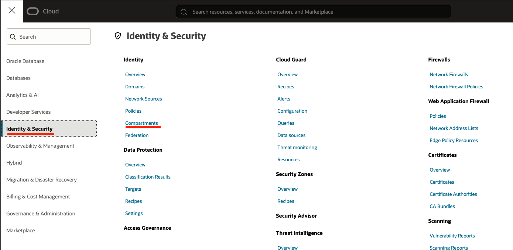
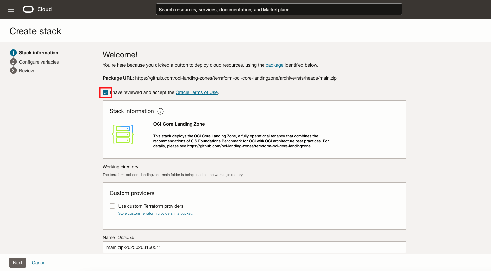

# Upload Landing Zone Terraform files to Resource Manager

## Introduction

In this Lab we will upload the files for the OCI Core Landing Zone from the public GitHub repository into Resource Manager. The process for this is simple.

Estimated Lab Time: 5 minutes

### Objectives

In this lab you will:

- Create a Landing Zone Compartment
- Load OCI Core Landing Zone files into OCI Resource Manager
- Create a Resource Manager Stack

## Task 1: Create an Enclosing Compartment

1. From the console home page, navigate to _Identity & Security_ > _Compartments_.

    

2. Click on the __Create Compartment__ button.

    

3. Select a name for the enclosing compartment as well as an appropriate parent compartment.

    

4. Click the __Create Compartment__ button.

## Task 2: Upload Landing Zone to Resource Manager

1. Navigate to the OCI Core Landing Zone Repository on GitHub [https://github.com/oci-landing-zones/terraform-oci-core-landingzone/](https://github.com/oci-landing-zones/terraform-oci-core-landingzone/blob/main/README.md)

2. Find the __Deploy to Oracle Cloud__ button and click it. 

3. If you are not already logged into your OCI tenancy, you will be taken to the login screen for authentication. Once authenticated, you will be presented with the __Create Stack__ menu for creating Resource Manager Stacks.

4. Check the _I have reviewed and accept the Oracle Terms of Use_ checkbox, and after a few seconds your screen should look something like this: 

    - Set the _Name_ parameter to an appropriate name for the _Stack_. This will be what OCI uses as a display name for the Resource Manager Stack containing the Terraform files, configurations, and state going forward.

    - Make sure that the correct compartment is selected for the _Create in Compartment_ field before moving on. _Note: This defines which compartment will contain the Stack object itself, not where the Landing Zone will be deployed._

5. Once satisfied with the current settings for the stack, click the __Next__ button on the bottom-left corner and move onto _Lab 2: Configure Variables for Basic Deployment_.

## Acknowledgements

- __Author__ - KC Flynn
- __Contributors__ - Andre Correa, Johannes Murmann, Josh Hammer, Olaf Heimburger
- __Last Updated By/Date__ - KC Flynn September 2025
