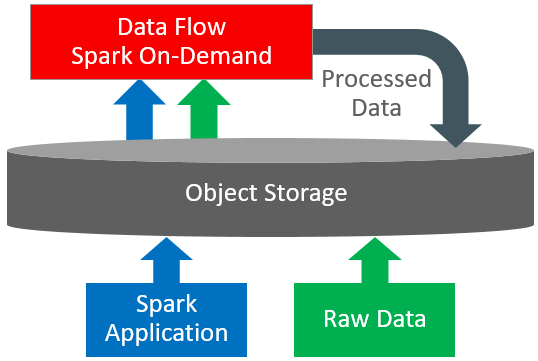

# Introduction

## About this workshop
We will build a modern data platform on OCI leveraging OCI Data Flow, OCI Data Integration Service, OCI Data Catalog, Autonomous Database and OCI Data Lake services. We will use the Citibike trip histories datasetfrom https://citibikenyc.com/system-data.

We will modernize the Citibike data platform to solve 3 problems:
1. Capacity problem: How to store the right number of bikes in each station?
2. Maintenance problem: How to ensure the bikes are serviced at the right time?
3. Security problem: How to ensure that the users have the right level of security and access, defined and governed centrally at the data platform itself?

### Workshop Architecture

 
OCI Data Platform helps you drive advances outcomes using all your data. It comprises of a set of managed open source engines like OCI Data Flow along with best-in-class proprietary database engines like Autonomous Database, managed low-code engines like OCI Data Integration service, managed metadata from OCI Data Catalog and centralized storage and governance from OCI Data Lake. We will use all these services in today's hands-on-lab to provide you a complete picture of what an end-to-end Data-AI-ML pipeline will look like in OCI.    

OCI Data Flow service is a fully managed Spark as a service. OCI Data Flow makes it easy to run Spark applications to process stream data and perform heavy-weight stream operations including machine learning. In today's workshop, we will use OCI Data Flow as a key data processing engine.

Estimated Workshop Time: 120 minutes

### About Oracle Cloud Infrastructure Data Flow
Data Flow is a cloud-based serverless platform with a rich user interface. It allows data engineers and data scientists
to create, edit, and run Apache Spark workloads at any scale without the need for clusters, an operations team, or highly
specialized Spark knowledge. Being serverless means there is no infrastructure for you to deploy or manage.
It is entirely driven by REST APIs, giving you easy integration with applications or workflows. You can:

* Connect to Apache Spark data sources.
* Create reusable Apache Spark applications.
* Launch Apache Spark jobs in seconds.
* Create Apache Spark applications using SQL, Python, Java, Scala, or spark-submit.
* Manage all Apache Spark applications from a single platform.
* Process data in the Cloud or on-premises in your data center.
* Create Big Data building blocks that you can easily assemble into advanced Big Data applications.

The diagram below provides an overview of the OCI Data Flow Service, its features, components, and some of the other OCI services it integrates with.

   

### Objectives
In this workshop, you will:
* Ingest raw data from Object Store to the Bronze Zone of OCI Data Lake using OCI Data Integration Service
* Prepare data between the Bronze Zone and Silver Zone using the OCI Data Flow ETL leveraging the Data Flow Pools
* Explore data interactively between Silver Zone & Gold Zone using OCI Data Flow Studio Jupyter Notebooks managed by OCI Data Science.
* Use OCI Data Flow SQL Endpoint to query data in securely Gold Zone in OCI Data Lake with Column Level Security in place
* Write data between the Delta Lake in Gold Zone and the ADW using the OCI Data Flow Spark Oracle Data Source
* (Optional): Schedule the OCI Data Flow ETL jobs using the OCI Data Integration Service

### Prerequisites

This workshop has all the prerequisites provided for the workshop. Also:

* Some understanding of Cloud, Database, Data Lake terms is helpful 
* Familiarity with Oracle Cloud Infrastructure (OCI) is helpful 
* Familiarity with ETL, Notebooks and SQL concepts is helpful

##Login to OCI

Login to OCI using the URL below and the tenancy and username/password provided;

https://console.us-ashburn-1.oraclecloud.com/

## Acknowledgements
- **Created By** -  Rohit Saha, Product Manager, OCI Data Lake
- **Contributors** - Sujoy Chowdhury, Product Manager, OCI Data Flow
- **Last Updated By/Date** - Mario Miola, Solution Architect, OCI Data Integration
