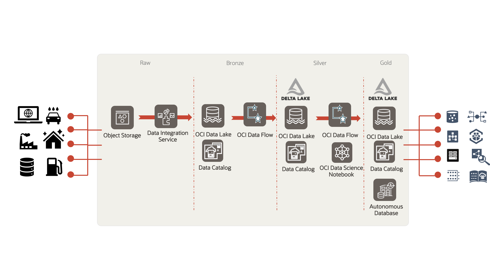
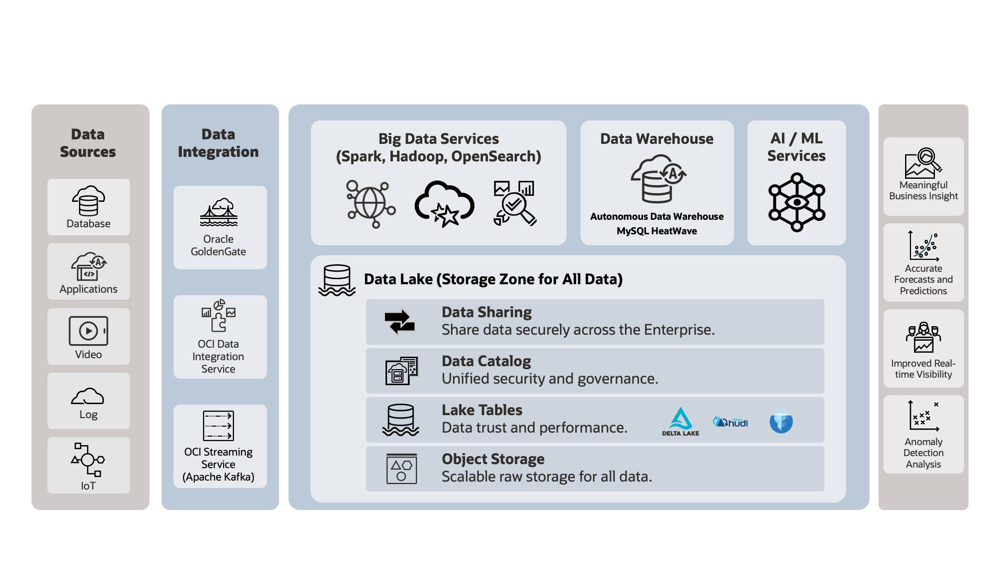

# Introduction

## About this workshop
We will build a modern data platform on OCI using the building blocks of OCI Data Flow, OCI Data Integration Service, OCI Data Catalog, Autonomous Database and OCI Data Lake services. 

We will use the Citibike trip histories dataset from https://citibikenyc.com/system-data. We will modernize the Citibike data platform to solve 3 problems:
1. Capacity problem: How to store the right number of bikes in each station?
2. Maintenance problem: How to ensure the bikes are serviced at the right time?
3. Security problem: How to ensure that the users have the right level of security and access, defined and governed centrally at the data platform itself?

### Workshop Architecture
In today's workshop, we will process the data incrementally in different zones. We will first ingest the data from the raw zone to the bronze zone, will perform data engineering between the bronze and the silver zones, and then finally push the enriched and aggregated data from the silver to the gold zone. We will learn:
* How to modernize a data platform using all the data, all kinds of data
* How to implement bronze, silver and gold zones in your modern data platform
* How to modernize a data platform interactively, enabling all programming languages (SQL, Python, Scala), all data roles
* How to leverage the power of Delta Lake in your Data Lake, along with Databases
* How to leverage the deep integrations within Oracle Modern Data Platform (e.g. OCI Data Flow Spark SQL endpoints within OCI Data Lake for column level security, managed Spark within managed Jupyter notebooks from OCI Data Science, OCI Data Flow’s one-line-of-code integration with databases via Spark Oracle Data Source, pre-included Delta Lake libraries)
 
We will learn how OCI Data Platform helps drive advanced outcomes using all your data. OCI Data Platform comprises of managed open source engines like OCI Data Flow, side-by-side with best-in-class proprietary database engines like Autonomous Database, managed low-code data ingestion and orchestration engines like OCI Data Integration service, managed metadata from OCI Data Catalog and centralized storage and governance from OCI Data Lake. We will use all these services in today's hands-on-lab to provide you a complete picture of what an end-to-end Data-AI-ML pipeline will look like in OCI.    

In today's workshop, we will use OCI Data Flow as a key distributed big data processing engine in different zones and Delta Lakes managed within OCI Data Lake. OCI Data Flow service is a fully managed Spark as a service. If you are a Data Engineer, a Data Scientist, or a Data Analyst, you would love OCI Data Flow because of its zero administration overhead. As Data Engineers, today we will leverage both the serverless Spark and pool-based Spark ETL capabilities on OCI Data Flow. As Data Scientists, we will interactively explore the data from Spark notebooks managed by OCI Data Flow and OCI Data Science. As Data Analysts, we will perform SQL based ad-hoc queries on petabyte scale data in the lake from OCI Data Flow's Spark SQL Endpoints. If you are a Data Admin, configuring coarse-grained (database or table level) or fine-grained access control (e.g. Column level) on your structured, semi-stuctured or unstructured data will be a breeze because of OCI Data Flow's deep integration with OCI Data Lake. You can see below how OCI Data FLow can be used as a building block or a 'Lego' piece to process data from different kinds of sources and sinks (we are showing the first party services just as examples). You can rinse-repeat this 'Lego'-like pattern for all engines, both low-code engines like OCI Data Integration Service and 'with-code' engines like OCI Data Flow. You can 'stack' these lego blocks vertically or horizontally to build your own 'castles', or your own modern intelligent Data Platforms.

Estimated Workshop Time: 120 minutes

### Objectives
In this workshop, you will:
* Ingest raw data from Object Store to the Bronze Zone of OCI Data Lake using OCI Data Integration Service
* Prepare data between the Bronze Zone and Silver Zone using the OCI Data Flow ETL leveraging the Data Flow Pools
* Explore data interactively between Silver Zone & Gold Zone using OCI Data Flow Studio Jupyter Notebooks managed by OCI Data Science.
* Use OCI Data Flow SQL Endpoint to query data in securely Gold Zone in OCI Data Lake with Column Level Security in place
* Write data between the Delta Lake in Gold Zone and the ADW using the OCI Data Flow Spark Oracle Data Source
* (Optional): Schedule the OCI Data Flow ETL jobs using the OCI Data Integration Service

### Prerequisites

This workshop has all the prerequisites provided for the workshop. Also:

* Some understanding of Cloud, Database, Data Lake terms is helpful 
* Familiarity with Oracle Cloud Infrastructure (OCI) is helpful 
* Familiarity with ETL, Notebooks and SQL concepts is helpful

##Login to OCI

Login to OCI using the URL below and the tenancy and username/password provided;

https://console.us-ashburn-1.oraclecloud.com/

## Acknowledgements
- **Created By** -  Rohit Saha, Product Manager, OCI Data Lake
- **Contributors** - Sujoy Chowdhury, Product Manager, OCI Data Flow
- **Last Updated By/Date** - Mario Miola, Solution Architect, OCI Data Integration
