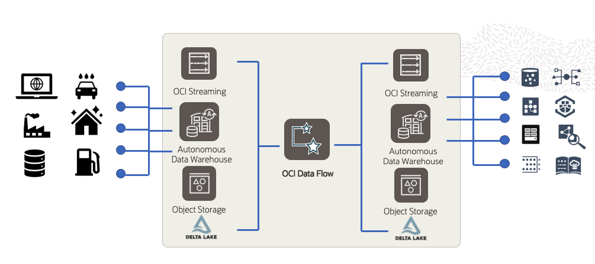

# Introduction

## About this workshop

OCI Data Flow service is a fully managed serverless Spark as a service. OCI Data Flow makes it easy to run Spark applications to process stream data and perform heavy-weight stream operations including machine learning. In today's workshop, we will cover a typical streaming-related use case from the manufacturing industry.

### Workshop Architecture
  

Estimated Workshop Time: 120 minutes

### About Oracle Cloud Infrastructure Data Flow
Data Flow is a cloud-based serverless platform with a rich user interface. It allows data engineers and data scientists
to create, edit, and run Apache Spark workloads at any scale without the need for clusters, an operations team, or highly
specialized Spark knowledge. Being serverless means there is no infrastructure for you to deploy or manage.
It is entirely driven by REST APIs, giving you easy integration with applications or workflows. You can:

* Connect to Apache Spark data sources.
* Create reusable Apache Spark applications.
* Launch Apache Spark jobs in seconds.
* Create Apache Spark applications using SQL, Python, Java, Scala, or spark-submit.
* Manage all Apache Spark applications from a single platform.
* Process data in the Cloud or on-premises in your data center.
* Create Big Data building blocks that you can easily assemble into advanced Big Data applications.

The diagram below provides an overview of the OCI Data Flow Service, its features, components, and some of the other OCI services it integrates with.

   

### Objectives
In this workshop, you will:
* Ingest raw data from Object Store to the Bronze Zone of OCI Data Lake using OCI Data Integration Service
* Prepare data between the Bronze Zone and Silver Zone using the OCI Data Flow ETL leveraging the Data Flow Pools
* Explore data interactively between Silver Zone & Gold Zone using OCI Data Flow Studio Jupyter Notebooks managed by OCI Data Science.
* Use OCI Data Flow SQL Endpoint to query data in securely Gold Zone in OCI Data Lake with Column Level Security in place
* Write data between the Delta Lake in Gold Zone and the ADW using the OCI Data Flow Spark Oracle Data Source
* (Optional): Schedule the OCI Data Flow ETL jobs using the OCI Data Integration Service

### Prerequisites

## Acknowledgments
- **Created By/Date** - 
- **Contributors** - 
- **Last Updated By/Date** - 
