# Data Ingestion 

## Introduction

This workshop uses OCI Data Integration to upload data into OCI Data Lake.

Estimated time: 20 minutes

### Objectives

* The objective of this lab is to familiarize you with OCI Data Lake service, the concepts in OCI Data Integration and teach you how we can ingest data into the lake in a no-code way, using Data Loader task. Let us get started.

### Prerequisites

* Completion of the preceding tasks in this workshop introduction
* Some understanding of Cloud, Database, Data Lake terms is helpful 

## Task 1: Navigate to the Data Integration using the Data Lake Interface.

1. First browse to the data lake service, go to the hamburger menu on the top left. Click on **Analytics & AI**, and then click on **Data Lake**.

   

2. Once you are in the OCI Data Lake service, click on the lake assigned to you. For example: **User1** from **Group1** will use **LakeGrp1**

   

3. Click on **Data Integration** from the right hand menu.

   

4. Click on the data integration home button as shown below, this will take you to the data integration workspace home, attached to the lake.

   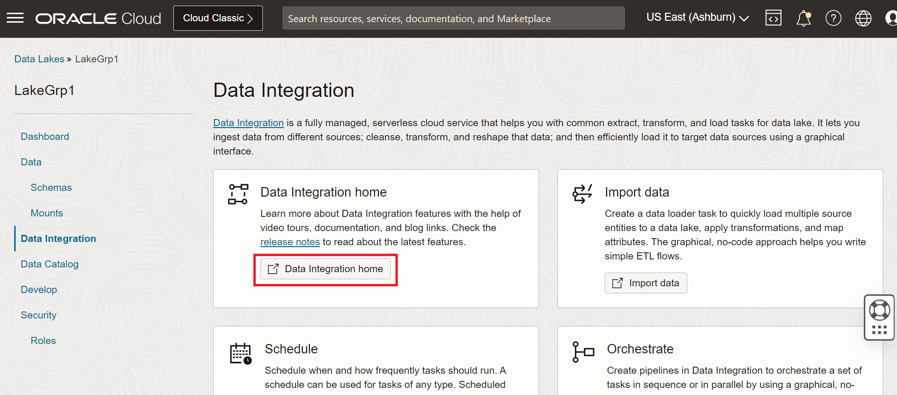

5. Verify in the Data Integration workspace home, there are three artifacts we should familiarize ourselves with: **Data Assets**, **Projects** and **Application**, you can click on them as highlighted in the image below.

   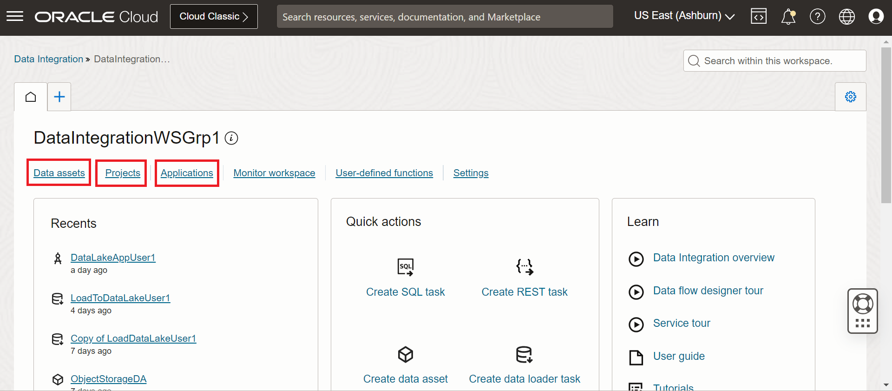

## Task 2: Create a Data Loader task  

1. Verify in the Data Assets page an Object Storage Data Asset named **ObjectStorageDA**. This is common for all the users in the group and is used to connect to the **Object Storage**. There is another Data Asset of type **OCI Data Lake**. This is used to connect to the Lake instance. Close the Data Assets tab by click on the X button as shown below.

   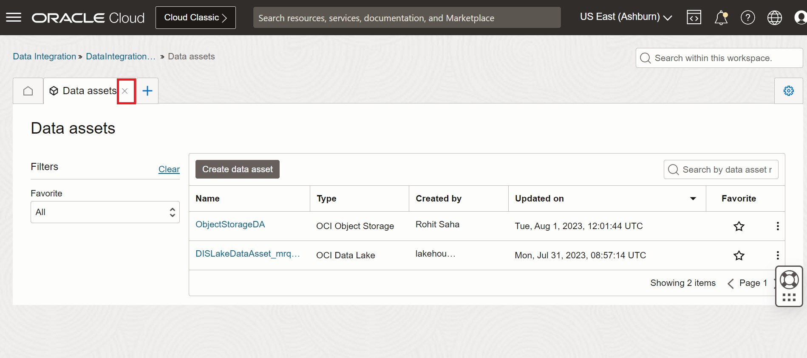

2. Verify the Projects. **Projects** are containers for design time artifacts. ETL flows use features like Data Loader, data flow, REST task etc. in a project. In the projects page you find multiple projects each for an user in your group, you will identify the project that you will work in by looking for a project that end with the user number assigned to you. For example: **User 1** from **Group 1** will work in **DataLakePrjUser1** as shown below. 

   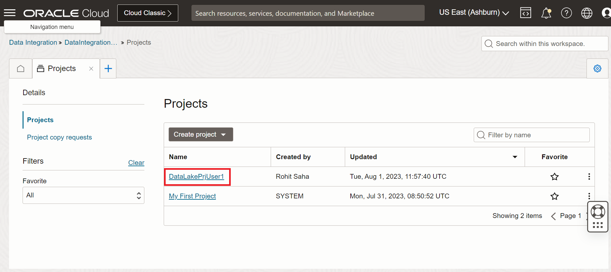

3. Click on **Tasks** and you will find a **Data Loader Task**. The Data Loader task is located by searching for the the task that ends with the user number assigned to you. For example: **User 1** from **Group 1** will work in **LoadToDataLakeUser1**. Click on it to open it as shown below.

   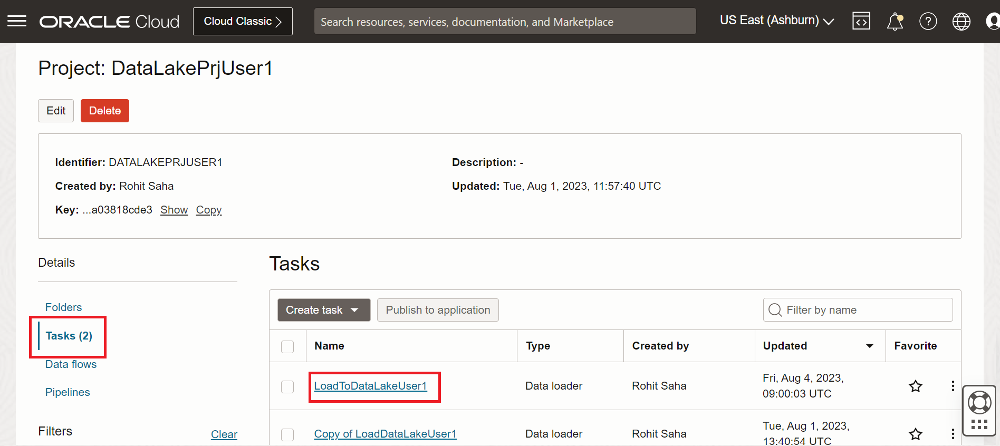

4. Explore the Data Loader task workflow browsing through the various steps by clicking on the Step numbers in the header or using the previous/next buttons in the footer as shown below.

  

5. Verify intake rules. In the source step you will observe that the source data asset is the **ObjectStorageDA**, scroll down to the **Data Entities** section below file settings and click on **View Rules**. Verify there is a rule already added to read from the source all entities which match the pattern **"datasets/\*"**

  

  

6. Write to a managed mount. In the target step choose the lake data asset and specify the name of the **Managed mount** as a concatenation of **bronzeZone + user number**.
   
  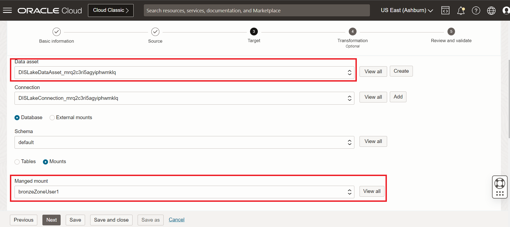
  
7. Add suffix to the new data entities. Scroll further down to the data entities section, verify that the selection should be to **Create new data entities** and the selected option for target data entity name option should be: **Add prefix/suffix** and lastly the Add suffix field should have the **user number**.

  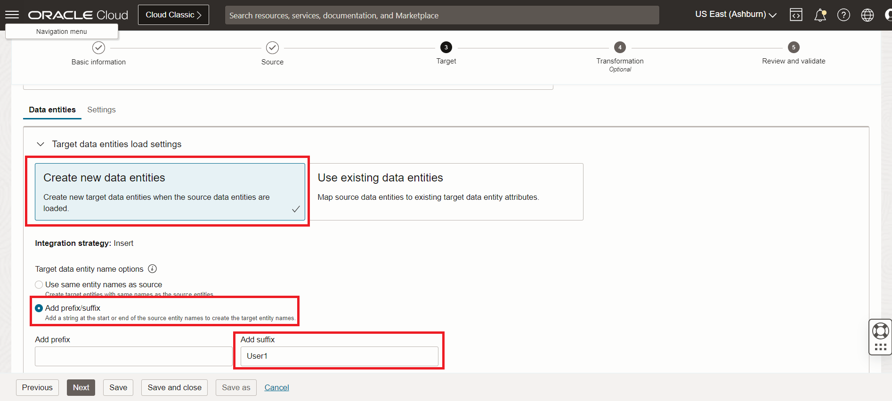
  
8. Review and Validate step and make sure there are no validation errors and save and close the task. See details below.

   

9. Save and close the task, you will be back in the project details page.

## Task 3: Run-time artifacts.

1. Locate the task that you were working on and click on **Publish to application** as shown below.

   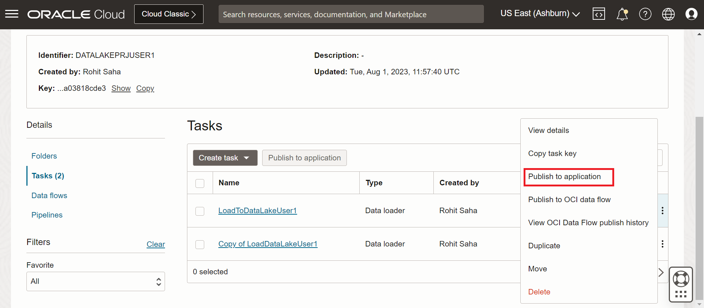

2. Select the correct application that corresponds to the application name ending with your **user number**. For example: **user 1** from **group 1** we will select **DataLakeAppUser1**. Then click on **Publish** button. Please find the details below.

   

3. After you publish the task, a toast message will appear on the right top corner. Click on the View application link in the toast message as shown below.

   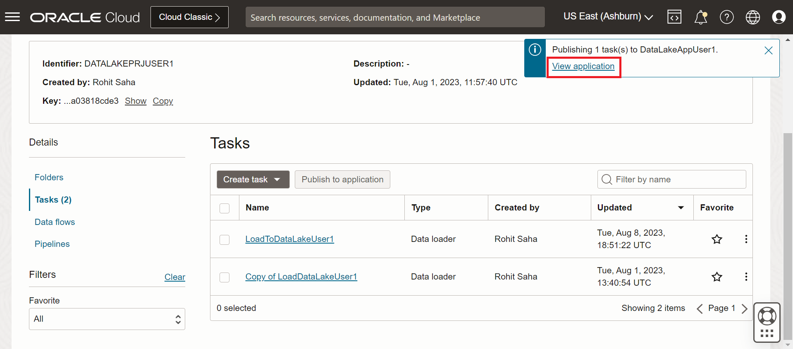

4. Verify the application details patches menu. Here you can find the status of the publish action and click on refresh to get the latest status. Please see image below for details.
   
   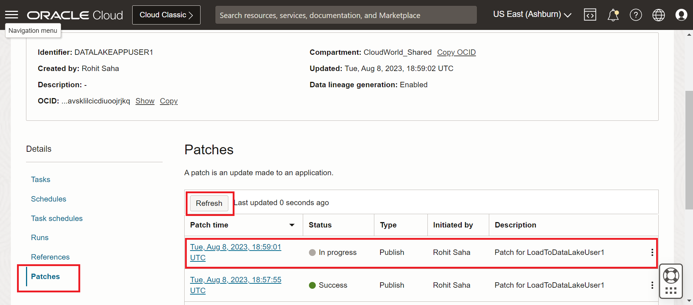

## Task 4: Execute the runtime task.

1. Once the task publish status turns to Success, go to the **Tasks** menu and click on the action buttons on the right and click **Run** to execute the task as show below.

   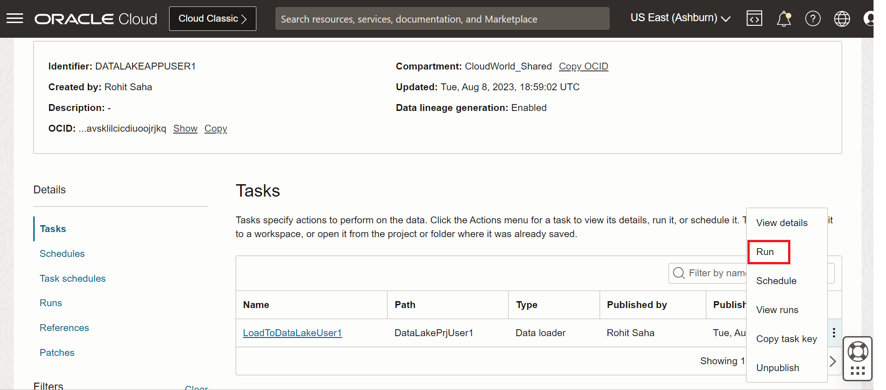

2. The task execution will get kicked off. You can monitor the task execution from the Runs menu as highlighted below.

   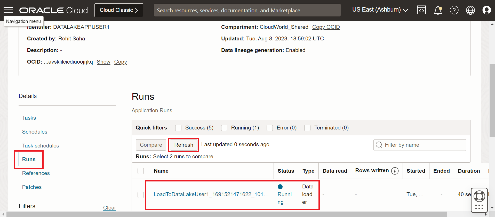

3. Once the task is successfully executed, you can visit the Data Lake home. Click on the **Mount** menu and then locate the managed mount. Look for the mount ending with your **user number**. We have created the mount before hand for your convenience. See details below.

   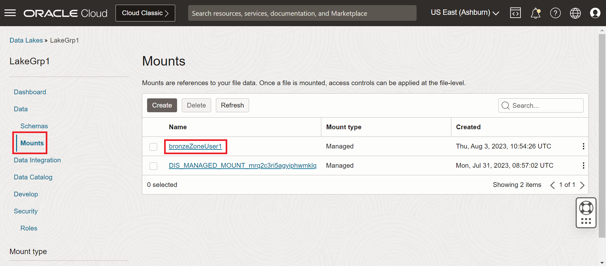

4. Verify the data in the files section.

   

5. From this step, copy the URI using the Copy link and append the **"Citibike/datasets/" + user number + "/"**, for **user 1** from **group 1** the last part of the string will be **"Citibike/datasets/User1/"**. 
Keep this string handy it will be used in Lab 2. 

6. With this you have completed the first section on data ingestion into Data Lake using OCI Data Integration's data loader task.

You may now **proceed to the next lab**. 

## Acknowledgments
- **Created By** -  Rohit Saha, Product Manager, OCI Data Lake
- **Contributors** - Sujoy Chowdhury, Product Manager, OCI Data Flow
- **Last Updated By/Date** - Mario Miola, Solution Architect, OCI Data Integration
