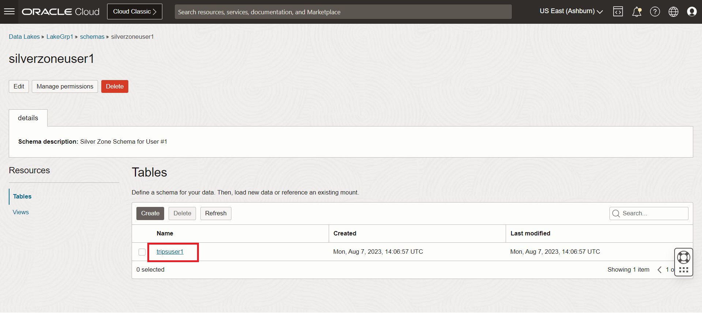

# Data Engineering Lab 

## Introduction

This workshop uses OCI Data Flow to cleanse raw data ingested into OCI Data Lake.

Estimated time: 20 minutes

### Objectives

* The objective of this lab is to teach you how to create a pool in OCI Data Flow. To learn more about pools refer the documentation here. We will then use a data flow application to cleanse the raw data. This data flow application leverages the pool created before hand for your convenience. We will execute the spark application and store the cleansed data in the silver zone schema.

### Prerequisites

* Completion of the preceding tasks in the Lab1
* Some understanding of Cloud, Database, Data Lake terms is helpful 
* Familiarity with ETL, Notebooks and SQL concepts is helpful

## Task 1: Activate Data Flow Pools

1. Navigate to the Data Flow service by clicking on the hamburger menu on the top left of your screen, select **Analytics & AI** and then select **Data Flow**.

   

2. Click on **Pools** from the left hand menu and locate the pool assigned to your group. For example: **Group 1** users will work in **LabPoolGrp1**.

   

3. Click on the pool and examine the pool details page to understand the pool configuration.

   

4. Navigate back to the Data Flow service page by using bread crumb.

   

## Task 2: Configure and run the Data Flow Application

1. Click on Applications and look for **DataPrep** application for your group. We have pre-created an spark Data Flow application for each group. **Group 1** users will click on **DataPrepGrp1**, refer to the picture below for details.
   
   

2. Click on the data flow application for your group, the application details page will load, here look for **Arguments** in Application information. This the input for the spark application. The spark application takes 3 arguments as input:

   1. Mount Path Location: use the string you saved in the last step of **Lab1** or refer next step to understand how to get this
   2. Schema Name: this is the schema where the cleansed data table will be created, value = **silverZone + user number**, for example for the first user in **Group 1** it will be: **silverZoneUser1**
   3. Table Name: this is the name of the table where the data will be written, value = **trips + user number**, for example for the first user in **Group 1** it will be: **tripsUser1**

   

   For Step 1 above, go to Data Lake assigned to you and click on mount in which you were working.

   

   Copy the URI using the Copy link and append the **"Citibike/datasets/" + user number + "/"**, for **User 1** from **Group 1** the last part of the string will be **Citibike/datasets/User1/**.

3. Click on **Run** in the data flow application details page as shown below and provide the 3 arguments discussed above and run the data flow application.

   

   

4. Monitor the application run details by clicking on the **Runs**

   

## Task 3: Verify the results in the Data Lake 

1. Once the Data Flow application run succeeds go to the lake. Click on **Schemas** and then browse to the **silverZone** schema assigned to you. The schema you will work on will end with your user number, for example, **Group1** **User 1** will work in **silverZoneUser1** schema
   
   

2. Verify the table has been created successfully.

   

You may now **proceed to the next lab**. 

## Acknowledgments
- **Created By** -  Rohit Saha, Product Manager, OCI Data Lake
- **Contributors** - Sujoy Chowdhury, Product Manager, OCI Data Flow
- **Last Updated By/Date** - Mario Miola, Solution Architect, OCI Data Integration

