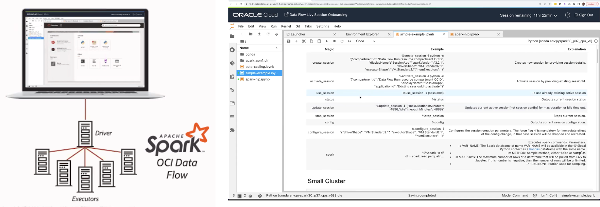
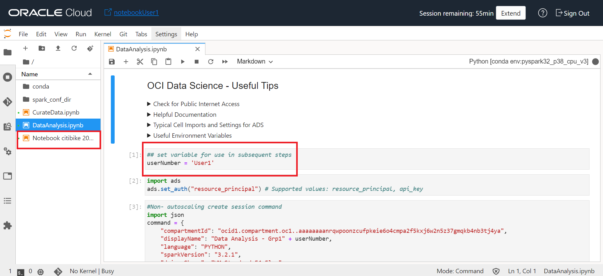

# Data Exploration Notebooks

## Introduction

In this section we will analyze the data stored in silver zone and try to draw some insights.

Estimated time: 20 minutes

### Objective

We will use an OCI Data Science notebook for this exercise and as you run the notebook you will learn:

* How to connect OCI Data Science notebook to a data lake
* Read data from tables in the lake
* Analyze data using OCI Data Science notebook

### Prerequisites

* Completion of the preceding tasks in the Lab2
* Familiarity with ETL, Notebooks and SQL concepts is helpful

##  Task 1: Browse to Data Science service

1. Click on the hamburger menu, select **Analytics & AI**, then click on **Data Science** as shown below.

 

2. Open the data science project where we will analyze the data. Look for the project name that is ending with your group number. For example: **Group 1** participants will look for the project name ending with Grp1.

 

##  Task 2: Notebook sessions

We have created a notebook session before hand for you. Once you are in the data science project assigned to you, look for a notebook session ending with the user number assigned to you.

1. Open notebook session: For example an user 1 from group 1 will work in the notebook session named **notebookUser1**.

 

2. Click the Open button as shown below.

 

##  Task 3: Notebook data analysis

1. Click on the DataAnalysis.ipynb file on the left hand tree.

 

2. Provide inputs to the notebook. Go to the first cell in the notebook and provide the following information:
   1. **userNumber**: replace the value of the variable with your user number. For example you are user 1 from group 1 input should be **User1**.

 

3. Execute all the steps by clicking on the run button on the ribbon as shown below.

   

4. In the last cell output observe the plots and note down your insights from the plot.
With this, Lab 3 is complete.

You may now **proceed to the next lab**. 

## Acknowledgements
- **Created By** -  Rohit Saha, Product Manager, OCI Data Lake
- **Contributors** - Sujoy Chowdhury, Product Manager, OCI Data Flow
- **Last Updated By/Date** - Mario Miola, Solution Architect, OCI Data Integration

