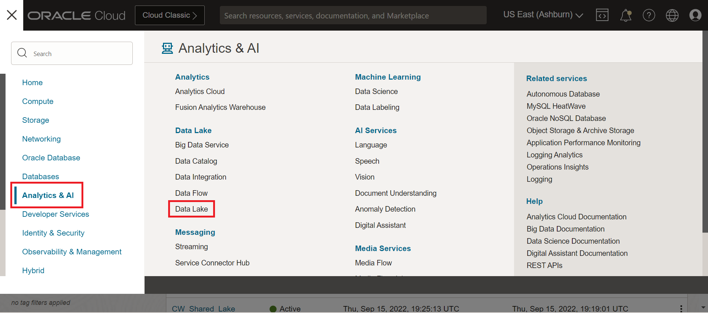
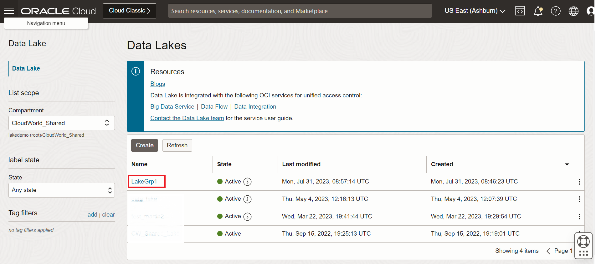
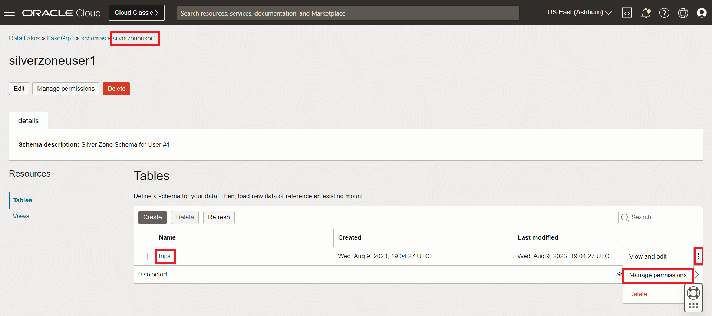
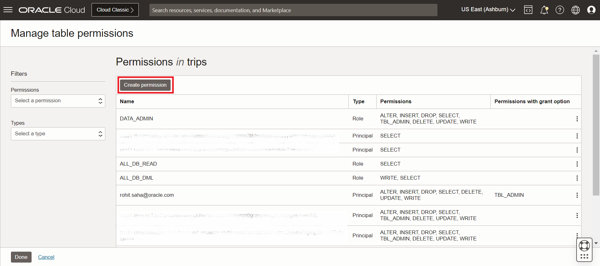
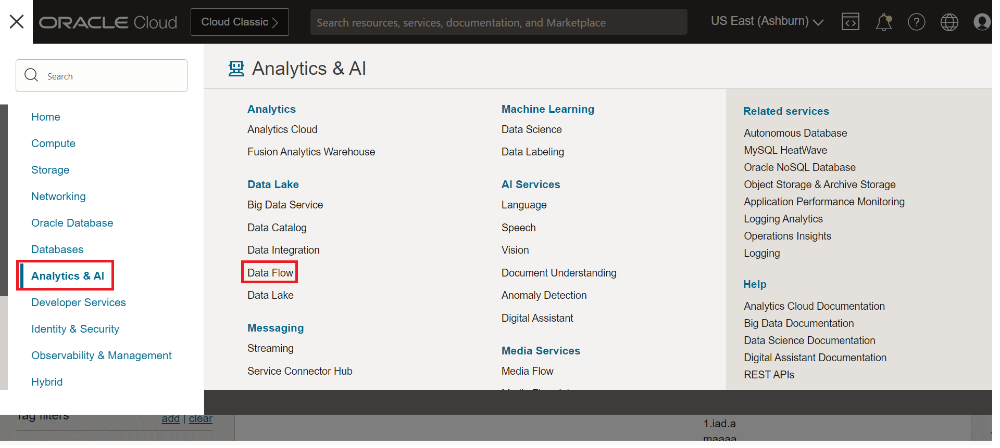
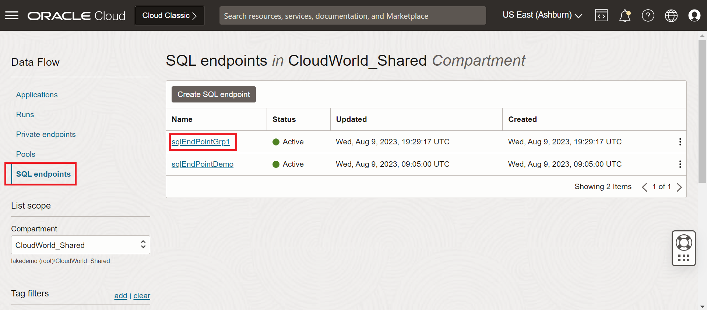
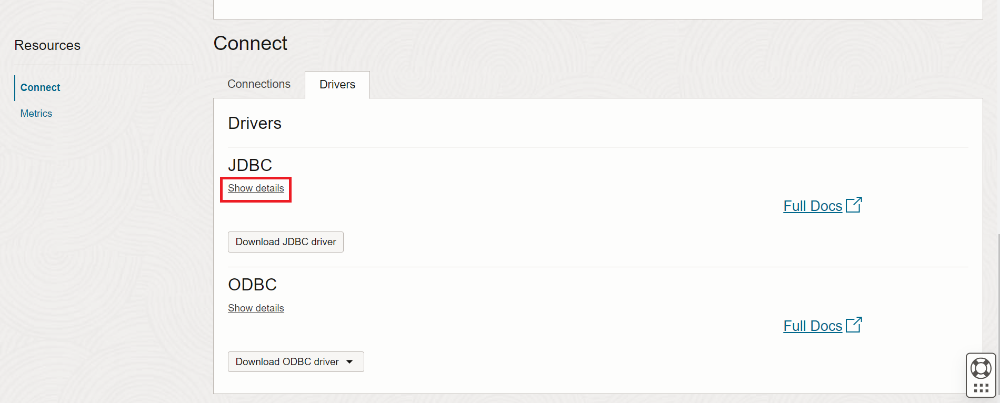

# Data Flow SQL End Point Lab

## Introduction

In this lab we will introduce you to OCI Data Flow SQL End Point. We will use the JDBC/ODBC driver provided by OCI Data Flow SQL endpoint and configure DBeaver.

Estimated time: 20 minutes

## Objective

We will understand how to query data using SQL endpoint. We will also learn how to set up column level security in OCI Data Lake and lastly we will query the trips table and see column level security in action.

##  Task 1 - Install DBeaver

1. Download the DBeaver client from its download site. You can use either Community or Enterprise versions, but they must be at least 22.x.

2. Install DBeaver on your local. As DBeaver gets downloaded and installed we will proceed to the next steps.

## Task 2 - Set up column level security

1. Go to the data lake service

 

2. Navigate to the proper lake group (**LakeGrp1** for Group 1)

 

3. Click on Schemas to browse tables in the schema. Select the silverzone schema ending with your user number. For example User 1 from Group 1 will work in **silverzoneuser1** schema.

 

4. Click on the action menu (three vertical dots on the right in the row) for the trips table and click on **Manage permissions** as shown below.

 

5. Create permissions. On the next page click on **Create permissions** button as shown below.

 

6. Set up column level security. Select type as User and from the User drop down select "unprivileged_user". Specify the permission type as "Column level" and in the column permissions section, select access type as "Except columns" and select birth_year and user_gender in the Except column combo box. Finally click on create to create the permission. Refer screenshot below.

 

7. Close permissions pane. In the Manage Permission panel, click on Done as shown below.

 

## Task SQL Endpoint

1. Go to OCI Data Flow service.

 

2. Browse to SQL Endpoints. Look for the SQL Endpoint assigned to your group. Look for the SQL endpoint ending with your group number. For example Group 1 users will look for a SQL endpoint with Grp1 in the end like **sqlEndPointGrp1**.

 

3. View SQL Endpoint details. You will observe in the details page that the SQL endpoint is attached to the data lake for your group. Make sure in the Spark configuration properties, the highlighted property: **spark.oracle.deltalake.version** with value **2.0.1** is present. Also you can view the pool shape configurations.

 

4. Scroll down the page to download the **Simba JDBC driver** from the Data Flow SQL Endpoint details page.
   1. Under Resources, click Connect.
   2. Under Connect with JDBC, click Download JDBC Driver.

 

5. Unzip the downloaded driver. It creates documentation and **sparkSimba.zip**. Unzip sparkSimba.zip.
6. In the SQL Endpoint's details page, click on Show details.

   

7. To copy the JDBC URL, click **Copy**.

   

8. Follow the instructions [here] (https://docs.oracle.com/en-us/iaas/data-flow/using/sql-reporting-dbeaver-setup.htm#sql-reporting-configure-dbeaver) to configure DBeaver and use the JDBC URL copied in previous step to configure the connection. Once connection is configured click on connect to connect to the Lake.
9. A browser window will appear with session picker. Scroll down to click on **"Sign in with different user"** option.

   

10. Provide tenancy name as **lakedemo**.

   

11. Select **default** as the identity domain.

   

12. Login to OCI. provide username as **unprivileged_user** and password as **WelcomeToLake0!**.
13. Once logged in you will expand the connection and see all the schemas and then click on SQL Editor, and then Open SQL Script
14. Query data lake. Type the query **"Select bike_id from schema.trips"** where schema should be the schema assigned to you. For example if you are User 1 from Group 1, the schema name will be: **silverzoneuser1** and the query will be **"Select bike_id from silverzoneuser1.trips"**. You will get the result set as the query output.

   

15. Now query the data lake for columns on all the columns. Change the query to **"Select * from schema.trips"** where schema should be the schema assigned to you. For example if you are User 1 from Group 1, the schema name will be: **silverzoneuser1** and the query will be **"Select * from silverzoneuser1.trips"**. You will get an error as the user does not have the required access.

   

This concludes this lab. In this section you learnt about Data Flow SQL endpoint, how to query data in OCI Data Lake and also enforced column level security on the lake.

You may now **proceed to the next lab**.

## Acknowledgments
- **Created By** -  Rohit Saha, Product Manager, OCI Data Lake
- **Contributors** - Sujoy Chowdhury, Product Manager, OCI Data Flow
- **Last Updated By/Date** - Mario Miola, Solution Architect, OCI Data Integration
