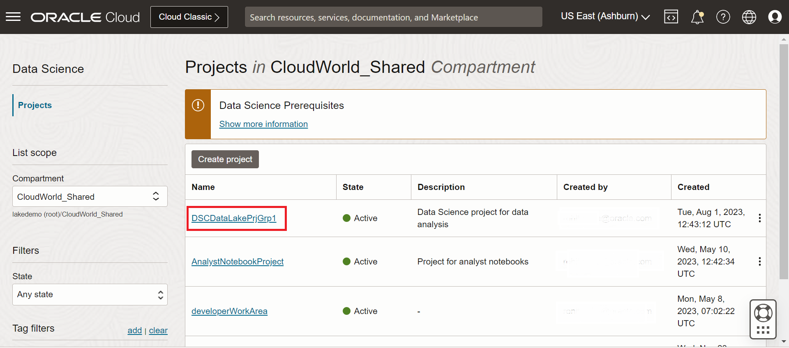
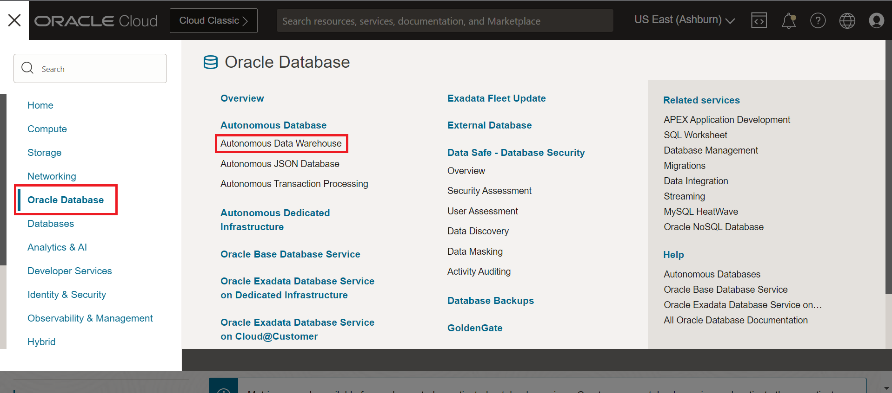
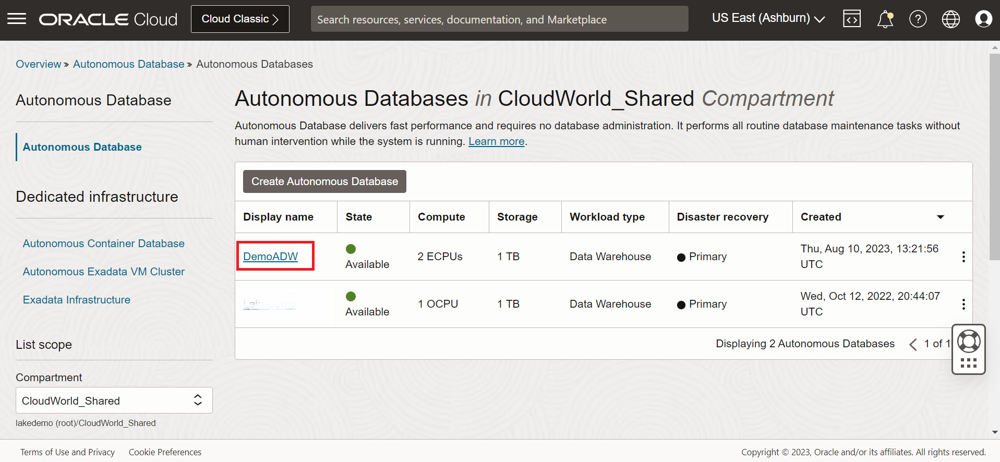
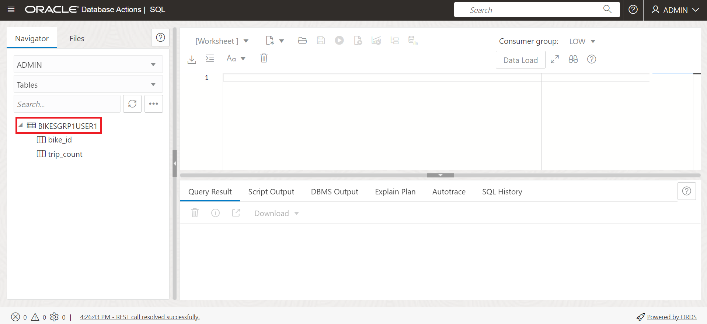
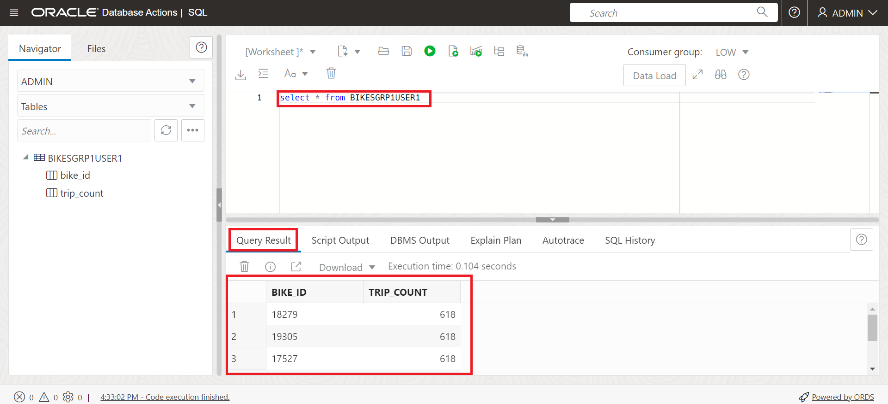

# Data Loading Lab

## Introduction

In this section we will analyze the data stored in silver zone and try to draw some insights.

Estimated time: 20 minutes

### Objective

We will use an OCI Data Science notebook for this exercise and as you run the notebook you will learn:

1. How to connect OCI Data Science notebook to a data lake
2. Write data into tables in the lake 
3. Write data into tables in an Autonomous DB

### Prerequisites

* Completion of the preceding tasks in the Lab4
* Some understanding of Cloud, Database, Data Lake terms is helpful 
* Familiarity with ETL, Notebooks and SQL concepts is helpful

##  Task 1: Curate Data

1. Browse to Data Science service: Click on the hamburger menu, select "Analytics & AI", then click on Data Science as shown below.

 
 
2. Open the data science project where we will analyze the data: Look for the project name that is ending with your group number. For example: Group 1 participants will look for the project name ending with **Grp1**.

 

3. Open notebook session: We have created a notebook session before hand for you. Once you are in the data science project assigned to you, look for a notebook session ending with the user number assigned to you. For example an user 1 from group 1 will work in the notebook session named **notebookUser1**.

 

4. Open notebook: Click the Open button as shown below.

 

5. Open Notebook: Click on the CurateData.ipynb file on the left hand tree.

 

6. Provide inputs to the notebook. Go to the first cell in the notebook and provide the following information:
   1. userNumber: replace the value of the variable with your user number 
   2. groupNumber: replace the value of the variable with group Number, like for Group 1 use Grp1

   For example you are user 1 from group 1 input should be: User1, Grp 1

 

7. Execute all the steps by clicking on the run button on the ribbon as shown below.

 

## Task 2: Save to Autonomous Data Warehouse

For this section we have created a demo Autonomous Data warehouse to demonstrate how we can write data into ADW from the notebook.

1. Once you have executed all the steps, go to Oracle Databases and then click on Autonomous Data Warehouse.

 

2. Click on DemoADW as shown below.

 

3. Click on SQL to open the SQL interface.

 

4. Provide the credentials. To view the credentials find the values for the variables USER and PASSWORD in the notebook and use them to login.

 

5. Once you have signed in look for the table on the left hand tree. To look for your table name use the group number and user number. For example if you are user 1 in Group 1, the table name will be bikes + Grp1 + User 1 = **bikesGrp1User1**.

 

6. Now query the table using the query select * from tableName. The table name for user 1 in Group 1 will be bikesGrp1User1 and the query will be **"select * from bikesGrp1User1"**.
7. Verify the query result.

 

This brings you to the end of Lab 5.

You may now **proceed to the next lab**.

## Acknowledgements
- **Created By** -  Rohit Saha, Product Manager, OCI Data Lake
- **Contributors** - Sujoy Chowdhury, Product Manager, OCI Data Flow
- **Last Updated By/Date** - Mario Miola, Solution Architect, OCI Data Integration

