# Scheduling and Orchestration Lab

## Introduction

Learn how to **run a Data Loader task**, create a **task schedule** in your OCI Data Integration application, to **schedule the Pipeline task** and to **run it**.
After publishing tasks to an Application, you can run a task **manually on-demand**, or you can use schedules and task schedules to **automate the execution** of your tasks.
To run a task automatically on a specific schedule, you must:
* **Create a schedule**: A schedule defines when and how frequently tasks should be run. A schedule can be used across tasks of any type.
* **Create a task schedule for the task**: A task schedule is an automated run configuration for a specific task. You schedule a task to run automatically by creating a task schedule, and associating the task schedule with an existing schedule.

You will schedule your Pipeline Task to run daily at 2PM.

**Estimated Time**: 20 minutes

### Objectives
* Run the Data Loader task
* Create a Schedule
* Schedule the Pipeline Task
* Run the Pipeline Task

### Prerequisites

* Completion of the preceding tasks in the Lab1
* Some understanding of Cloud, Database, Data Lake terms is helpful 
* Familiarity with ETL concepts is helpful

## Task 1: Run the Data Loader task

In this step, you will do a **manual on-demand run** of your **Data Loader task**. However, you can run all the published tasks in your Application (Integration task, Data Loader task, SQL task, Pipeline task) in the same manner. The Tasks section of an Application details page shows the list of tasks you have published to the Application. You execute published tasks from the list.

1. In the Oracle Cloud Infrastructure Console navigation menu, navigate to **Analytics & AI**. Under Data Lake, click **Data Integration**.

  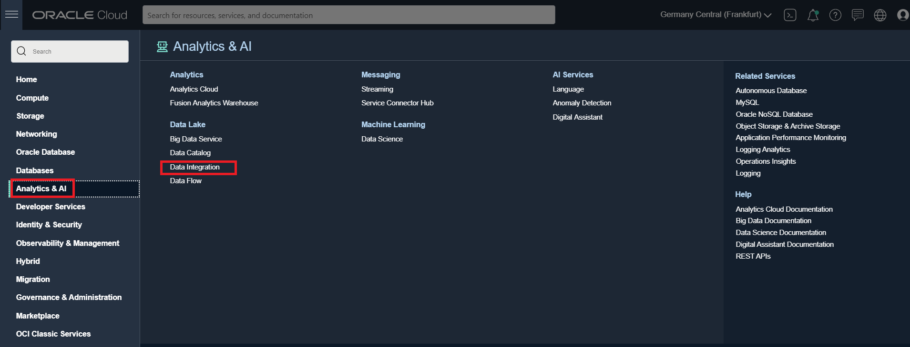

2. From the Workspaces page, make sure that you are in the compartment you created for data integration (`DI-compartment`). Click on your **Workspace** (`DI-workspace`).

  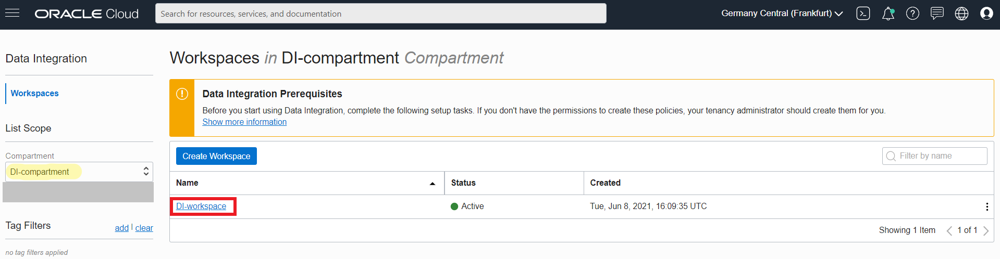

3. From your `DI_Workspace` homepage, click on **Applications**.

  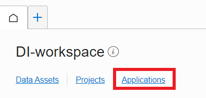

4. From the **list of Applications**, select the `Workshop Application`, which contains all the tasks that you created previously in this workshop.

  

5. You now have the list of published task in `Workshop Application` displayed. From the list of tasks, select **Run** from the **Actions menu** (three dots) for the `Load Revenue Data into Data Warehouse` Data Loader task that you will run.

  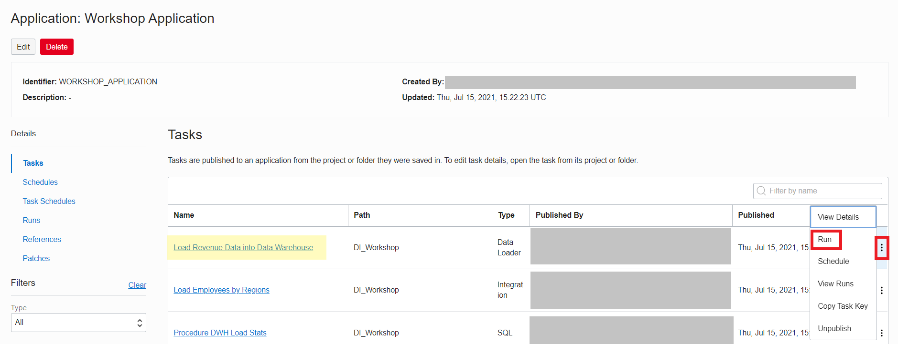

6. A **run entry** is created in the Runs section of the Application details page. You can monitor here the **status** and **duration** of your task run. Click on **Refresh** if you want to update the status.

  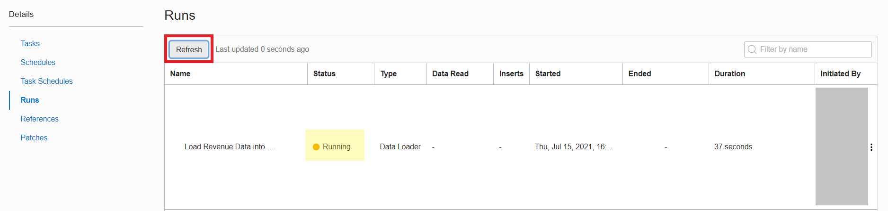

7. After a short time, The **Data Loader task run ends successfully**. You can also check in the Autonomous Data Warehouse the inserted data.

  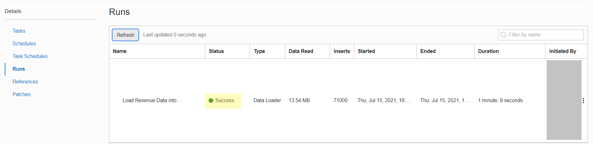

## Task 2: Create a Schedule

You will first create a **Schedule** in the Application that contains the tasks that can be scheduled for automated runs. Set up a schedule by selecting a time zone and configuring a frequency at which associated task schedules should run. You can automate task runs on an hourly schedule, or a daily or monthly schedule.

1. In the Oracle Cloud Infrastructure Console navigation menu, navigate to **Analytics & AI**. Under Data Lake, click **Data Integration**.

  

2. From the Workspaces page, make sure that you are in the compartment you created for data integration (`DI-compartment`). Click on your **Workspace** (`DI-workspace`).

  

3. From your `DI_Workspace` homepage, click on **Applications**.

  

4. From the **list of Applications**, select the `Workshop Application`, which contains all the tasks that you created previously in this workshop.

  

5. On the Application details page, click **Schedules tab** under Details.

  

6. Click **Create Schedule**.

  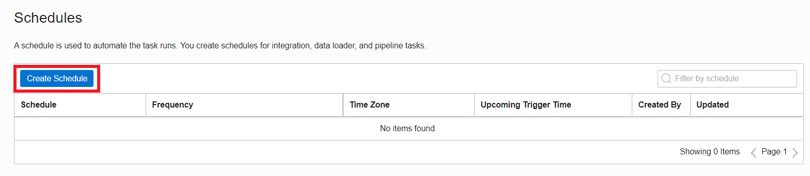

7. On the **Create Schedule** page:

    - Enter a **Name**: `Daily Schedule 2PM`
    - Enter a **Description** (optional)
    - Select a **Time Zone** for this schedule: `For example, (UTC+01:00) Central European Time (CET)`
    - From the **Frequency** drop-down, select `Daily`
    - **Repeat Every**: Enter the number of days between scheduled runs. We want the schedule to repeat every single day, so leave the default option of `1`
  For example, enter 2 if you want the schedule to run every two days
    - **Time**: Enter the time in the 24-hour format. For example, enter `14:00` for 2PM
    - **Review** the Summary of your schedule
    - Click **Create**.

    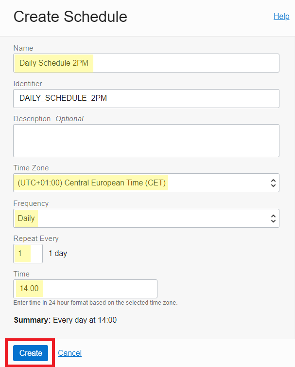

8. You can now see the **new schedule** in the Schedules list from your application.

  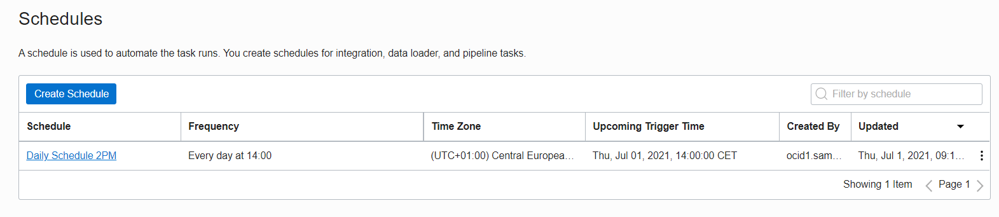

## Task 3: Schedule the Pipeline task

You can create **task schedules** to schedule tasks to run on **specific days and times**, and at a **specific frequency**. You create a task schedule for each task that you want to run on an **automated schedule**. A task schedule must be associated with an existing schedule. You can enable or disable a task schedule at any time. In this step, you will schedule the Pipeline Task. However, scheduling process is the same for all tasks in OCI Data Integration.

1. From the `Workshop Application` you are currently in, click on **Tasks** under Details section.

  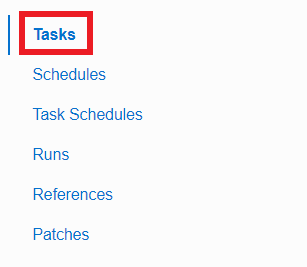

2. In the Tasks section, click on the **Actions menu** (three dots) from the `Load DWH Pipeline Task` and select **Schedule**.

  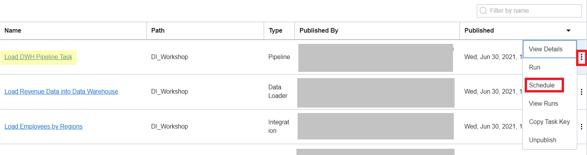

4. On the **Create Task Schedule** page, enter a **Name** (`Load DWH Pipeline Task - Daily`) and **Description** (optional).

  

5. Select the **Enable Task Schedule check box** to allow this task schedule to trigger automated runs when schedule conditions are met.

  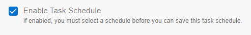

6. In the **Schedule** section:

    - Click **Select** to associate this task schedule with a schedule
    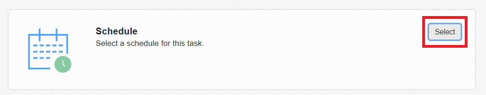
    - On the **Select Schedule** page, check the existing schedule (`Daily Schedule 2PM`) that you created in _Create a Schedule_, then click **Select**.
    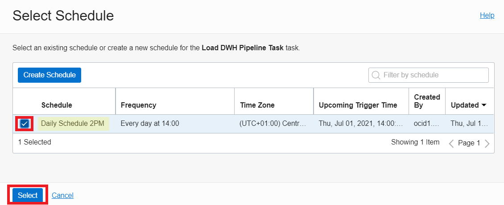

7. In the Configure Task Schedule section, click **Configure** to specify run options for this task schedule.

  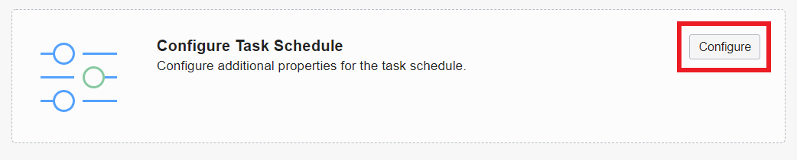

8. In the **Configure Task Schedule** page:

    - **Start Time** and **End Time** are optional. If you don't specify a Start Time, this task schedule takes effect immediately, and runs are triggered when conditions specified in the associated schedule are met. We will not define Start Time and End Time.
    - Leave blank also the optional **Expected Time to Complete** field.
    - For **Retry Count**, enter the number of times to retry executing the task when a run fails. For example, you can define a value of **1**.
    - Enter a value in **Retry Delay Duration**, and then select a unit from the menu to specify the time interval between retries. You can specify a value in seconds, minutes, or hours. The value must be greater than 5 seconds. Leave the default of **30 seconds**.
    - Click **Configure**.

    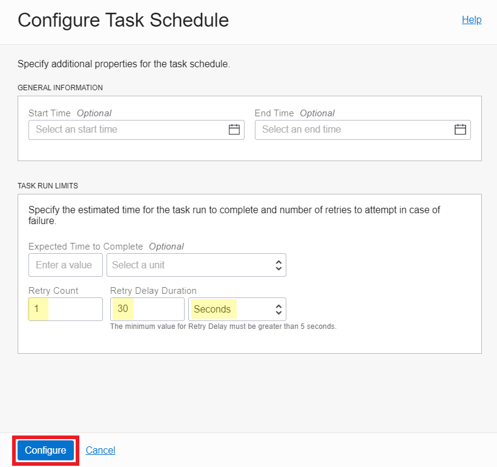

9. **Review** the options you defined and click **Save and Close**.

  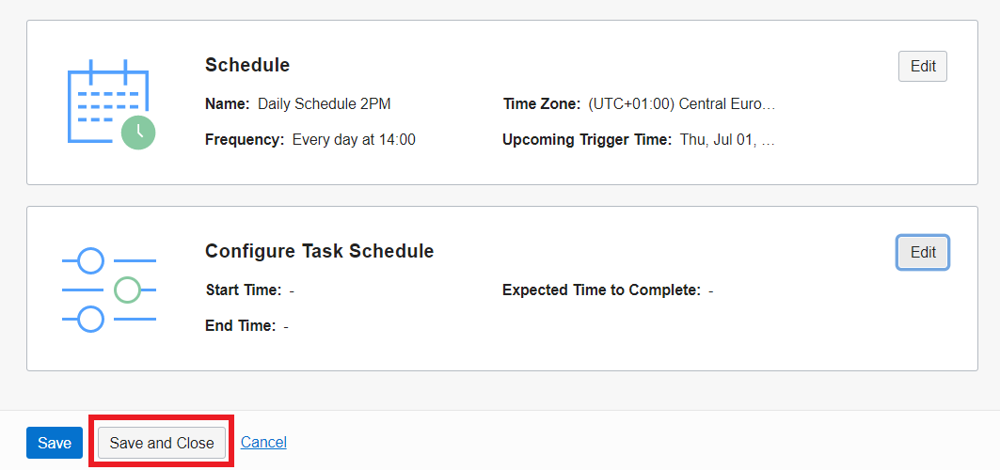

10. From the `Workshop Application` you are currently in, click on **Task Schedules** under Details section.

  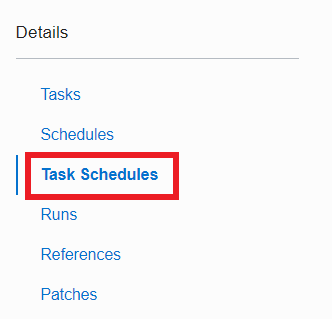

11. In the list of Task Schedules, you can find the one you have just defined. **Your pipeline task is now scheduled to run every day at 2PM**.

  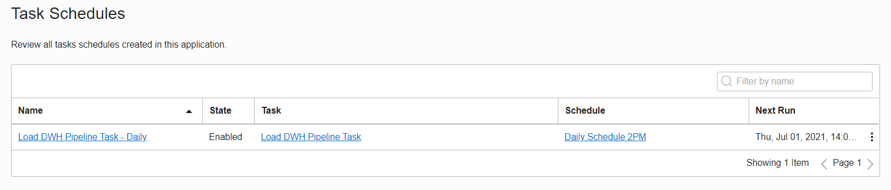

## Task 4: Run the Pipeline task

In this step, you will now do a **manual on-demand run** of your pipeline task. However, you can run all the published tasks in your Application (Integration task, Data Loader task, SQL task, Pipeline task).

1. From the `Workshop Application` you are currently in, click on **Tasks** under Details section.

  

2. From the list of tasks, select **Run** from the **Actions menu** (three dots) for the `Load DWH Pipeline Task` that you will run.

  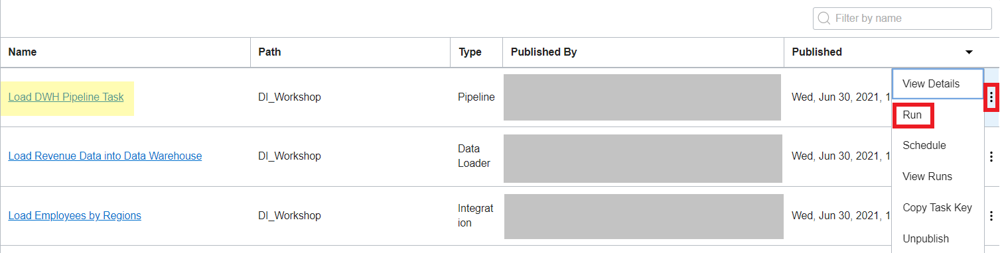

3. A **run entry** is created in the Runs section of the Application details page. You can monitor here the **status** and **duration** of your task run. Click on **Refresh** if you want to update the status.

  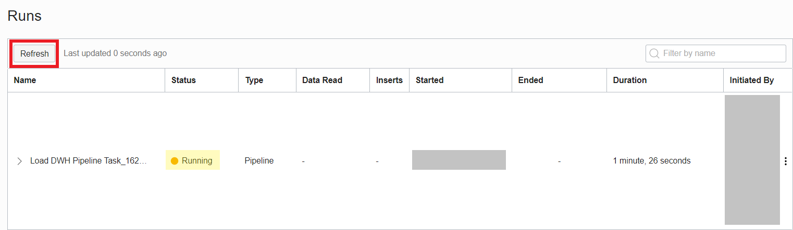

4. The Pipeline task run has ended successfully. You can also check in the Autonomous Data Warehouse the inserted data.

  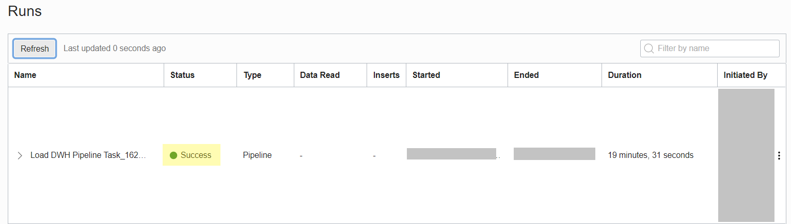

   **Congratulations!**

## Learn More

* [Scheduling tasks in OCI Data Integration](https://docs.oracle.com/en-us/iaas/data-integration/using/schedules.htm)
* [Executing Published Tasks](https://docs.oracle.com/en-us/iaas/data-integration/using/published-tasks.htm)
* [Viewing Executed Task Runs](https://docs.oracle.com/en-us/iaas/data-integration/using/task-runs.htm)

## Acknowledgements

* **Author** - Theodora Cristea
* **Contributors** -  Rohit Saha
* **Last Updated By/Date** - Mario Miola, August 2023
