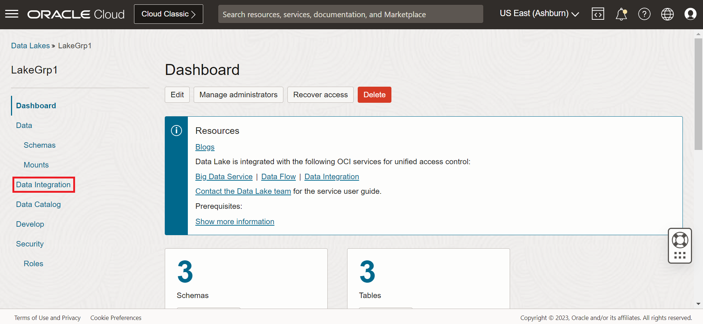
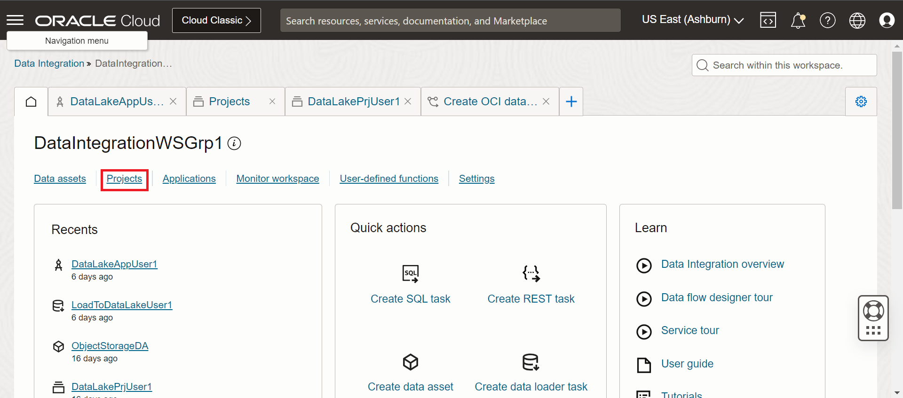
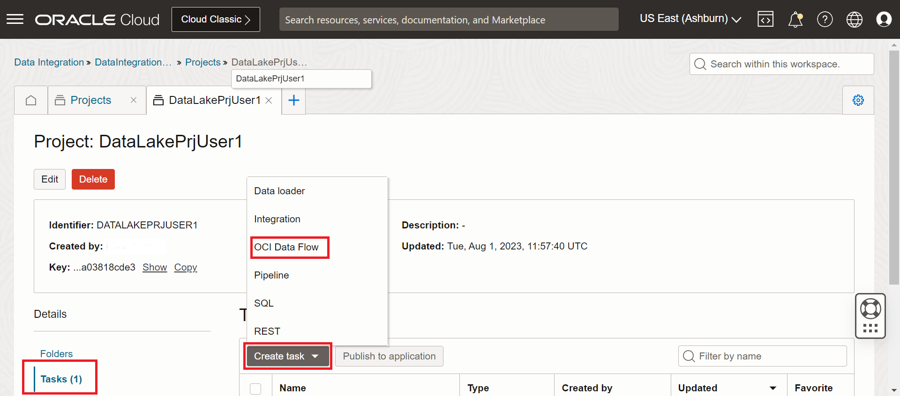
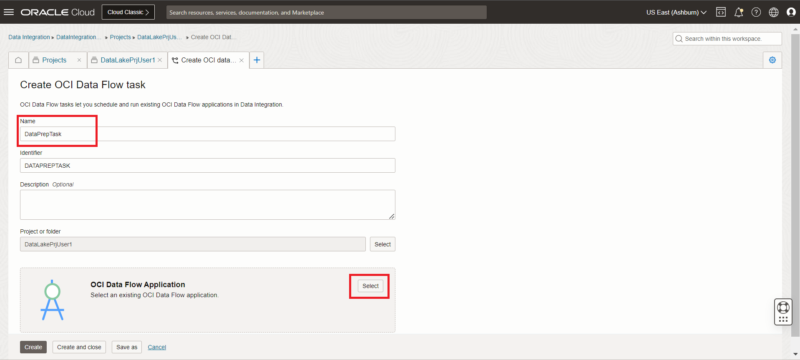
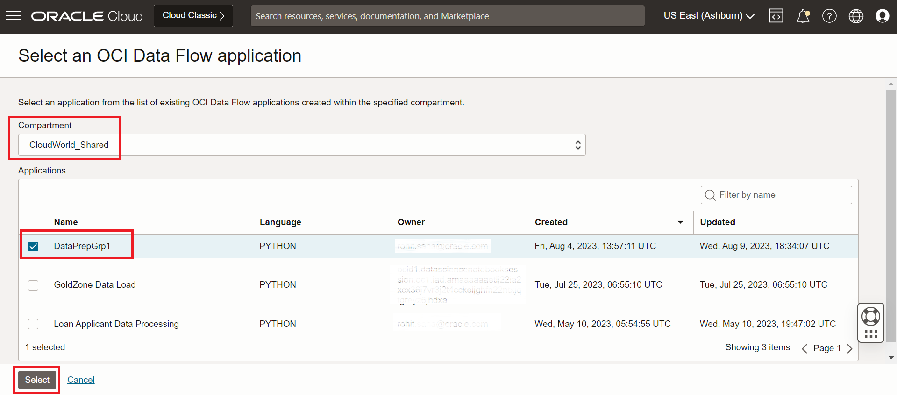
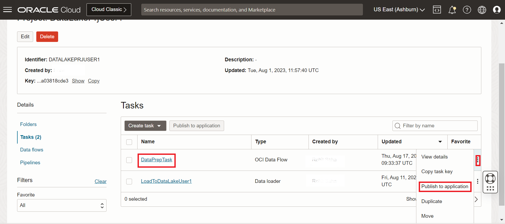
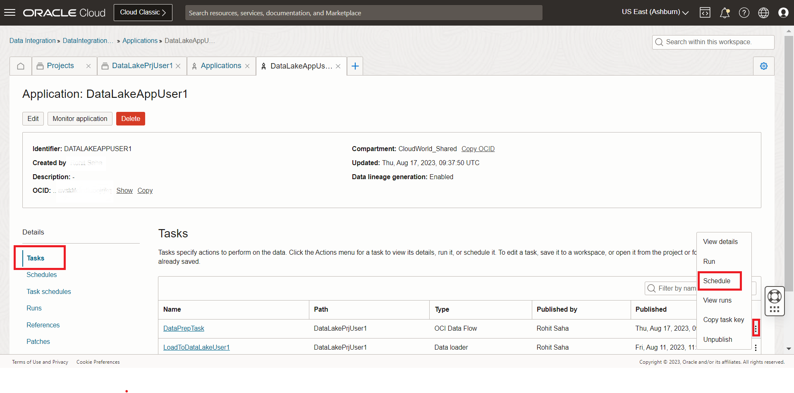
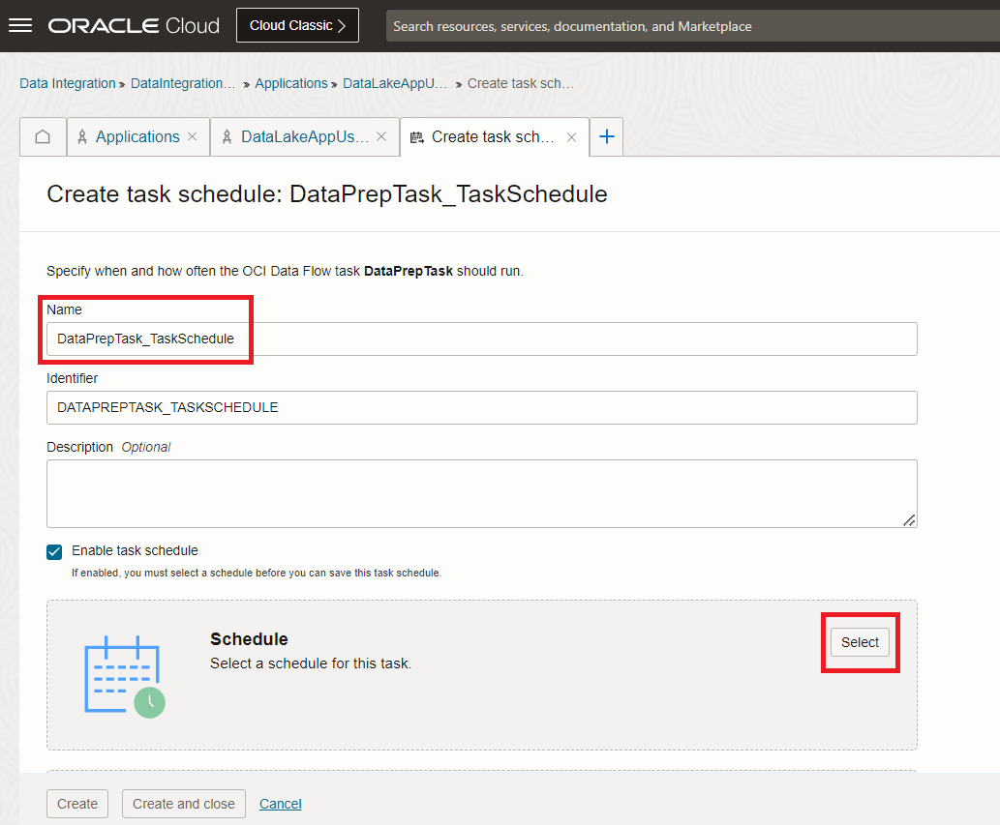

# Scheduling and Orchestration

## Introduction

Learn how to **run a Data Integration task**, create a **task schedule** in your OCI Data Integration application, and to **run it**.
After publishing tasks to an Application, you can run a task **manually on-demand**, or you can use schedules and task schedules to **automate the execution** of your tasks.
To run a task automatically on a specific schedule, you must:
* **Create a schedule**: A schedule defines when and how frequently tasks should be run. A schedule can be used across tasks of any type.
* **Create a task schedule for the task**: A task schedule is an automated run configuration for a specific task. You schedule a task to run automatically by creating a task schedule, and associating the task schedule with an existing schedule.

Estimated Time: 20 minutes

### Objectives
* Create and publish a Data Integration task
* Manage Data Integration application tasks
* Create a Schedule

### Prerequisites

* Completion of the preceding tasks in the Lab1
* Some understanding of Cloud, Database, Data Lake terms is helpful 
* Familiarity with ETL concepts is helpful

## Task 1: Create and publish tasks

1. Once you are in the OCI console, click on the left hand top left menu, go to **Analytics & AI** and then click on **Data Lake**.

  

2. Go to the Data Lake assigned to you.

  

3. Click on the **Data Integration** menu on the left hand menu.

  

4. Click on the **Data Integration home** button as shown below.

  

5. Click on the **Projects** menu as shown below.

  

6. Once in the project listing page, click on the project that is assigned to you, for example: **user 1** from **group 1** will work in **DataLakePrjUser1**.

  

7. We will now create a OCI Data Flow task. Click on the **Tasks** menu in the left hand side, then click on **Create Task** and then select **OCI Data Flow** as shown below.

  

8. In the name field input **DataPrepTask** and then click on Select in **OCI Data Flow Application** block as shown below.

  

9. In the following screen select the compartment **"CloudWorld_Shared"**, this will populate a table with all Data Flow applications in the compartment, select **DataPrepGrp1** based on the group number you belong to and then click on **Select** as shown below.

  

10. Then click on **Validate**, wait for successful validation, then click on **Create and close**.

  

11. This will take you to the Tasks page, click on the action menu on the right and then click on **Publish to application**.

  

12. Select the application assigned to you, if you are from group 1 user 1, the application will end with the string User1.

  

## Task 2: Manage Application tasks and Scheduling

1. A notification will pop up on the right top corner click on **"View Application"**.

  

2. Make sure you are in the **Tasks** section and click on the action menu for the newly published task and click on **Schedule**.

  

3. Now we will create a task schedule. In the slide in window for creating task schedule give the task schedule a name: **DataPrepTask_TaskSchedule**, then scroll down to the Schedule block and click on select as shown below.

  

4. Next we will create a schedule, click on **Create Schedule** button.

  

5. In the Create schedule page, give the schedule a name, select Time zone as per your preference, select the frequency and time and click on create as shown below.

  

6. You will be redirected to the create schedule page, make sure the newly created schedule is selected and click on **Select**.

  

7. Verify the schedule information and click on create and close.

  

8. You will get a notification on the top right corner of the screen for successful creation of the schedule as shown below.

  

You have successfully scheduled the task and the same will run at the selected frequency and time. 

Congratulations!

## Learn More

* [Scheduling tasks in OCI Data Integration](https://docs.oracle.com/en-us/iaas/data-integration/using/schedules.htm)
* [Executing Published Tasks](https://docs.oracle.com/en-us/iaas/data-integration/using/published-tasks.htm)
* [Viewing Executed Task Runs](https://docs.oracle.com/en-us/iaas/data-integration/using/task-runs.htm)

## Acknowledgements

* **Author** - Rohit Saha
* **Last Updated By/Date** - Mario Miola, August 2023
