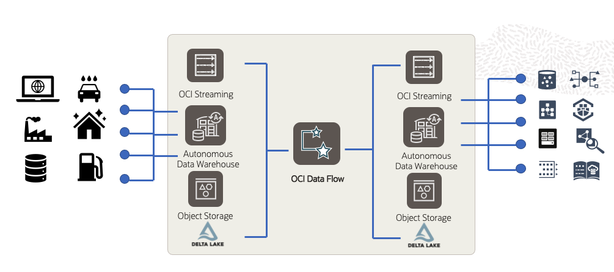
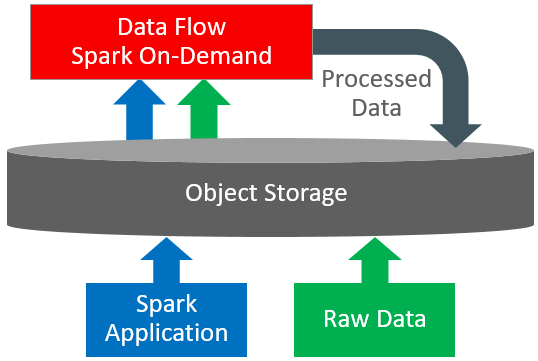

# Introduction

## About this workshop

OCI Data Flow service is a fully managed serverless Spark as a service. OCI Data Flow makes it easy to run Spark applications to process stream data and perform heavy-weight stream operations including machine learning. In today's workshop, we will cover a typical streaming-related use case from the manufacturing industry.

In the manufacturing industry, predictive maintenance is always better than reactive maintenance. One of the most common use cases of predictive maintenance in the manufacturing industry is predicting the Remaining Useful Life (RUL) of equipment. Today's workshop demonstrates running a streaming application with machine learning on top of it to predict the RUL of equipment.

Today we will build four apps using the OCI Data Flow service to demonstrate the prediction of RUL.

1. RULSurvivalModelTrainer - Offline model trainer for predicting Remaining Useful Life using Apache Spark MLlib.
2. SensorDataSimulator     - Random sensor data simulator for equipment using Apache Spark Structured Streaming.
3. RealtimeRULPredictor    - Realtime RUL Predictor using Apache Spark Structured Streaming.
4. DeltaTable              - DeltaTable operations on predicted RUL Apache Spark and DeltaLake.

### Workshop Architecture
  

Estimated Workshop Time: 120 minutes

### About Oracle Cloud Infrastructure Data Flow
Data Flow is a cloud-based serverless platform with a rich user interface. It allows data engineers and data scientists
to create, edit, and run Apache Spark workloads at any scale without the need for clusters, an operations team, or highly
specialized Spark knowledge. Being serverless means there is no infrastructure for you to deploy or manage.
It is entirely driven by REST APIs, giving you easy integration with applications or workflows. You can:

* Connect to Apache Spark data sources.
* Create reusable Apache Spark applications.
* Launch Apache Spark jobs in seconds.
* Create Apache Spark applications using SQL, Python, Java, Scala, or spark-submit.
* Manage all Apache Spark applications from a single platform.
* Process data in the Cloud or on-premises in your data center.
* Create Big Data building blocks that you can easily assemble into advanced Big Data applications.

The diagram below provides an overview of the OCI Data Flow Service, its features, components, and some of the other OCI services it integrates with.

### Objectives
In this workshop, you will:
* Create Apache Spark machine learning applications in OCI Data Flow.
* Create Apache Spark structured streaming applications in OCI Data Flow.
* Create Apache Spark batch application that can do Delta Table operations in OCI Data Flow.
* Explore Spark UI for Apache Spark batch and structured streaming applications in OCI Data Flow.
* Access Spark driver, executor, and application logs in real-time in OCI Data Flow.
* Integrate with other OCI services such as OCI Streaming, OCI Object Storage, OCI Autonomous Databases, and OCI Vault.

### Prerequisites
If you are running the workshop in a Paid Cloud Account, ensure you are an Oracle Cloud Account Administrator with the permissions below:
* Permission to manage policies, compartments, user groups, and resource managers.

## Acknowledgments
- **Created By/Date** - Sivanesh Selvanataraj, OCI Data Flow
- **Contributors** - Sujoy Chowdhury, OCI Data Flow
- **Last Updated By/Date** - Sivanesh Selvanataraj, October 2022
