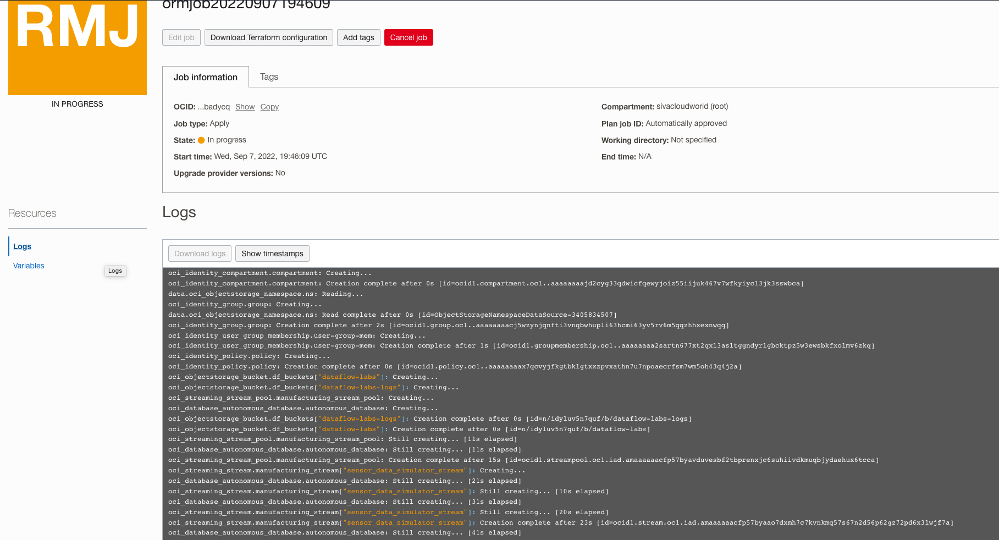
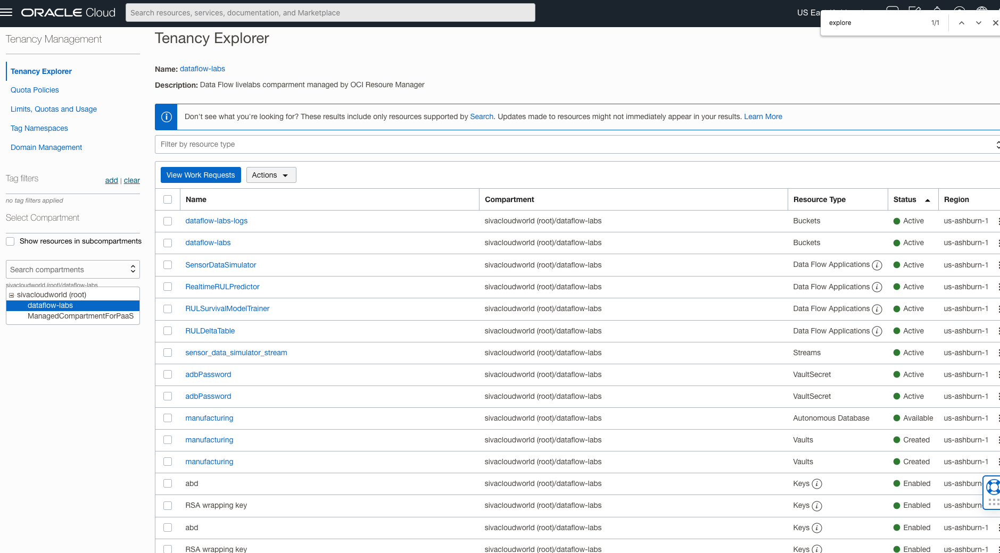

# Set up required resources for manufacturing applications

## Introduction

This workshop helps set up the resources required for running the Apache Spark applications in OCI Data Flow for the Remaining Useful Life (RUL) prediction.

Estimated time: 15 minutes

### Objectives

* Plan and Apply automated terraform scripts in OCI Resource Manager to deploy the required cloud resources for the lab.
* Verify required resources are created.

### Prerequisites

* This lab requires an [Oracle Cloud account](https://www.oracle.com/cloud/free/). You may use your own cloud account, or a Free tier account, a cloud account that you obtained through a trial.
* This lab requires a user with the necessary Identity and Access Management permissions to CREATE, MODIFY, and DELETE below OCI resources at the tenancy level.
    * OCI Compartments
    * OCI UserGroup
    * OCI Policies
    * OCI Autonomous Databases
    * OCI Vault
    * OCI Object Storage Buckets & Objects
    * OCI Streampool & Streams
    * OCI Dataflow Application & Runs

## Task 1: Create a manufacturing application stack 
1. Open the profile in the top right corner and click on the username.
	
2. Click the link to create a stack to deploy all necessary resources [](https://cloud.oracle.com/resourcemanager/stacks/create?zipUrl=https://github.com/oracle-samples/oracle-dataflow-samples/raw/main/scala/manufacturing/src/resources/manufacturing.zip)
3. Review and accept ```Oracle terms to Use``` and click Next.
   
4. Update the ```user_ocid``` variable with the value from step 1. Other variables don't need any change and click Next.
   
   
5. Review the information provided, Ensure that the ```Run apply``` checkbox is selected. and click ```Create```.
   
6. Creating stack will auto create Apply job which starts provisioning resources.
    
   
## Task 2: Verify required resources provisioned
1. Wait for Resource Manager Apply job completes, you can watch the logs.
   
   
2. Verify Apply job status is SUCCEEDED.
   
3. Click on the SUCCEEDED job to see job details and resources.
   
4. Click on the hamburger menu in the top left corner, select Governance & Administration and then select Tenancy Explorer.
   
5. Select the dataflow-labs compartment and verify resources in the screenshot are available.
   

You may now **proceed to the next lab**.

## Acknowledgments
- **Created By** -  Sivanesh Selvanataraj, Software Engineer, OCI Data Flow
- **Contributors** - Sujoy Chowdhury, Product Manager, OCI Data Flow
- **Last Updated By/Date** - Sivanesh Selvanataraj, October 2022
