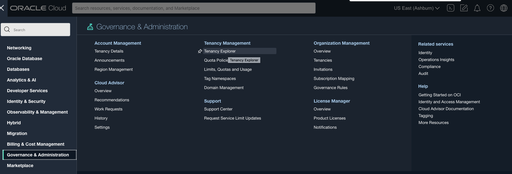

# Setup required resources for manufacturing application

## Introduction

This workshop help setup resources required for running manufacturing spark applications in OCI Data Flow.

Estimated time: 10 minutes

### Objectives

* Plan and Apply automated terraform scripts in OCI Resource Manager to provision required resources.
* Verify required resources are created.

### Prerequisites

* This lab requires an [Oracle Cloud account](https://www.oracle.com/cloud/free/). You may use your own cloud account, or a Free tier account, a cloud account that you obtained through a trial.
* This lab requires user with necessary access to CREATE,MODIFY,DELETE below OCI resources at tenancy level.
    * OCI Compartments
    * OCI UserGroup
    * OCI Policies
    * OCI Autonomous Databases
    * OCI Vault
    * OCI Object Storage Buckets & Objects
    * OCI Streampool & Streams
    * OCI Dataflow Application & Runs

## Task1: Create manufacturing stack in Resource Manager Stack Root compartment
1. Open profile on top right corner and click on username.
	
2. Click the link to create stack to provision all necessary resources 
3. Stack information will show you name of the stack and it is getting created from oracle dataflow samples github.
   
4. Update user ocid variable with value from step 1. ,other variables doesn't need any change
   
   
5. Review the information provided and ensure Run apply checkbox is selected and click create.
   
6. Creating stack will auto create Apply job which start provisioning resources.
    
   
## Task2: Verify resources are created
1. Wait for Resource Manager apply job completes, you can watch the logs.
   
   
2. Verify apply job status is succeeded.
   
3. Click on succeeded job to see job details and resources.
   
4. Click on the breadcrums in top left corner , select Governance & Administration and then select Tenancy Explorer.
   
5. Select dataflow-labs compartment and verify resources in the screenshot are available.
   

You may now **proceed to the next lab**.

## Acknowledgements
- **Author** - Sujoy Chowdhury, Senior Principal Product Manager,
- **Contributors** - OCI Data Flow Sivanesh Selvanataraj, Senior Software Engineer, OCI Data Flow
- **Last Updated By/Date** - Sivanesh Selvanataraj, September 2022
