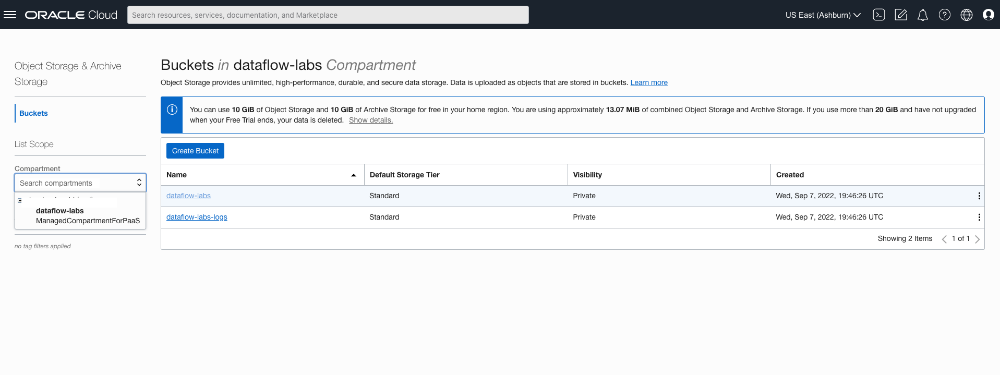
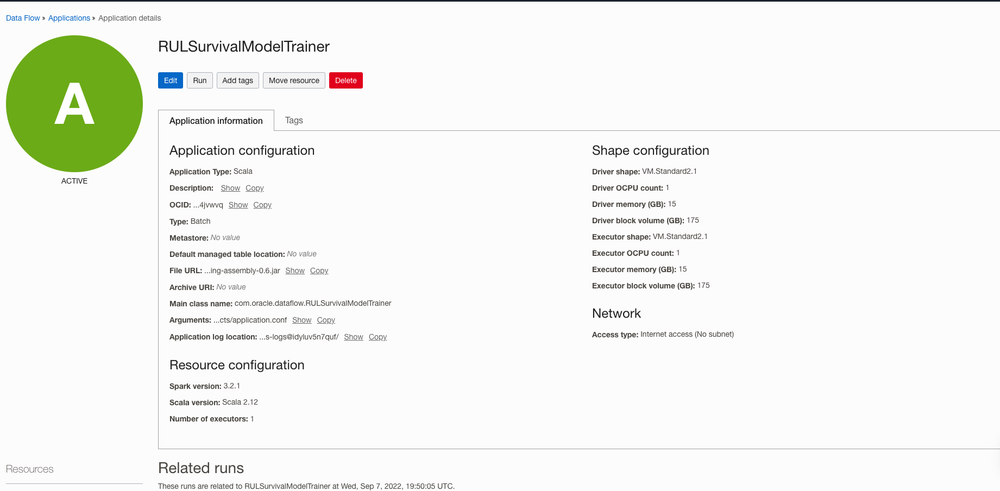
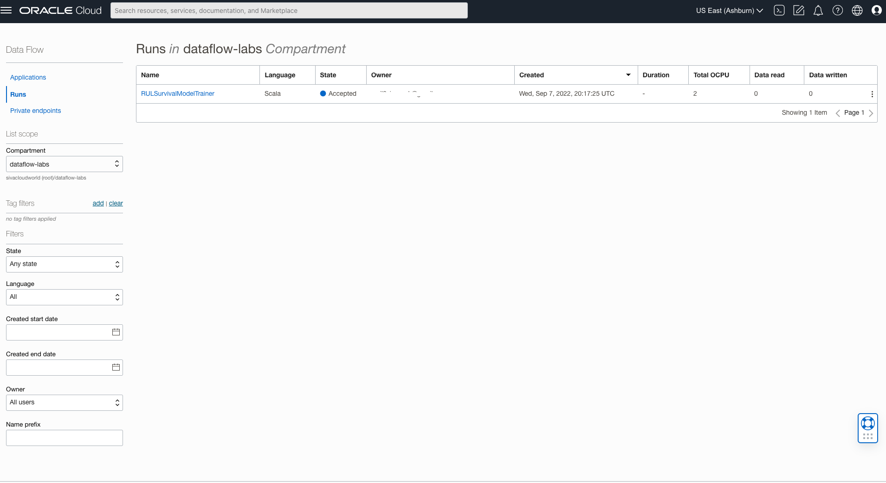
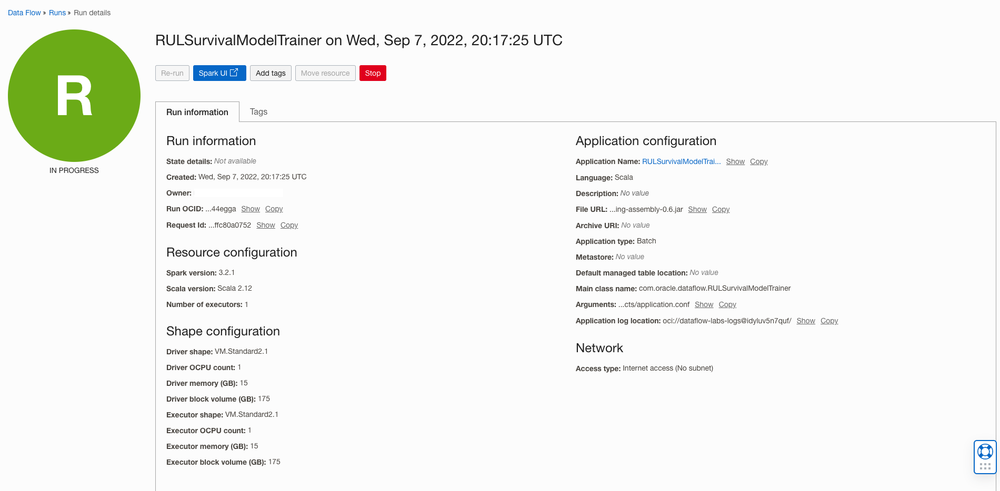
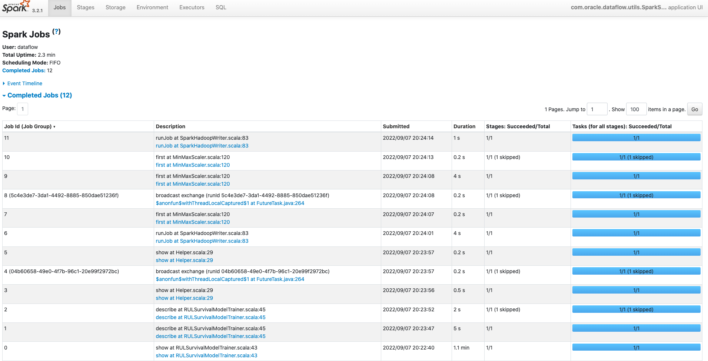
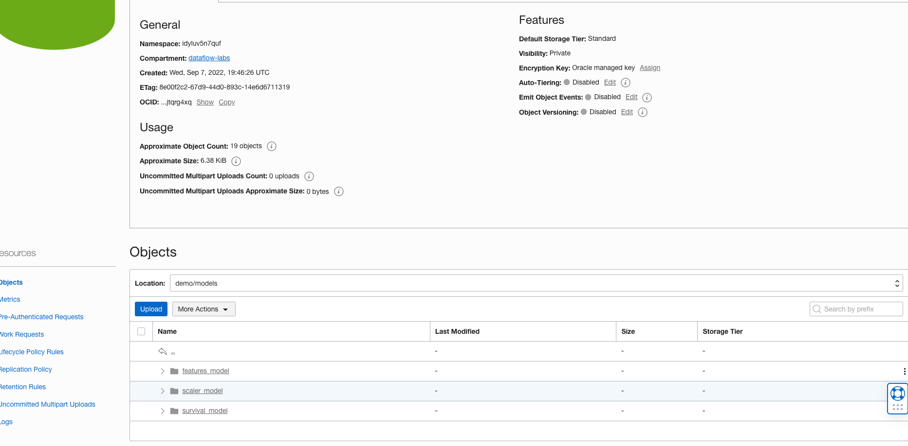
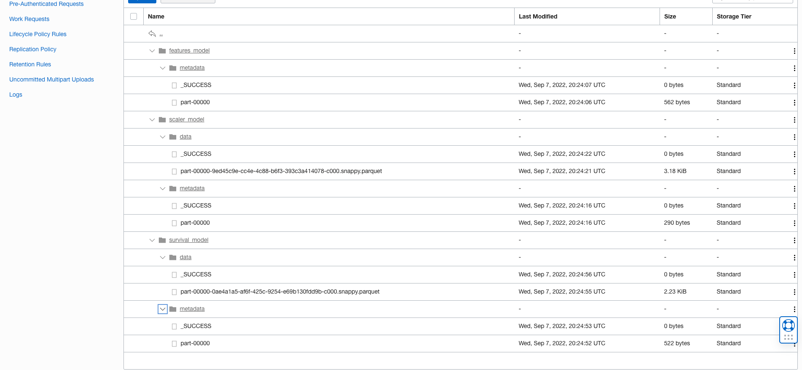

# Train the model 

## Introduction

This workshop uses OCI Data Flow to run AFT Machine Learning Model to predict Remaining Useful Life (RUL) using Apache Spark applications with the resources provisioned in Lab 1.

Estimated time: 20 minutes

### Objectives

* Run machine learning model in OCI Data Flow

### Prerequisites

* Completion of the preceding labs in this workshop

## Task 1: Verify artifacts.

1. Go to OCI Object Storage Console (aka. hamburger menu) in the Oracle Cloud console, and select **Storage ** &gt; **Buckets**.

   

2. Select the ```dataflow-labs``` compartment on the left side and select the ```dataflow-labs``` object storage bucket

   

3. Click on the object ```demo```.
   

4. Click the ```artifacts``` object and verify the ```application.conf``` object is available.
   

## Task 2: Run machine learning model 

1. Go to OCI Data Flow Console (aka. hamburger menu) in the Oracle Cloud console, and select **Analytics & AI ** &gt; **Data Flow**.

   

2. Click ```RULSurvivalModelTrainer``` OCI Data Flow Application. 
   

3. Click the ```Run``` button on top and confirm by clicking ```Run``` again.
   
   
4. OCI Data Flow Run will be created with the ACCEPTED state under ```RUNS``` resources.

  

5. Wait for approximately 2-3 minutes for OCI Data Flow RUN to move from ACCEPTED TO IN PROGRESS state.

6. Click on the run with IN PROGRESS state.
   
  

6. Click Spark UI to explore Spark UI Options.

  

7. Wait for the run to complete, it will take approximately 4-6 minutes.

   

## Task 3: Verify RUL survival model is created.

1. Go to OCI Object Storage Console (aka. hamburger menu) in the Oracle Cloud console, and select **Storage ** &gt; **Buckets**.

   

2. Select the ```dataflow-labs``` compartment on the left side and select the ```dataflow-labs``` bucket

   

3. Select object ```demo```.
   

4. Select the ```models``` object and verify three folders as shown below
   

5. Expand and verify that the models are in a parquet file format with associated metadata.
   
   
You may now **proceed to the next lab**.

## Acknowledgments
- **Created By** -  Sivanesh Selvanataraj, Software Engineer, OCI Data Flow
- **Contributors** - Sujoy Chowdhury, Product Manager, OCI Data Flow
- **Last Updated By/Date** - Sivanesh Selvanataraj, October 2022
