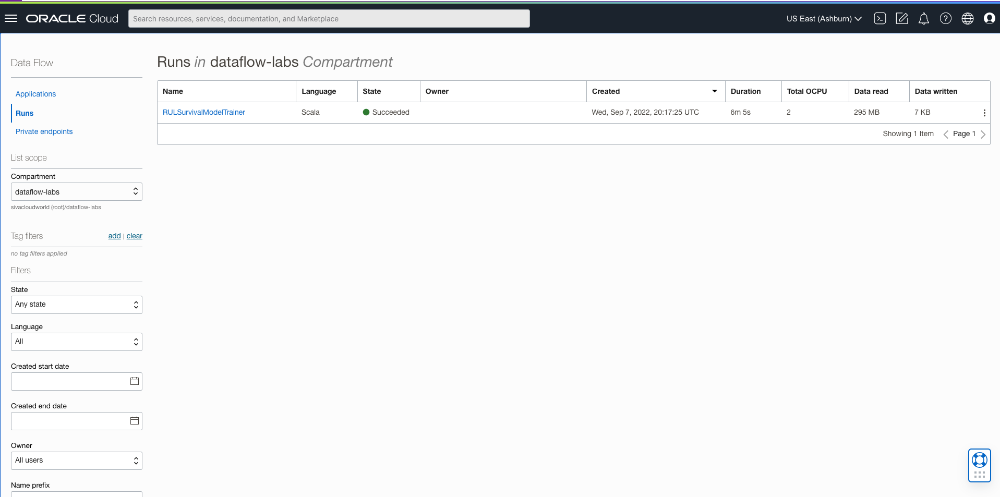

# Build a microservices application

## Introduction

This workshop uses OCI Data Flow to run applications with the resources provisioned in Lab 1.

Estimated time: 10 minutes

### Objectives

* Run machine learning modelin OCI Data Flow

### Prerequisites

* Completion of the preceding labs in this workshop

## Task1: Verify artifacts.

1. Go to OCI Object Storage Console (aka. hamburger menu) in the Oracle Cloud console, and select **Storage ** > **Buckets**.

   

2. Select dataflow-labs compartment in left side and select dataflow-labs bucket

   

3. Select object demo.
   

4. Select artifacts object and verify application.conf object is available
   

## Task2: Run Machine Learning Model 

1. Go to OCI Data Flow Console (aka. hamburger menu) in the Oracle Cloud console, and select **Analytics & AI ** > **Data Flow**.

   

2. Click RULSurvivalModelTrainer Application. 
   

3. Click Run button on top and click Run again
   
   
4. Run will be created with ACCEPTED state.

  

5. Click on the run with IN PROGRESS state.
   
  

6. Click Spark UI and explore

  

7. Wait for run to complete

   

## Task3: Verify RUL survival model is created.

1. Go to OCI Object Storage Console (aka. hamburger menu) in the Oracle Cloud console, and select **Storage ** > **Buckets**.

   

2. Select dataflow-labs compartment in left side and select dataflow-labs bucket

   

3. Select object demo.
   

4. Select models object and verify three folder as shown below
   

5. Expand and verify models in parquet file format with associated metadata.
   
   
You may now **proceed to the next lab**.

## Acknowledgements
- **Author** - Sujoy Chowdhury, Senior Principal Product Manager,
- **Contributors** - OCI Data Flow Sivanesh Selvanataraj, Senior Software Engineer, OCI Data Flow
- **Last Updated By/Date** - Sivanesh Selvanataraj, September 2022
