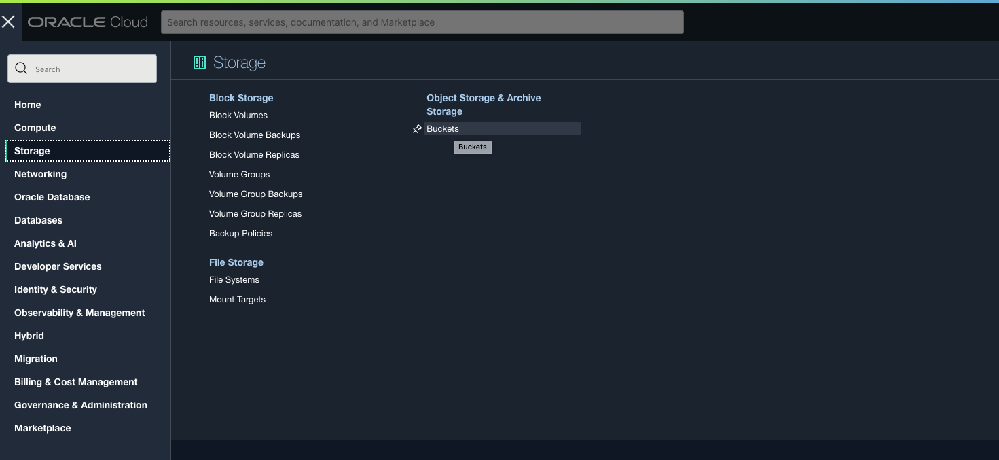
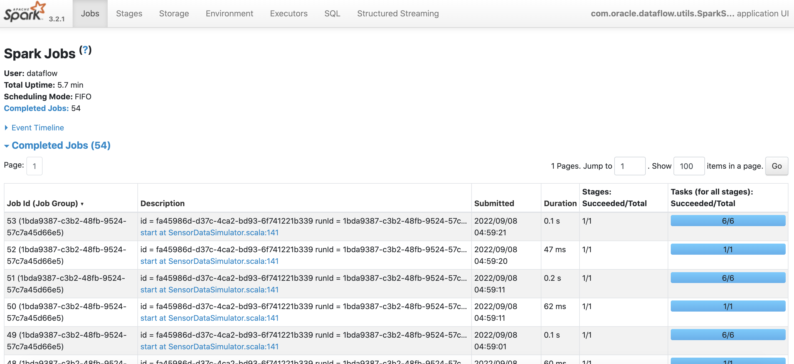
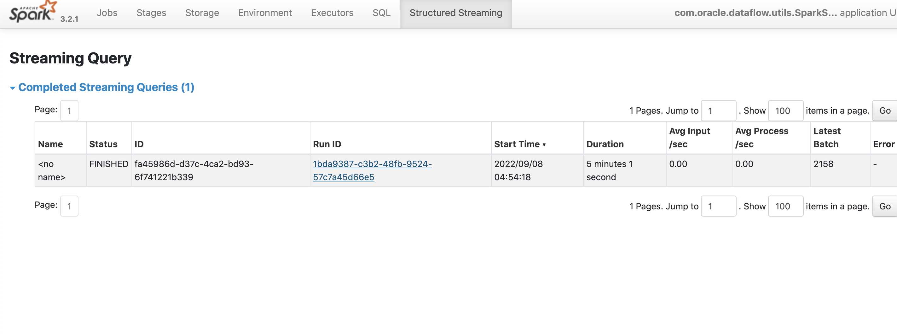
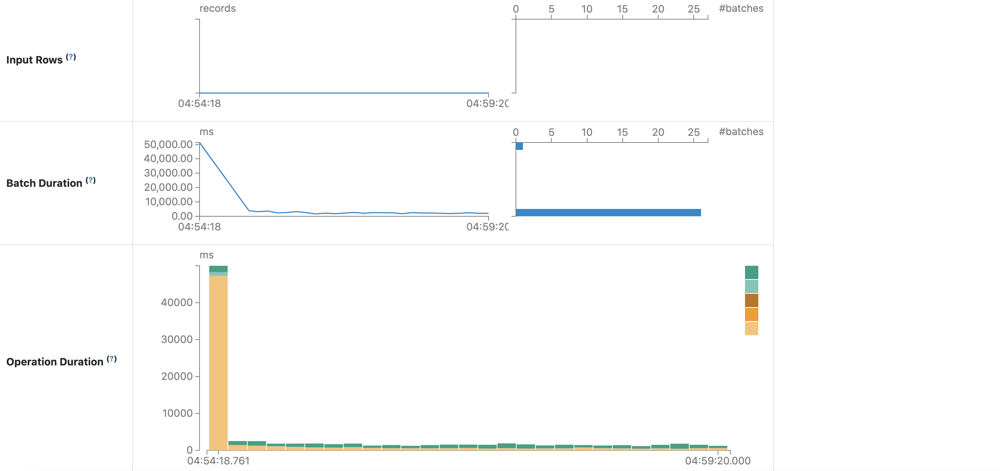
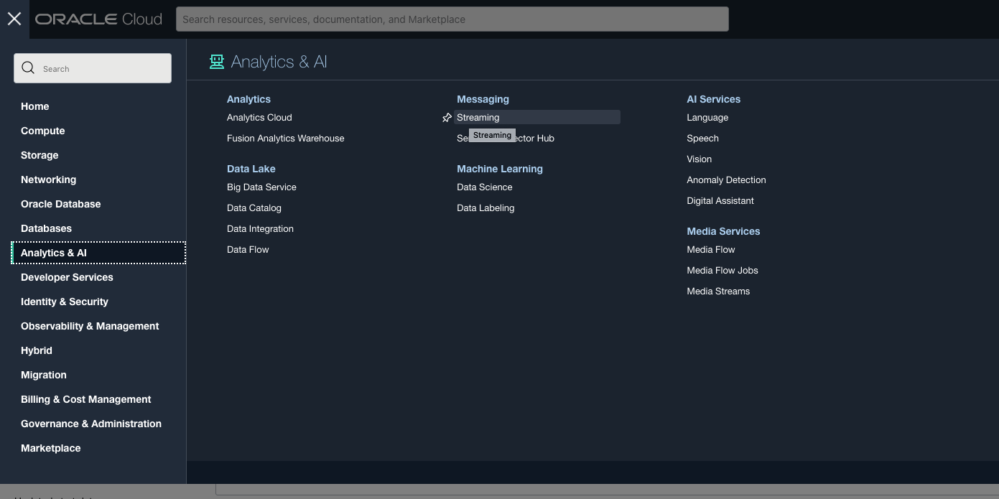
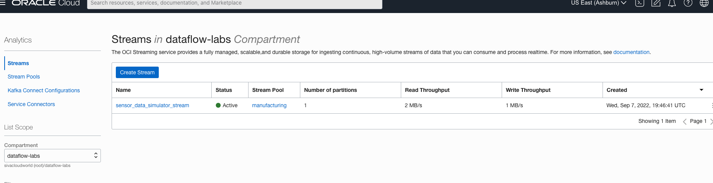

# Run Sensor Data Simulator

## Introduction

This workshop uses OCI Data Flow to produce sensor data using an Apache Spark application with the resources provisioned in Lab 1.

Estimated time: 15 minutes

### Objectives

* Run sensor data streaming simulator(producer) in OCI Data Flow to OCI Streaming.

### Prerequisites

* Completion of the preceding labs in this workshop

## Task 1: Verify artifacts.

1. Go to OCI Object Storage Console (aka. hamburger menu) in the Oracle Cloud console, and select **Storage ** &gt; **Buckets**.

   

2. Select the ```dataflow-labs``` compartment on the left side and select the ```dataflow-labs``` bucket.

   

3. Select object demo from object storage.
   

4. Select ```artifacts``` object and verify the ```application.conf``` object is available.
   

## Task 2: Run Streaming Simulator

1. Go to OCI Data Flow Console (aka. hamburger menu) in the Oracle Cloud console, and select **Analytics & AI ** &gt; **Data Flow**.

   

2. Click ```SensorDataSimulator``` OCI Data Flow Application.
   

3. Click the ```Run``` button on top and confirm by clicking ```Run``` again.
   

4. Run will be created with ACCEPTED and moved to IN PROGRESS state.

   

6. Click Spark UI, Job, and ```Structured Streaming query```

   
   
   

## Task 3: Verify Simulator is streaming sensor data.

1. Go to OCI Streaming Console (aka. hamburger menu) in the Oracle Cloud console, and select **Analytics & AI ** &gt; **Streaming**.

   

2. Select the ```dataflow-labs``` compartment on the left side.

   

3. Click ```sensor-data-simulator-stream``` streams.
   

4. Click on ```Load Messages``` and verify we are receiving messages.
   

You may now **proceed to the next lab**.

## Acknowledgments
- **Created By** -  Sivanesh Selvanataraj, Senior Software Engineer, OCI Data Flow
- **Contributors** - Sujoy Chowdhury, Senior Principal Product Manager, OCI Data Flow
- **Last Updated By/Date** - Sivanesh Selvanataraj, October 2022
