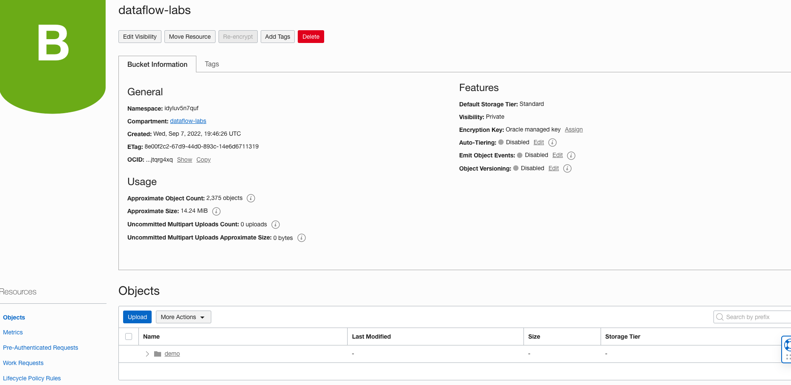
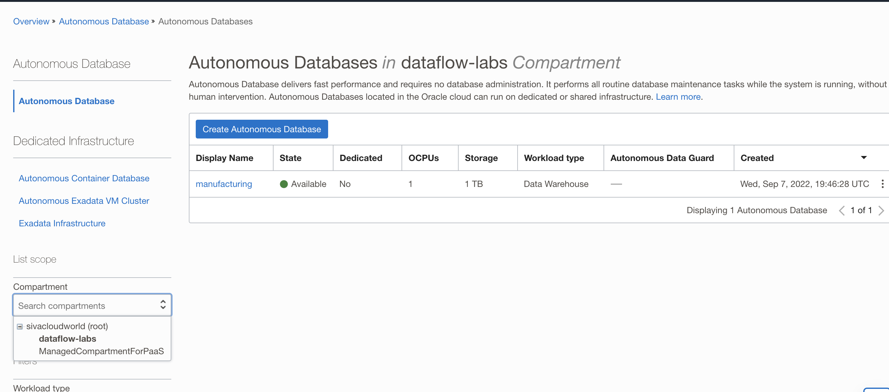
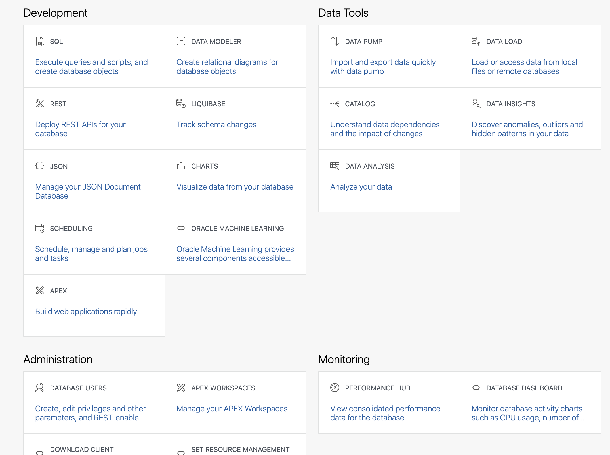

# Run Remaining Useful Life (RUL) predictor

## Introduction

This workshop uses OCI Data Flow to predict in real time the Remaining Useful Life (RUL) of equipment using the Apache Spark streaming application with the resources provisioned in Lab 1, Lab 2, and Lab 3.

Estimated time: 15 minutes

### Objectives

* Run the real-time machine Learning predictor application in OCI Data Flow

### Prerequisites

* Completion of the preceding labs in this workshop

## Task 1: Verify artifacts.

1. Go to OCI Object Storage Console (aka. hamburger menu) in the Oracle Cloud console, and select **Storage ** &gt; **Buckets**.

   

2. Select the ```dataflow-labs``` compartment on the left side and select the ```dataflow-labs``` bucket

   

3. Select object ```demo```.
   

4. Select ```artifacts``` object and verify the ```application.conf``` object is available.
   

## Task 2: Run real-time predictor

1. Go to OCI Data Flow Console (aka. hamburger menu) in the Oracle Cloud console, and select **Analytics & AI ** &gt; **Data Flow**.

   

2. Click ```RealtimeRULPredictor``` Application.
   

3. Click the ``Run`` button on top and confirm by clicking ```Run``` again
   

4. Run will be created with ACCEPTED state

   

5. In 2-3 minutes state of the OCI Data Flow run will be moved to IN PROGRESS

   


## Task 3: Verify the delta table and the parquet table.

1. Go to OCI Object Storage Console (aka. hamburger menu) in the Oracle Cloud console, and select **Storage ** &gt; **Buckets**.

   

2. Select the dataflow-labs compartment on the left side and select the dataflow-labs bucket

   

3. Select object demo.
   

4. Predicted RUL DeltaTable and ParquetTable
   


## Task 4: Verify Autonomous Database.

1. Go to OCI Oracle Database Console (aka. hamburger menu) in the Oracle Cloud console, and select **Oracle Database ** &gt; **Autonomous Data Warehouse**.

   

2. Select the dataflow-labs compartment on the left side and select the manufacturing autonomous database instance

   

3. Click on manufacturing autonomous database and click on the Database Actions button.
   

4. Select SQL developer tool
   

5. Select PREDICTED_RUL_ALERTS table
   
   
6. Click on Data to see predicted RUL data.
   

7. Alternate to step 5. you can write SQL queries to fetch data from the PREDICTED_RUL_ALERTS table.
   


You may now **proceed to the next lab**.

## Acknowledgments
- **Created By** -  Sivanesh Selvanataraj, Software Engineer, OCI Data Flow
- **Contributors** - Sujoy Chowdhury, Product Manager, OCI Data Flow
- **Last Updated By/Date** - Sivanesh Selvanataraj, October 2022
