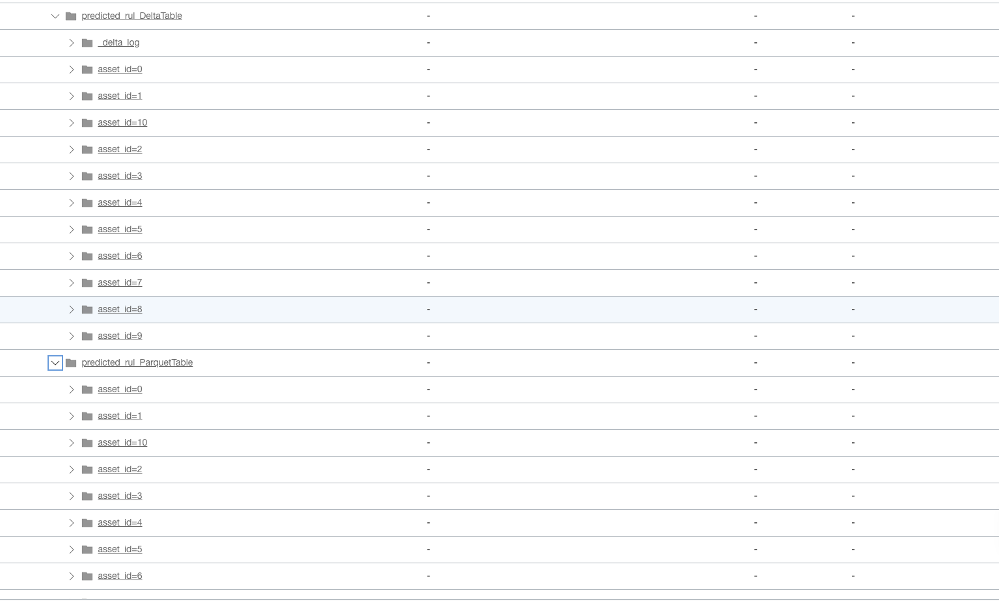

# Run Remaining Useful Life (RUL) Predictor

## Introduction

This workshop uses OCI Data Flow to predicts realtime RUL using Apache Spark streaming application with the resources provisioned in Lab 1, Lab 2, Lab 3.

Estimated time: 15 minutes

### Objectives

* Run realtime Machine Learning prediction in OCI Data Flow

### Prerequisites

* Completion of the preceding labs in this workshop

## Task1: Verify artifacts.

1. Go to OCI Object Storage Console (aka. hamburger menu) in the Oracle Cloud console, and select **Storage ** > **Buckets**.

   

2. Select ```dataflow-labs``` compartment in left side and select ```dataflow-labs``` bucket

   

3. Select object ```demo```.
   

4. Select ```artifacts``` object and verify ```application.conf``` object is available
   

## Task2: Run Realtime Predictor

1. Go to OCI Data Flow Console (aka. hamburger menu) in the Oracle Cloud console, and select **Analytics & AI ** > **Data Flow**.

   

2. Click ```RealtimeRULPredictor``` Application.
   

3. Click ``Run`` button on top and confirm by clicking ```Run``` again
   

4. Run will be created with ACCEPTED state

   

5. In 2-3 minutes state of OCI Data Flow run will be moved to IN PROGRESS

   


## Task3: Verify delta table and parquet table.

1. Go to OCI Object Storage Console (aka. hamburger menu) in the Oracle Cloud console, and select **Storage ** > **Buckets**.

   

2. Select dataflow-labs compartment in left side and select dataflow-labs bucket

   

3. Select object demo.
   

4. Predicted RUL DeltaTable and ParquetTable
   


## Task4: Verify Autonomous Database.

1. Go to OCI Oracle Database Console (aka. hamburger menu) in the Oracle Cloud console, and select **Oracle Database ** > **Autonomous Data Warehouse**.

   

2. Select dataflow-labs compartment in left side and select manufacturing autonomous database instance

   

3. Click on manufacturing autonomous database and click on Database Actions button.
   

4. Select SQL developer tool
   

5. Select PREDICTED_RUL_ALERTS table
   
   
6. Click on Data to see predicted RUL data.
   

7. Alternate to step 5. you can write SQL queries to fetch data from PREDICTED_RUL_ALERTS table.
   


You may now **proceed to the next lab**.

## Acknowledgements
- **Author** -  Sivanesh Selvanataraj, Software Engineer, OCI Data Flow
- **Contributors** - Sujoy Chowdhury, Product Manager, OCI Data Flow
- **Last Updated By/Date** - Sivanesh Selvanataraj, September 2022
