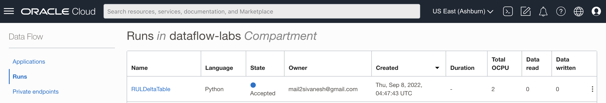
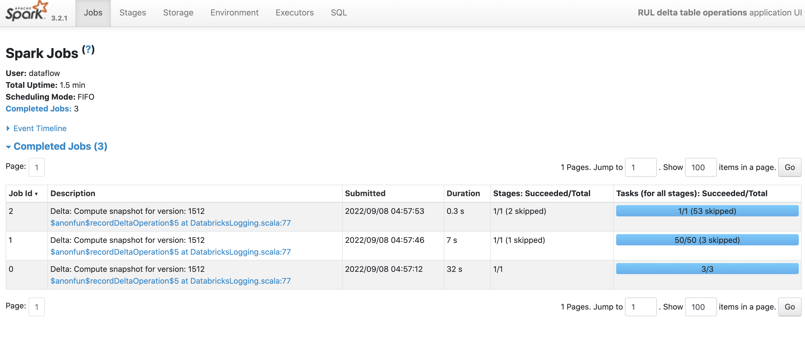

# Run Sensor Data Simulator

## Introduction

This workshop uses OCI Data Flow to run applications with the resources provisioned in Lab 1, Lab2, Lab3 and Lab4.

Estimated time: 10 minutes

### Objectives

* Delta Table operations using OCI Data Flow on Predicted RUL delta table created in Lab 3

### Prerequisites

* Completion of the preceding labs in this workshop

## Task1: Verify delta table location.

1. Go to OCI Object Storage Console (aka. hamburger menu) in the Oracle Cloud console, and select **Storage ** > **Buckets**.

   

2. Select dataflow-labs compartment in left side and select dataflow-labs bucket

   

3. Select object demo.
   

4. Verify if delta table located in below location
    

## Task2: Run DeltaTable Operations

1. Go to OCI Data Flow Console (aka. hamburger menu) in the Oracle Cloud console, and select **Analytics & AI ** > **Data Flow**.

   

2. Click RULDeltaTable Application.
   

3. Click Run button on top and click Run again
   

4. Run will be created with ACCEPTED state
   
   
5. In 2-3 minutes OCI Data Flow run will be moved to IN PROGRESS

   

6. Click Spark UI, Job and DeltaTable operations

   

You may now **proceed to the next lab**.

## Acknowledgements
- **Author** - Sujoy Chowdhury, Senior Principal Product Manager, OCI Data Flow
- **Contributors** - OCI Data Flow Sivanesh Selvanataraj, Senior Software Engineer, OCI Data Flow
- **Last Updated By/Date** - Sivanesh Selvanataraj, September 2022
