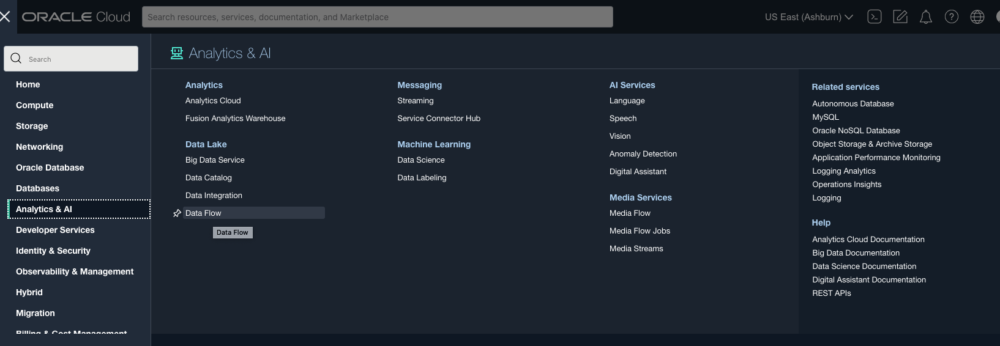

# Run Delta Table operations

## Introduction

This workshop uses OCI Data Flow to run spark applications with the resources provisioned in Lab 1, Lab 2, Lab 3, and Lab 4.

Estimated time: 10 minutes

### Objectives

* Delta Table operations using the OCI Data Flow on Predicted RUL delta table created in Lab 3

### Prerequisites

* Completion of the preceding labs in this workshop

## Task 1: Verify delta table location.

1. Go to OCI Object Storage Console (aka. hamburger menu) on the Oracle Cloud console, and select **Storage ** &gt; **Buckets**.

   

2. Select the dataflow-labs compartment on the left side and select the dataflow-labs bucket

   

3. Select object demo.
   

4. Verify if the delta table located in the below location
    

## Task 2: Run delta table operations

1. Go to OCI Data Flow Console (aka. hamburger menu) in the Oracle Cloud console, and select **Analytics & AI ** &gt; **Data Flow**.

   

2. Click RULDeltaTable Application.
   

3. Click the Run button on top and click Run again
   

4. Run will be created with ACCEPTED state
   
   
5. In 2-3 minutes OCI Data Flow run will be moved to IN PROGRESS

   

6. Click Spark UI, Job, and DeltaTable operations

   

You may now **proceed to the next lab**.

## Acknowledgments
- **Created By** -  Sivanesh Selvanataraj, Software Engineer, OCI Data Flow
- **Contributors** - Sujoy Chowdhury, Product Manager, OCI Data Flow
- **Last Updated By/Date** - Sivanesh Selvanataraj, October 2022
