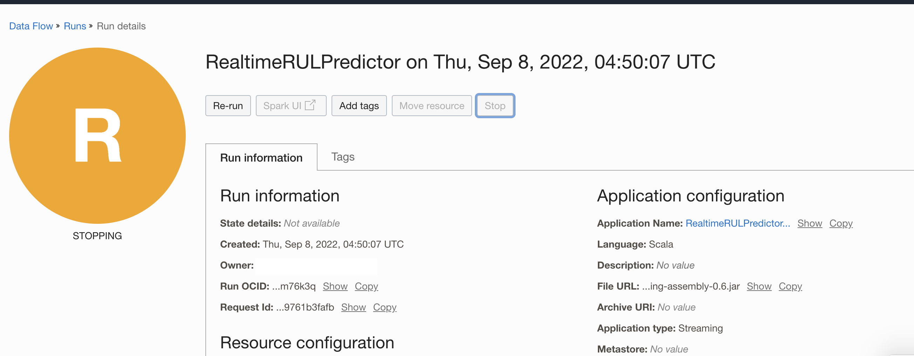
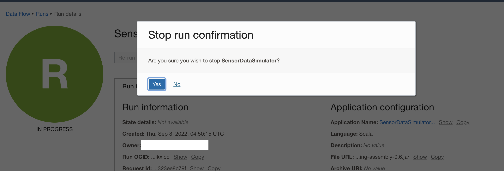
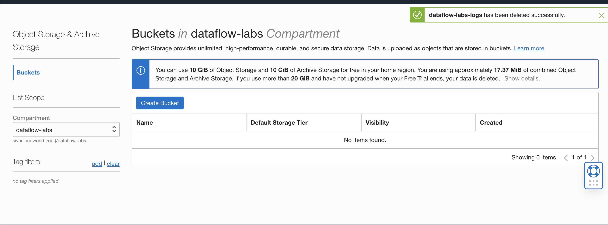
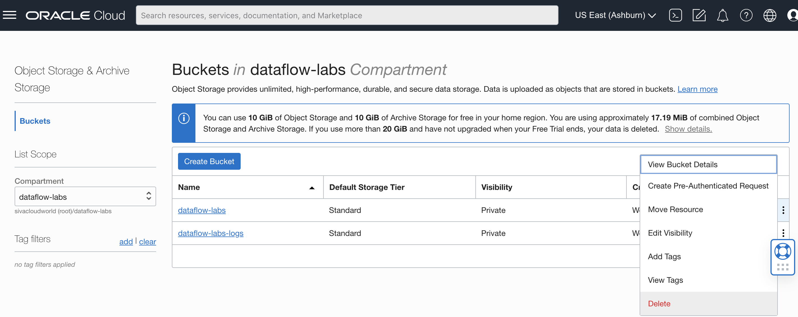
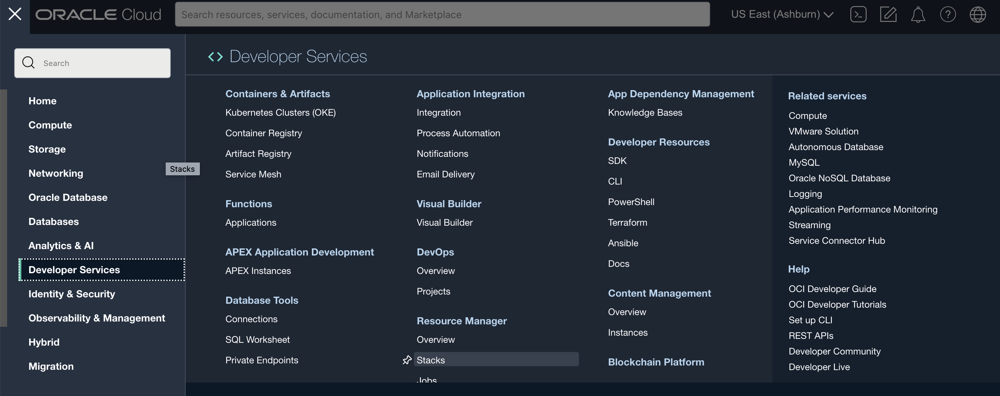
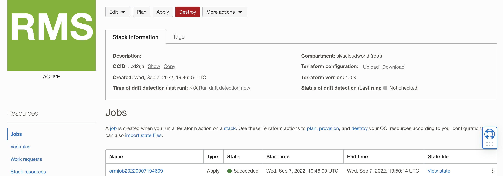

# Clean up the workshop environment

## Introduction

In this lab, you will clean up the workshop environment resources used for the manufacturing applications in OCI Data Flow.

Estimated time: 20 minutes

### Objectives

* Remove the lab configurations and setups

### Prerequisites

* Completion of preceding labs in this workshop.

## Task 1: Stop Data Flow runs

1. Go to OCI Data Flow Console (aka. hamburger menu) in the Oracle Cloud console, and select **Analytics & AI ** &gt; **Data Flow**.

   

2. Select the dataflow-labs compartment and select Runs.
   

3. Click on RealtimeRULPredictor and click on STOP.
   

4. Confirm stopping RealtimeRULPredictor.
   

5. Click on SensorDataSimulator and click on STOP.
   

6. Confirm stopping SensorDataSimulator.
   

7. Confirm all the running apps are stopped.
   

## Task 2: Delete Object Storage buckets

1. From the navigation menu in the Oracle Cloud console, select **Storage** &gt; **Bucket**.

    

2. On the **Object Storage Details** page, click **Delete** on dataflow-labs-logs. In the confirmation window, click **Delete**.

      

3. Deletion of the delete dataflow_labs_logs buckets starts and completes.

        

4. On the **Object Storage Details** page, click **Delete** on dataflow-labs. In the confirmation window, click **Delete**.

   

5. Deletion of the delete dataflow_labs_logs buckets starts and completes.

   

## Task 3: Destroy Manufacturing Stack to clean up other resources

1. From the navigation menu in the Oracle Cloud console, select **Developer Services** &gt; **Stacks**. 

           

2. Click destroy on the manufacturing stack and confirm the destruction of the stack.

        

3. Wait for successful destruction of manufacturing stack

   

4. Wait for successful destruction of manufacturing stack

   

## Acknowledgments
- **Created By** -  Sivanesh Selvanataraj, Software Engineer, OCI Data Flow
- **Contributors** - Sujoy Chowdhury, Product Manager, OCI Data Flow
- **Last Updated By/Date** - Sivanesh Selvanataraj, September 2022
