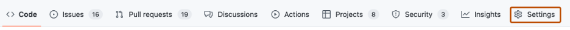
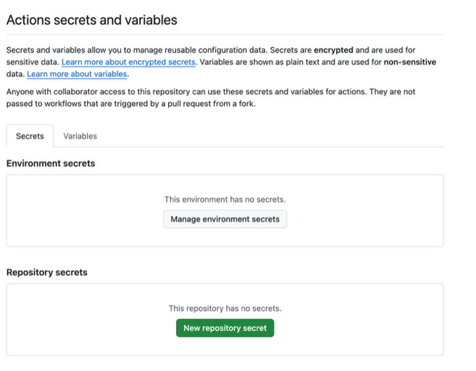
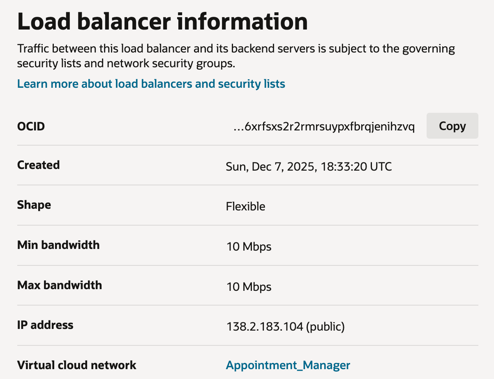
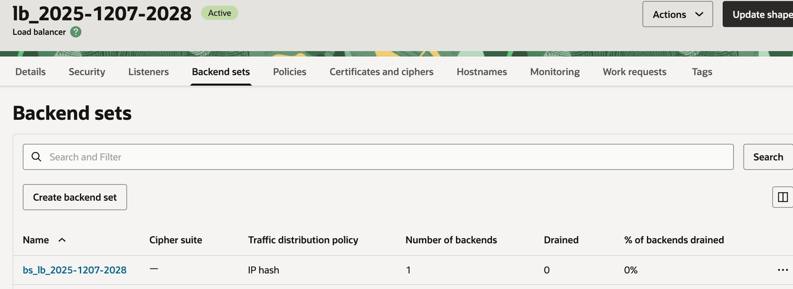
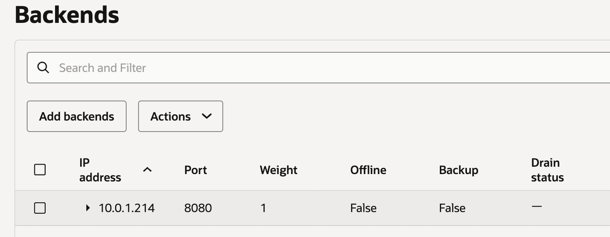

# Configure GitHub Repository Secrets and Variables for OCI Deployment

## Introduction

In this lab, you will configure the GitHub Repository Secrets and Variables required for the CI/CD workflow to authenticate with Oracle Cloud Infrastructure (OCI) and deploy resources.

Estimated Time: 60 minutes

### Objectives

In this lab, you will:
* Configure GitHub Repository Secrets for OCI authentication
* Configure the GitHub Variables for Container Instance settings
* Prepare the repository for automated CI/CD execution

### Prerequisites

This lab assumes you have:
* An Oracle account
* A GitHub account

## Task 1: Actions secrets setup

1. On GitHub, navigate to the main page of the repository.
2. Under your repository name, click Settings. If you cannot see the "Settings" tab, select the dropdown menu, then click Settings.
	

3. In the "Security" section of the sidebar, select Secrets and variables, then click Actions.
   
4. Click the Secrets tab.
5. Click New repository secret.
6. In the Name field, enter a name for your secret.
7. In the Value field, enter the value for your secret.
8. Click Add secret.

## Task 2: Adding secrets

1. Following Task 1, add each secret together with its corresponding value as shown in the table below.

  Use tables sparingly:

  | Name                            | Value                                                                                                                                                                                                                                      |
  |---------------------------------|--------------------------------------------------------------------------------------------------------------------------------------------------------------------------------------------------------------------------------------------|
  | OCI_CLI_USER                    | The OCID of the user calling the API. See [Where to Get the Tenancy's OCID and User's OCID.](https://docs.oracle.com/en-us/iaas/Content/API/Concepts/apisigningkey.htm#five) Example: ocid1.user.oc1..<unique_ID>                  |
  | OCI_CLI_TENANCY                 | The OCID of your tenancy. See [Where to Get the Tenancy's OCID and User's OCID.](https://docs.oracle.com/en-us/iaas/Content/API/Concepts/apisigningkey.htm#five) Example: ocid1.tenancy.oc1..<unique_ID>                           |
  | OCI_CLI_REGION                  | An Oracle Cloud Infrastructure region.  See [Regions and Availability Domains.](https://docs.oracle.com/en-us/iaas/Content/General/Concepts/regions.htm) Example: us-ashburn-1                                                     |
  | OCI_CLI_KEY_CONTENT             | The full content of the private key enclosed in single quotes.  See [Generating an API Signing Key](https://docs.oracle.com/en-us/iaas/Content/API/Concepts/apisigningkey.htm#two)  Important: The key pair must be in PEM format. |
  | OCI_CLI_FINGERPRINT             | The fingerprint for the public key that was added to this user. To get the value, see [How to Get the Key's Fingerprint](https://docs.oracle.com/en-us/iaas/Content/API/Concepts/apisigningkey.htm#four)                                   |
  | OCI_AUTH_TOKEN                  | See [Getting an Auth Token](https://docs.oracle.com/en-us/iaas/Content/Registry/Tasks/registrygettingauthtoken.htm)                                                                                                                        |
  | OCI_BACKEND_LB_OCID             | The OCID value of the LB created in Lab 2 Task 4.                                                                                                                                                         |      
  | OCI_BACKEND_LB_BACKEND_SET_NAME | The backend set name                                                                                                                                                                                    |   
  | OCI_BACKEND_LB_BACKEND_PORT     | The backend port number, for example: 8080 .                                                                                                                                                          |
  | DB_USER                         | The database user that was set in Lab 2 Task 3.                                                                                                                                                                                            |
  | DB_PASS                         | The database password that was set in Lab 2 Task 3.                                                                                                                                                                                        |

## Task 3: Adding variables
4. Click the Variables tab.
5. Click New repository variable.
6. In the Name field, enter a name for your variable.
7. In the Value field, enter the value for your variable.
8. Click Add variable.

| Name                            | Value                                                                                                                                                                                                                                                           |
|---------------------------------|-----------------------------------------------------------------------------------------------------------------------------------------------------------------------------------------------------------------------------------------------------------------|
| COMPARTMENT_ID                   | The OCID of the compartment that you are working on.  See [Finding the OCID of a Compartment.](https://docs.oracle.com/en-us/iaas/Content/GSG/Tasks/contactingsupport_topic-Locating_Oracle_Cloud_Infrastructure_IDs.htm#Finding_the_OCID_of_a_Compartment) |
| SUBNET_ID               | The private subnet ID of your VCN.  See [Getting a Subnet's Details.](https://docs.oracle.com/en-us/iaas/Content/Network/Tasks/get-subnet.htm)                                                                                                              |
| OCIR_REGION_KEY               | OCI region keys are unique 3-letter identifiers.  See [Region Key.](https://docs.oracle.com/en-us/iaas/Content/General/Concepts/regions.htm) Example: fra for Frankfurt                                                                                 |
| IMAGE_REPO              | The name of the Docker image repository in OCIR.                                                                                                                                                                                                                |
| SHAPE             | Container shape. See [Continer instance shapes list.](https://docs.oracle.com/en-us/iaas/Content/container-instances/container-instance-shapes.htm) Example: CI.Standard.E4.Flex                                                                        |
| CONTAINER_INSTANCE_NAME             | The image name of the container instance.                                                                                                                                                                                                                       |
| CONTAINER_DISPLAY_NAME            | The display image name of the container instance.                                                                                                                                                                                                               |
| DB_HOST             | The PostgresDb host.                                                                                                                                                                                                                                            |
| DB_NAME            | The PostgresDb name.                                                                                                                                                                                                                                            |

